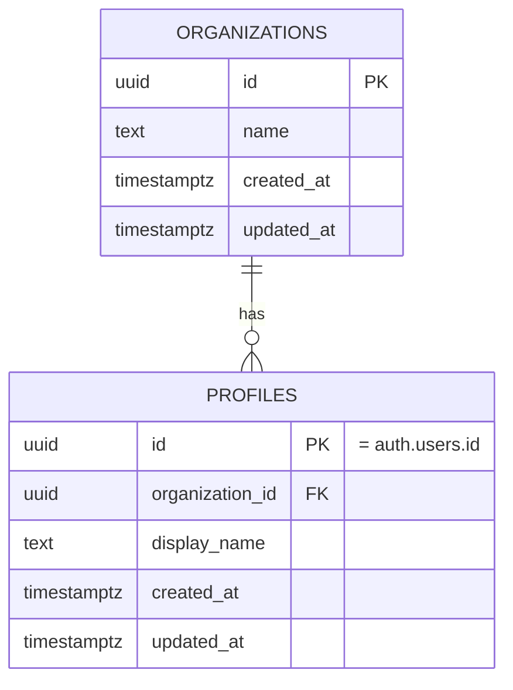
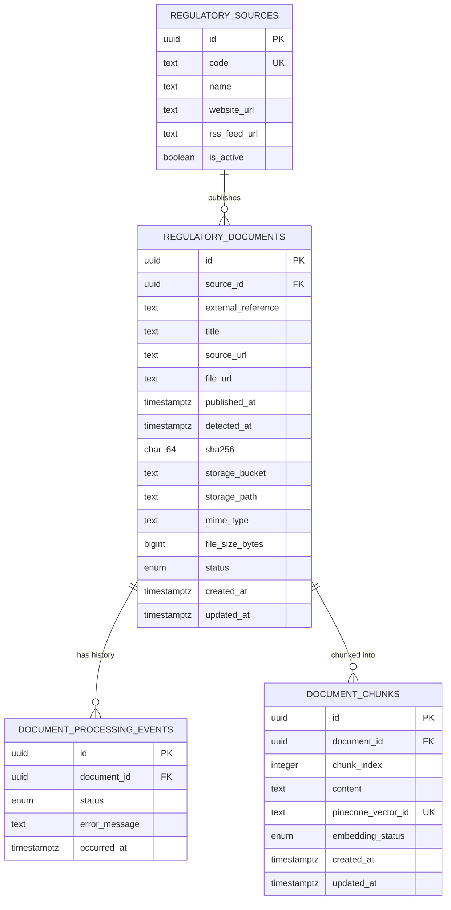
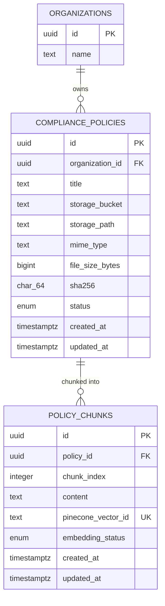
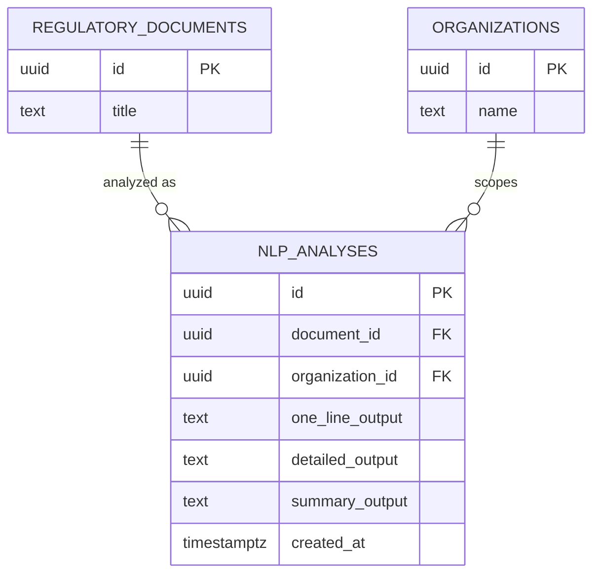
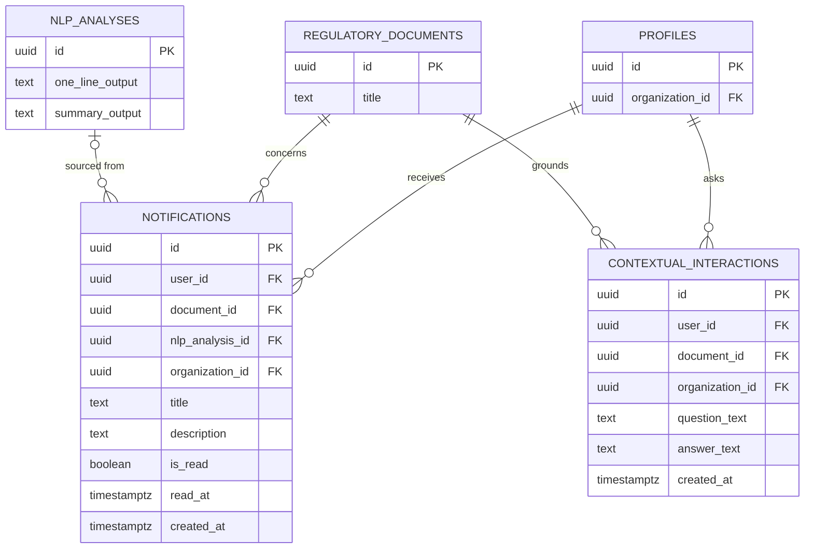
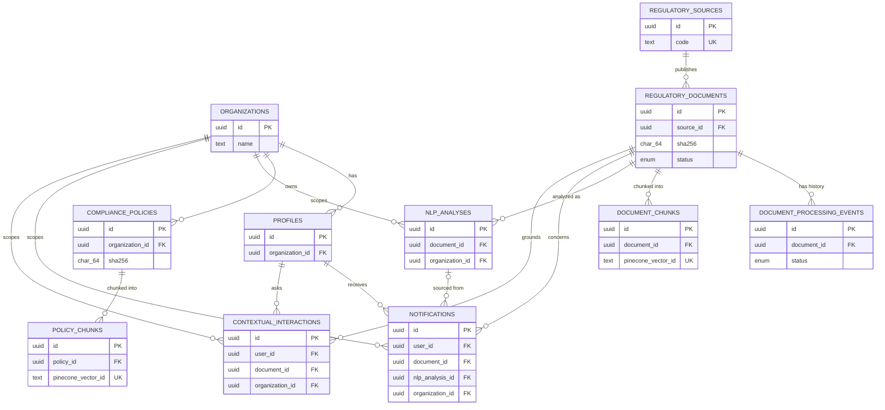

# Gapture FT-07 — PostgreSQL Database Schema & Data Models Document

---

## 1. Document Control

| Field | Value |
|---|---|
| Document Title | Gapture FT-07 — PostgreSQL Database Schema & Data Models Document |
| Version | 1.0 |
| Status | Draft — for engineering review |
| Product | Gapture (FT-07 — Regulatory Compliance Intelligence Platform) |
| Project | FT-07 |
| Author | Database Architecture (generated with Claude, Senior PostgreSQL Database Architect role) |
| Date | September 10, 2026 |
| Source Documents | FT-07 Master PRD v1.1; Gapture FT-07 BRD; Gapture Approved Technology Stack & Architecture; Gapture FT-07 HLSA v1.0 |
| Source-of-Truth Hierarchy | Master PRD → BRD → HLSA → Approved Technology Stack → Database Architecture Decisions (this document) |
| Parent Document | This document inherits system boundaries and component responsibilities from the HLSA (§6 Logical Architecture Layer 7 "Application Data Layer", §9 "PostgreSQL vs Pinecone Architecture"). It does not redefine those boundaries. |

---

## 2. Database Architecture Purpose

This document defines the **PostgreSQL relational schema** that implements the "Application Data Layer" (HLSA §6, Layer 7) and "Supabase Backend" component (HLSA component 20) — the single system-of-record database required by PRD FR-17. It translates the entities named in HLSA §9 and BRD §34 into a normalized, indexed, constrained, query-pattern-driven schema that a backend team can migrate, query, and extend.

It covers: entity design, relationships, constraints, indexes, join/N+1/pagination strategy, transaction boundaries, Supabase RLS, the Pinecone/Storage boundary, migrations, seed data, complete DDL, and traceability back to the PRD/BRD/HLSA.

It does not cover: application-layer business logic beyond the invariants enforced at the database layer, the Node.js backend's internal service structure (owned by the HLSA and its future Backend/API module document), or the Pinecone index configuration itself (owned by a future RAG/Pinecone module document).

---

## 3. Source-of-Truth Rules

```text
Master PRD  →  BRD  →  HLSA  →  Approved Technology Stack  →  Database Architecture Decisions
```

No table in this schema exists without a traceable reason in one of the first four documents (see §50 for the full traceability matrix). Every design choice not explicitly specified by the source documents is labeled one of:

* **TBD** — genuinely undecided; requires a future product/architecture decision.
* **Architecture Decision** — a concrete choice made here to fill a gap the PRD/BRD deliberately left open (per PRD §33/§30.3), consistent with everything the source documents do define.
* **Proposed / Optional** — a defensible addition beyond the literal text of the source documents, offered for engineering judgment rather than asserted as required.

**Scope note (carried forward from the HLSA, §2):** Gapture's broader platform vision (obligation extraction, control mapping, gap scoring, remediation, evidence/audit management, RBI/SEBI/FIU-IND coverage) is wider than the FT-07 MVP. The PRD explicitly removes FIU and explicitly excludes gap classification, risk scoring, remediation, evidence/audit management, and clause-level comparison from the current scope (PRD §30.2; BRD §8). Accordingly, this schema contains **no** `regulatory_obligations`, `company_controls`, `compliance_mappings`, `compliance_gaps`, `remediation_actions`, `evidence`, or generic `audit_logs` tables. Those belong to a future, separately-scoped schema extension if and when that broader product direction is approved — not to FT-07.

---

## 4. Database Architecture Principles

| Principle | Applied here as |
|---|---|
| Relational integrity over convenience | Every relationship is a real foreign key with an explicit `ON DELETE` behavior (§27); nothing is held together only by application code. |
| ~3NF by default, denormalize only with a stated reason | Two deliberate denormalizations exist in this schema (`notifications.title`/`description`, and `organization_id` mirrored onto every tenant-scoped child table) — both are justified inline where introduced and summarized in §4.1. |
| One system of record | PostgreSQL is authoritative for every fact about a document, policy, analysis, notification, and interaction. Pinecone and Supabase Storage hold derived/binary artifacts only, referenced by ID (§37, §38). |
| Design for the actual read/write pattern, not just the entities | Every table's index list is derived from a named query in §29/§44, not applied by default (§31). |
| Small, disciplined vocabulary for status | Two PostgreSQL ENUM types (§15) for tightly-controlled internal states; ordinary lookup tables (not ENUMs) for business-growable reference data like regulatory sources (§12). |
| Multi-tenancy is explicit, not incidental | `organization_id` is present on every organization-scoped table and is the single column every RLS policy filters on (§35). |

### 4.1 Denormalization Register

| Denormalized field(s) | Why | Performance problem solved | Consistency trade-off |
|---|---|---|---|
| `notifications.title`, `notifications.description` | PRD FR-20 defines a notification's title/description as the 1-Line/Summary output *at the time the notification was created*. A notification is a historical record of what a user was actually shown, not a live view of the current analysis. | Avoids a join to `nlp_analyses` on the single highest-frequency read path in the product (the notification feed, HLSA §56). | If an analysis is ever regenerated for the same document, existing notifications keep their original wording — this is intentional, not a bug. |
| `organization_id` mirrored onto `nlp_analyses`, `notifications`, `contextual_interactions` (in addition to the natural path via `profiles`/`compliance_policies`) | Supabase RLS policies run per row; a policy that must join up through `profiles` to find the tenant boundary is materially slower at scale than a policy that compares one indexed column. | Keeps every RLS policy a single indexed equality check instead of a join-based subquery (§35). | A trigger (§35.2) populates and maintains this column server-side so it can never drift from the true owning organization — the trade-off is one small trigger per table, not an application-level discipline requirement. |

## 5. Gapture Data Domains

| Domain | Tables |
|---|---|
| Identity & Organization | `organizations`, `profiles` |
| Regulatory Source & Documents | `regulatory_sources`, `regulatory_documents`, `document_processing_events` |
| Semantic Retrieval Metadata | `document_chunks`, `policy_chunks` |
| Compliance Policy | `compliance_policies` |
| AI / NLP Analysis | `nlp_analyses` |
| Delivery | `notifications` |
| Contextual AI | `contextual_interactions` |

Eleven tables total. No table exists "because SaaS apps usually have one" — each is justified in §8 and traced in §50.

---

## 6. Database Context Architecture

```text
PostgreSQL / Supabase
        ↓
Transactional / relational system of record
        (users, organizations, document metadata, processing state,
         NLP outputs, notifications, contextual interactions)

Pinecone
        ↓
Semantic / vector retrieval
        (chunk embeddings only — never the system of record)

Supabase Storage
        ↓
Original file / object storage
        (encrypted original regulatory documents and policy files)
```

PostgreSQL never stores a document's raw binary content or its embedding vectors. It stores exactly what HLSA §9 assigns to it: identity, metadata, processing state, relationships, and generated text outputs — plus a *reference* to where the binary lives (Storage) and a *reference* to where the vector lives (Pinecone).

---

## 7. Conceptual Data Model

```text
Identity
   ↓
Organization
   ↓
Company Compliance Policies → Policy Chunks → (Pinecone)

Regulatory Source
   ↓
Regulatory Document → Document Chunks → (Pinecone)
   ↓
Document Processing (status + event history)
   ↓
NLP Analysis (per organization × document)
   ↓
Generated Outputs (1-Line / Detailed / Summary — columns on NLP Analysis)
   ↓
Notification
   ↓
User Interaction (Contextual AI Q&A)
```

**Key modeling decision — analysis is organization-scoped, not global.** PRD FR-11/FR-12 defines NLP analysis as a comparison of regulatory content *against that organization's own compliance policies*. Two organizations with different policies can legitimately receive different 1-Line/Detailed/Summary output for the *same* regulatory document. `nlp_analyses` is therefore keyed by `(document_id, organization_id)`, not by `document_id` alone — treating analysis as global/shared data would be a correctness bug, not just a modeling simplification.

`regulatory_sources`, `regulatory_documents`, and `document_chunks` remain **global, shared reference data** — the regulation itself is identical for every tenant; only its *analysis* is tenant-specific.

---

## 8. Entity Inventory

| Entity | Purpose | Owner (Scope) | Primary Relationship | Required? |
|---|---|---|---|---|
| `organizations` | The tenant boundary; owns policies, and the users within it | Platform | 1 organization → N profiles | Required — BRD §34 names "organizations" explicitly; HLSA §15 requires org-scoped data access |
| `profiles` | Application-level user record, extending Supabase `auth.users` | Organization | 1 organization → N profiles; 1 profile → N notifications | Required — PRD's "user" is the actor for login, notifications, and contextual Q&A |
| `regulatory_sources` | Reference data for RBI/SEBI as monitored sources | Platform (global) | 1 source → N regulatory_documents | Required — PRD FR-01 names RBI and SEBI explicitly |
| `regulatory_documents` | One detected regulatory file and its identity/security/lifecycle metadata | Platform (global) | 1 document → N processing events, N chunks, N analyses | Required — PRD FR-06–FR-09, HLSA §16/§23/§24 |
| `document_processing_events` | Append-only history of a document's processing-state transitions and failures | Platform (global) | N events → 1 document | Required — HLSA §21/§22 requires per-stage failure visibility and observability without a generic audit product |
| `document_chunks` | Relational metadata for a regulatory document's retrieval-ready text segments and their Pinecone vector IDs | Platform (global) | N chunks → 1 document | Required — HLSA §9/§10, PRD FR-11 depends on retrieval context |
| `compliance_policies` | An organization's uploaded compliance-policy document and its storage/processing metadata | Organization | N policies → 1 organization | Required — PRD FR-12 |
| `policy_chunks` | Relational metadata for a policy's retrieval-ready text segments and their Pinecone vector IDs | Organization (via policy) | N chunks → 1 policy | Required — same rationale as `document_chunks`, applied to policy content |
| `nlp_analyses` | One completed NLP comparison run for a (document, organization) pair, holding the 1-Line/Detailed/Summary outputs | Organization | N analyses → 1 document, 1 organization | Required — PRD FR-11–FR-16 |
| `notifications` | A user-facing notification derived from a completed analysis | User (Organization) | N notifications → 1 profile | Required — PRD FR-19/FR-20 |
| `contextual_interactions` | One question/answer turn from the Voice/LLM contextual Q&A flow, grounded in a specific document | User (Organization) | N interactions → 1 profile, 1 document | Required — PRD FR-23 |

No `policy_versions`, `regulatory_obligations`, `compliance_mappings`, `compliance_gaps`, `audit_logs`, or `contextual_sessions` table is included — each was considered and explicitly rejected; see §17.1, §21.1, §25.1, and §34 for the reasoning behind each omission.

## 9. Logical Data Model

```text
organizations (1) ───< (N) profiles
organizations (1) ───< (N) compliance_policies
organizations (1) ───< (N) nlp_analyses
organizations (1) ───< (N) notifications
organizations (1) ───< (N) contextual_interactions

regulatory_sources (1) ───< (N) regulatory_documents

regulatory_documents (1) ───< (N) document_processing_events
regulatory_documents (1) ───< (N) document_chunks
regulatory_documents (1) ───< (N) nlp_analyses
regulatory_documents (1) ───< (N) notifications
regulatory_documents (1) ───< (N) contextual_interactions

compliance_policies (1) ───< (N) policy_chunks

profiles (1) ───< (N) notifications
profiles (1) ───< (N) contextual_interactions

nlp_analyses (1) ───< (0..N) notifications   [nullable FK — see §27]
```

---

## 10. Complete ERD

### ERD 1 — Identity & Organization



### ERD 2 — Regulatory Documents



### ERD 3 — Compliance Policies



### ERD 4 — AI / NLP / Retrieval



### ERD 5 — Notifications & User Interaction



### Consolidated ERD



## 11. Identity & Organization Model

### `organizations`

| Attribute | Detail |
|---|---|
| Purpose | The tenant boundary. Owns compliance policies and users; every RLS policy ultimately resolves to this table. |
| Primary Key | `id UUID` |
| Foreign Keys | None |
| Write Pattern | Low-frequency (org onboarding/rename) |
| Read Pattern | Near-constant, but almost always via `id` (RLS join target), rarely listed/browsed |
| Security | Row visible only to its own members via RLS (§35) |

| Column | Type | Nullable | Default | Constraint | Description |
|---|---|---|---|---|---|
| `id` | `UUID` | No | `gen_random_uuid()` | PK | Surrogate key |
| `name` | `TEXT` | No | — | `CHECK (char_length(name) > 0)` | Organization display name |
| `created_at` | `TIMESTAMPTZ` | No | `now()` | — | Row creation time |
| `updated_at` | `TIMESTAMPTZ` | No | `now()` | — | Maintained by trigger on update |

### `profiles`

| Attribute | Detail |
|---|---|
| Purpose | Application-level extension of Supabase `auth.users`; the actor behind notifications and contextual Q&A. |
| Primary Key | `id UUID` (shares its value with `auth.users.id` — standard Supabase pattern) |
| Foreign Keys | `id → auth.users(id)` ON DELETE CASCADE; `organization_id → organizations(id)` ON DELETE RESTRICT |
| Write Pattern | Low-frequency (signup, profile edits) |
| Read Pattern | High-frequency, always by `id` (session lookup) or `organization_id` (org member listing) |
| Security | A user reads only their own row and, where an admin view exists, rows within their own `organization_id` (§35) |

| Column | Type | Nullable | Default | Constraint | Description |
|---|---|---|---|---|---|
| `id` | `UUID` | No | — | PK, FK → `auth.users(id)` | Shared identity with Supabase Auth |
| `organization_id` | `UUID` | No | — | FK → `organizations(id)` | Owning organization (single-org-per-user — see Architecture Decision below) |
| `display_name` | `TEXT` | Yes | — | — | Optional display name |
| `created_at` | `TIMESTAMPTZ` | No | `now()` | — | Row creation time |
| `updated_at` | `TIMESTAMPTZ` | No | `now()` | — | Maintained by trigger on update |

**Architecture Decision — single organization per user.** The HLSA (§10) and this prompt both specify the cardinality as `Organization 1 | N Users` — a one-to-many, not a many-to-many. This schema implements that literally: `organization_id` lives directly on `profiles` rather than through an `organization_members` join table. If a future requirement needs a user to belong to multiple organizations, that is a schema-extending change (introduce a join table, migrate `organization_id` off `profiles`), not a reinterpretation of the current one — flagged here so it isn't silently assumed either way. **TBD:** role/permission model (BRD §10.3 marks the "Platform Administrator" persona and its permissions as proposed/TBD) — no `role` column is added until that is defined; inventing one here would be exactly the kind of assumption §1/§74 of the prompt prohibits.

---

## 12. Regulatory Source Model

### `regulatory_sources`

| Attribute | Detail |
|---|---|
| Purpose | Reference/seed data for the regulators FT-07 monitors. |
| Primary Key | `id UUID` |
| Foreign Keys | None |
| Write Pattern | Essentially write-once per source (seed data), rare admin updates |
| Read Pattern | Small table, frequently joined (every regulatory-document read), effectively fully cached by the planner/buffer cache |
| Security | Public reference data — readable by any authenticated user; not organization-scoped (see §6/§7 — this is global data, the same for every tenant) |

| Column | Type | Nullable | Default | Constraint | Description |
|---|---|---|---|---|---|
| `id` | `UUID` | No | `gen_random_uuid()` | PK | Surrogate key |
| `code` | `TEXT` | No | — | `UNIQUE` | Short stable code, e.g. `RBI`, `SEBI` |
| `name` | `TEXT` | No | — | `CHECK (char_length(name) > 0)` | Full name, e.g. "Reserve Bank of India" |
| `website_url` | `TEXT` | No | — | — | Regulator's website root |
| `rss_feed_url` | `TEXT` | Yes | — | — | RSS feed, where the source publishes one (PRD FR-02: "may use RSS where available") |
| `is_active` | `BOOLEAN` | No | `true` | — | Allows disabling a source's monitoring without deleting history |
| `created_at` | `TIMESTAMPTZ` | No | `now()` | — | — |
| `updated_at` | `TIMESTAMPTZ` | No | `now()` | — | Maintained by trigger on update |

**Architecture Decision — table, not ENUM.** Regulatory sources are business-configurable reference data, not a fixed internal vocabulary: PRD §30.1 explicitly frames additional sources as a *future product decision*, and the HLSA (§33) names "additional regulatory sources" as a future consideration. A PostgreSQL ENUM type requires a schema migration (`ALTER TYPE ... ADD VALUE`) to add a value; a lookup table only requires an `INSERT`. No `CHECK` constraint restricts `code` to `('RBI','SEBI')` for the same reason — that would reproduce the ENUM's rigidity through a different mechanism. Only RBI and SEBI are seeded today (§42); FIU is intentionally **not** seeded, per PRD §2.1/§6.3.

## 13. Regulatory Document Model

### `regulatory_documents`

| Attribute | Detail |
|---|---|
| Purpose | One detected regulatory file: its source-identity, security metadata, storage reference, and current lifecycle status. Implements PRD FR-06–FR-09 and HLSA §16/§23/§24. |
| Primary Key | `id UUID` |
| Foreign Keys | `source_id → regulatory_sources(id)` ON DELETE RESTRICT |
| Write Pattern | One INSERT per detected file (worker); periodic UPDATEs to `status`/security/storage columns as it moves through the pipeline (§24/§27) |
| Read Pattern | Very high — document list, document detail, "documents for source", "documents by status" (worker backlog) |
| Security | Global reference data — readable by any authenticated user (the *document* is not tenant-specific; only its *analysis* is — see §18) |

| Column | Type | Nullable | Default | Constraint | Description |
|---|---|---|---|---|---|
| `id` | `UUID` | No | `gen_random_uuid()` | PK | Surrogate key |
| `source_id` | `UUID` | No | — | FK → `regulatory_sources(id)` | RBI or SEBI |
| `external_reference` | `TEXT` | Yes | — | see §17 | Source-provided identifier (e.g. RSS `guid`), where available |
| `title` | `TEXT` | No | — | `CHECK (char_length(title) > 0)` | Document/notification title as detected |
| `source_url` | `TEXT` | No | — | — | The notification/circular page URL Watchdog detected |
| `file_url` | `TEXT` | Yes | — | — | Direct file URL used for retrieval, where distinct from `source_url` |
| `published_at` | `TIMESTAMPTZ` | Yes | — | — | Publication date/time from the source, where available (PRD §16: "publication metadata where available") |
| `detected_at` | `TIMESTAMPTZ` | No | `now()` | — | When Watchdog Extraction found this item |
| `retrieved_at` | `TIMESTAMPTZ` | Yes | — | — | When the file's bytes were successfully fetched |
| `sha256` | `CHAR(64)` | Yes | — | `CHECK (sha256 ~ '^[a-f0-9]{64}$')` | Fingerprint, populated once hashed (§17) |
| `storage_bucket` | `TEXT` | Yes | — | — | Supabase Storage bucket holding the encrypted original |
| `storage_path` | `TEXT` | Yes | — | — | Object path within the bucket |
| `mime_type` | `TEXT` | Yes | — | — | Original file's MIME type |
| `file_size_bytes` | `BIGINT` | Yes | — | `CHECK (file_size_bytes IS NULL OR file_size_bytes >= 0)` | Original file size |
| `status` | `document_processing_status` (ENUM) | No | `'DETECTED'` | — | Current pipeline state (§15/§24) |
| `created_at` | `TIMESTAMPTZ` | No | `now()` | — | — |
| `updated_at` | `TIMESTAMPTZ` | No | `now()` | — | Maintained by trigger on update |

No regulatory field beyond what PRD §16 lists is added — no `document_type`, `authority`, `effective_date`, or `version` columns, since none of those are defined by the FT-07 PRD/BRD (they belong to the broader platform vision referenced in §3, not to this scope).

---

## 14. Document Processing Model

### `document_processing_events`

| Attribute | Detail |
|---|---|
| Purpose | Append-only history of a document's state transitions and failures — the concrete mechanism behind HLSA §21's per-stage failure boundary and §22's observability requirement. |
| Primary Key | `id UUID` |
| Foreign Keys | `document_id → regulatory_documents(id)` ON DELETE CASCADE |
| Write Pattern | One INSERT per state transition (roughly 9–10 per successful document lifecycle) |
| Read Pattern | Fetched per-document (processing timeline / debugging a stuck document); rarely, if ever, queried across all documents at once |
| Security | Global — same visibility as its parent `regulatory_documents` row |

| Column | Type | Nullable | Default | Constraint | Description |
|---|---|---|---|---|---|
| `id` | `UUID` | No | `gen_random_uuid()` | PK | Surrogate key |
| `document_id` | `UUID` | No | — | FK → `regulatory_documents(id)` | Parent document |
| `status` | `document_processing_status` (ENUM) | No | — | — | The state entered/attempted |
| `error_message` | `TEXT` | Yes | — | — | Populated only on a failed attempt |
| `occurred_at` | `TIMESTAMPTZ` | No | `now()` | — | When this transition/attempt happened |

**Architecture Decision — event table, not a generic audit log.** §19/§47 of the prompt both ask for "adequate traceability" without "a complete audit-management product." This table is scoped narrowly to *document processing* (the one place the PRD/HLSA explicitly requires failure visibility across many async external-API stages) rather than generalized to every table in the schema. It is **not** a substitute for the out-of-scope `audit_logs` table referenced in the broader Gapture platform vision (§3) — it has one purpose: let the worker and an operator answer "what state is this document in, and if it's stuck, why."

## 15. OCR / Document Content Model

**Architecture Decision — no dedicated OCR table.** PRD §16/§20 of this prompt explicitly warns against storing "every OCR bounding box or token." OCR is a transient processing stage (HLSA component 9): the OCR service's output is consumed immediately by Document Cleaning and Chunking and is not queried on its own afterwards. Persisting the full OCR text would duplicate what already lives, chunk-by-chunk, in `document_chunks.content` (§16) — and a document's *original* representation already lives in Supabase Storage (`regulatory_documents.storage_path`), retrievable and re-OCR-able if ever needed. No `ocr_data` table or column is introduced. If a future requirement needs the full cleaned document text independently of its chunks (e.g. for re-chunking with a different strategy), that is a **Proposed / Optional** addition (a single `cleaned_text TEXT` column on `regulatory_documents`) — not included here because nothing in the current source documents calls for it.

## 16. Document Chunk Model

### `document_chunks`

| Attribute | Detail |
|---|---|
| Purpose | Relational metadata for a regulatory document's retrieval-ready text segments, and the bridge to their Pinecone vector records (HLSA components 14–16). |
| Primary Key | `id UUID` |
| Foreign Keys | `document_id → regulatory_documents(id)` ON DELETE CASCADE |
| Write Pattern | Batch INSERT per document (all chunks for a document written together — see §33 Batch Operations); occasional UPDATE of `embedding_status`/`pinecone_vector_id` as embedding completes |
| Read Pattern | By `document_id` (re-chunking/debugging); by `pinecone_vector_id` (resolving a Pinecone match back to its source — the hottest read on this table, driven by every contextual-Q&A and analysis retrieval call) |
| Security | Global — same visibility as its parent document |

| Column | Type | Nullable | Default | Constraint | Description |
|---|---|---|---|---|---|
| `id` | `UUID` | No | `gen_random_uuid()` | PK | Surrogate key |
| `document_id` | `UUID` | No | — | FK → `regulatory_documents(id)` | Parent document |
| `chunk_index` | `INTEGER` | No | — | `CHECK (chunk_index >= 0)`, `UNIQUE (document_id, chunk_index)` | Ordinal position within the document |
| `content` | `TEXT` | No | — | `CHECK (char_length(content) > 0)` | The chunk's plain text (**not** its embedding vector — see decision below) |
| `pinecone_vector_id` | `TEXT` | Yes | — | `UNIQUE` (partial, see §26) | ID of the corresponding vector in Pinecone, once upserted |
| `embedding_status` | `chunk_embedding_status` (ENUM) | No | `'PENDING'` | — | `PENDING` \| `EMBEDDED` \| `FAILED` |
| `created_at` | `TIMESTAMPTZ` | No | `now()` | — | — |
| `updated_at` | `TIMESTAMPTZ` | No | `now()` | — | Maintained by trigger on update |

**Architecture Decision — store chunk text, never the embedding vector, in PostgreSQL.** §21 of the prompt distinguishes storing chunk "text/reference" from "duplicat[ing] vector embeddings... if Pinecone is the approved vector database." This schema stores `content` (plain text — small, useful for debugging, re-embedding, and displaying source context without a round trip to Pinecone or Storage) but never a `vector`/`embedding` column. The 1536+-dimension float array lives exclusively in Pinecone, referenced here by `pinecone_vector_id`. This is not a contradiction of "don't duplicate Pinecone data" — text and its embedding are different artifacts; only the latter is Pinecone's job.

---

## 17. Compliance Policy Model

### `compliance_policies`

| Attribute | Detail |
|---|---|
| Purpose | An organization's own uploaded compliance-policy document and its storage/processing metadata — the comparison context for NLP analysis (PRD FR-12). |
| Primary Key | `id UUID` |
| Foreign Keys | `organization_id → organizations(id)` ON DELETE CASCADE |
| Write Pattern | Low-frequency (policy upload) |
| Read Pattern | By `organization_id` (list an org's policies); by `id` (policy detail) |
| Security | Organization-scoped via RLS (§35) — a policy is visible only to members of its owning organization |

| Column | Type | Nullable | Default | Constraint | Description |
|---|---|---|---|---|---|
| `id` | `UUID` | No | `gen_random_uuid()` | PK | Surrogate key |
| `organization_id` | `UUID` | No | — | FK → `organizations(id)` | Owning organization |
| `title` | `TEXT` | No | — | `CHECK (char_length(title) > 0)` | Policy document title/filename |
| `storage_bucket` | `TEXT` | No | — | — | Supabase Storage bucket |
| `storage_path` | `TEXT` | No | — | — | Object path within the bucket |
| `mime_type` | `TEXT` | Yes | — | — | Original file's MIME type |
| `file_size_bytes` | `BIGINT` | Yes | — | `CHECK (file_size_bytes IS NULL OR file_size_bytes >= 0)` | Original file size |
| `sha256` | `CHAR(64)` | Yes | — | `CHECK (sha256 ~ '^[a-f0-9]{64}$')` | Fingerprint, for within-org duplicate-upload detection (§26) |
| `status` | `policy_processing_status` (ENUM) | No | `'UPLOADED'` | — | `UPLOADED` \| `CLEANING` \| `INDEXING` \| `COMPLETED` \| `FAILED` |
| `created_at` | `TIMESTAMPTZ` | No | `now()` | — | — |
| `updated_at` | `TIMESTAMPTZ` | No | `now()` | — | Maintained by trigger on update |

### `policy_chunks`

| Attribute | Detail |
|---|---|
| Purpose | Retrieval-ready text segments of a compliance policy, mirroring `document_chunks` for the policy side of the RAG pipeline. |
| Primary Key | `id UUID` |
| Foreign Keys | `policy_id → compliance_policies(id)` ON DELETE CASCADE |
| Write Pattern | Batch INSERT per policy |
| Read Pattern | By `pinecone_vector_id` (resolving retrieval matches); by `policy_id` (debugging/re-chunking) |
| Security | Organization-scoped via its parent policy (§35) |

| Column | Type | Nullable | Default | Constraint | Description |
|---|---|---|---|---|---|
| `id` | `UUID` | No | `gen_random_uuid()` | PK | Surrogate key |
| `policy_id` | `UUID` | No | — | FK → `compliance_policies(id)` | Parent policy |
| `chunk_index` | `INTEGER` | No | — | `CHECK (chunk_index >= 0)`, `UNIQUE (policy_id, chunk_index)` | Ordinal position |
| `content` | `TEXT` | No | — | `CHECK (char_length(content) > 0)` | Chunk plain text |
| `pinecone_vector_id` | `TEXT` | Yes | — | `UNIQUE` (partial) | Corresponding Pinecone vector ID |
| `embedding_status` | `chunk_embedding_status` (ENUM) | No | `'PENDING'` | — | `PENDING` \| `EMBEDDED` \| `FAILED` |
| `created_at` | `TIMESTAMPTZ` | No | `now()` | — | — |
| `updated_at` | `TIMESTAMPTZ` | No | `now()` | — | Maintained by trigger on update |

**§17.1 — Why no `policy_versions` table.** PRD FR-12 explicitly states policy versioning is not specified by the workflow. Introducing `policy_versions` now would be exactly the "invent a complete policy-management product" the prompt (§22 of the original prompt) prohibits. **TBD:** policy upload mechanism, policy-training/re-ingestion mechanism, policy versioning, policy categorization/approval workflow — all remain open per PRD FR-12/BRD §28. When a policy needs to be replaced today, the Architecture Decision is: upload creates a new `compliance_policies` row (and new chunks); the previous row and its chunks are left in place rather than mutated, giving a natural (if unmanaged) history without building a versioning feature.

## 18. NLP / AI Analysis Model

### `nlp_analyses`

| Attribute | Detail |
|---|---|
| Purpose | One completed NLP comparison run for a (document, organization) pair — the record of "what did Gapture conclude about this regulation, for this company." |
| Primary Key | `id UUID` |
| Foreign Keys | `document_id → regulatory_documents(id)` ON DELETE CASCADE; `organization_id → organizations(id)` ON DELETE CASCADE |
| Write Pattern | One INSERT per completed analysis run; **never updated** — a row is immutable once written (see decision below) |
| Read Pattern | "Latest analysis for this document, for my organization" (document detail view, notification creation) — the dominant read |
| Security | Organization-scoped via RLS (§35) |

| Column | Type | Nullable | Default | Constraint | Description |
|---|---|---|---|---|---|
| `id` | `UUID` | No | `gen_random_uuid()` | PK | Surrogate key |
| `document_id` | `UUID` | No | — | FK → `regulatory_documents(id)` | The regulatory document analyzed |
| `organization_id` | `UUID` | No | — | FK → `organizations(id)` | The organization whose policies were the comparison context |
| `one_line_output` | `TEXT` | No | — | `CHECK (char_length(one_line_output) > 0)` | PRD FR-13 — becomes the notification title |
| `detailed_output` | `TEXT` | No | — | `CHECK (char_length(detailed_output) > 0)` | PRD FR-14 — source for the "Brief of Detailed NLP Data" view |
| `summary_output` | `TEXT` | No | — | `CHECK (char_length(summary_output) > 0)` | PRD FR-15 — becomes the notification description |
| `created_at` | `TIMESTAMPTZ` | No | `now()` | — | Immutable — this *is* the analysis timestamp |

**Architecture Decision — immutable, append-style rows; `(document_id, organization_id)` is not a hard uniqueness constraint.** PRD/BRD do not define re-analysis, but nothing prohibits it either (e.g. an organization updates its policies and wants a fresh comparison). Rather than force a single row per pair (which would require either destructive UPDATE-in-place, losing history, or an artificial versioning table), this schema allows multiple `nlp_analyses` rows per `(document_id, organization_id)` and always resolves "the current one" via `ORDER BY created_at DESC LIMIT 1`, supported by the composite index in §31. This keeps the common case (one analysis per pair) simple while not blocking a legitimate future re-analysis from requiring a schema change.

## 19. Output Model

**Architecture Decision — 1-Line/Detailed/Summary are columns, not child rows.** §23 of the original prompt asks whether outputs should be columns on the analysis table, separate output records, or versioned output records. This schema uses **columns on `nlp_analyses`**, because:

* All three are always produced together, in one LLM call (HLSA §11), and always read together (a document-detail view needs all three; a notification needs two of the three) — there is no query pattern that fetches one output without the others.
* Splitting them into a child table (`nlp_outputs` with a `kind` column, or three separate `1-Line`/`Detailed`/`Summary` tables) would force a join on every read of this table for zero benefit — the textbook case *against* over-normalizing (Principle 3.2: denormalization must solve a real problem; here, the "normalized" alternative solves nothing and costs a join).
* Versioning is already handled at the row level (§18) — a new analysis run is a new row with all three outputs together, not three independently-versioned fields.

---

## 20. Notification Model

### `notifications`

| Attribute | Detail |
|---|---|
| Purpose | A user-facing notification derived from a completed analysis — PRD FR-19/FR-20's "notify to login" and title/description rule. |
| Primary Key | `id UUID` |
| Foreign Keys | `user_id → profiles(id)` ON DELETE CASCADE; `document_id → regulatory_documents(id)` ON DELETE RESTRICT; `nlp_analysis_id → nlp_analyses(id)` ON DELETE SET NULL; `organization_id → organizations(id)` ON DELETE CASCADE |
| Write Pattern | One INSERT per (user, completed analysis); occasional UPDATE limited to `is_read`/`read_at` |
| Read Pattern | The single highest-frequency read in the product — the notification feed, `WHERE user_id = $1 ORDER BY created_at DESC` |
| Security | A user reads only their own rows (`user_id = auth.uid()`); organization-scoped as a secondary boundary (§35) |

| Column | Type | Nullable | Default | Constraint | Description |
|---|---|---|---|---|---|
| `id` | `UUID` | No | `gen_random_uuid()` | PK | Surrogate key |
| `user_id` | `UUID` | No | — | FK → `profiles(id)` | Recipient |
| `document_id` | `UUID` | No | — | FK → `regulatory_documents(id)` | The regulatory document this notification concerns |
| `nlp_analysis_id` | `UUID` | Yes | — | FK → `nlp_analyses(id)` | The specific analysis run this notification was generated from (nullable — see FK rationale, §27) |
| `organization_id` | `UUID` | No | — | FK → `organizations(id)`, trigger-populated (§35.2) | Denormalized for RLS performance |
| `title` | `TEXT` | No | — | `CHECK (char_length(title) > 0)` | Denormalized copy of `one_line_output` at creation time (§4.1) |
| `description` | `TEXT` | No | — | `CHECK (char_length(description) > 0)` | Denormalized copy of `summary_output` at creation time (§4.1) |
| `is_read` | `BOOLEAN` | No | `false` | — | Read/unread state |
| `read_at` | `TIMESTAMPTZ` | Yes | — | `CHECK (read_at IS NULL OR is_read = true)` | When the user opened it — enforces the impossible state "read_at set but is_read false" cannot occur |
| `created_at` | `TIMESTAMPTZ` | No | `now()` | — | — |

**PRD FR-20 rule implemented directly:** `title = one_line_output`, `description = summary_output`, captured at write time. The **Detailed** output is deliberately **not** duplicated here — PRD FR-20's "Brief of Detailed NLP Data" is retrieved by following `document_id`/`nlp_analysis_id` to `nlp_analyses.detailed_output` when the user clicks through, exactly as the prompt's §24 instructs ("Do not duplicate large detailed NLP output inside notifications. Reference the appropriate entity instead").

---

## 21. Contextual AI Model

### `contextual_interactions`

| Attribute | Detail |
|---|---|
| Purpose | One question/answer turn from the Voice/LLM contextual Q&A flow (PRD FR-21–FR-23), grounded in the document the user was viewing. |
| Primary Key | `id UUID` |
| Foreign Keys | `user_id → profiles(id)` ON DELETE CASCADE; `document_id → regulatory_documents(id)` ON DELETE CASCADE; `organization_id → organizations(id)` ON DELETE CASCADE |
| Write Pattern | One INSERT per Q&A turn, written atomically after the Contextual Q&A Service (HLSA component 24) returns an answer — never updated |
| Read Pattern | "This user's Q&A history for this document" (Query 9, §29) |
| Security | A user reads only their own rows; organization-scoped as a secondary boundary (§35) |

| Column | Type | Nullable | Default | Constraint | Description |
|---|---|---|---|---|---|
| `id` | `UUID` | No | `gen_random_uuid()` | PK | Surrogate key |
| `user_id` | `UUID` | No | — | FK → `profiles(id)` | Who asked |
| `document_id` | `UUID` | No | — | FK → `regulatory_documents(id)` | The document the question was grounded in |
| `organization_id` | `UUID` | No | — | FK → `organizations(id)`, trigger-populated (§35.2) | Denormalized for RLS performance |
| `question_text` | `TEXT` | No | — | `CHECK (char_length(question_text) > 0)` | The user's question (post speech-to-text, if voice) |
| `answer_text` | `TEXT` | No | — | `CHECK (char_length(answer_text) > 0)` | The grounded answer returned |
| `created_at` | `TIMESTAMPTZ` | No | `now()` | — | — |

**§21.1 — Why no session table, and why one row per turn.** The prompt explicitly cautions "only create a session entity if it is actually useful" and "avoid unnecessary chat tables." PRD FR-23 grounds every answer in "the relevant context" of the document being viewed — there is no multi-document conversation thread defined anywhere in the PRD/BRD. `document_id` already provides the natural grouping key ("all Q&A for this document, for this user"); a `contextual_sessions` parent table would add a join with no query it uniquely enables. Question and answer are likewise kept as **one row**, not two tables (`contextual_questions` + `contextual_answers` joined 1:1) — they are always written together, in a single backend transaction, immediately after the LLM call returns (HLSA §12 sequence diagram), and always read together. Splitting them would reproduce the same unjustified-1:1-split pattern rejected for NLP outputs in §19. **Proposed / Optional:** if a future requirement introduces genuinely multi-turn, cross-document conversations, a `contextual_sessions` table becomes justified at that point — not before.

---

## 22. PostgreSQL Schema Definitions

**Extension used:**

```sql
CREATE EXTENSION IF NOT EXISTS pgcrypto;
```

`pgcrypto` is included defensively for `gen_random_uuid()`; Supabase projects enable it by default, and PostgreSQL 13+ ships `gen_random_uuid()` in core regardless. No other extension is required — no `uuid-ossp`, no `pgvector` (vector storage is Pinecone's job, per the Approved Technology Stack — see §37), no `pg_trgm`/full-text extensions (no free-text search requirement exists in the PRD/BRD).

**ENUM types used:**

```sql
CREATE TYPE document_processing_status AS ENUM (
    'DETECTED', 'RETRIEVED', 'OCR_PROCESSING', 'SECURED', 'STORED',
    'CLEANING', 'INDEXING', 'ANALYZING', 'COMPLETED', 'FAILED'
);

CREATE TYPE policy_processing_status AS ENUM (
    'UPLOADED', 'CLEANING', 'INDEXING', 'COMPLETED', 'FAILED'
);

CREATE TYPE chunk_embedding_status AS ENUM (
    'PENDING', 'EMBEDDED', 'FAILED'
);
```

**Architecture Decision — ENUM here, not a lookup table.** Unlike `regulatory_sources` (§12), these three vocabularies are internal, code-driven states that only the application's own pipeline logic writes — never business/admin-configurable data. A closed, compiler/DB-checked ENUM is the right tool exactly because these values should *not* be easy to add without a deliberate, reviewed migration (adding a new processing state is a pipeline-logic change, not a data-entry task). `document_processing_status` and `policy_processing_status` are kept as **two separate types** rather than one shared type, because a document's lifecycle (`DETECTED`→`RETRIEVED`→`OCR_PROCESSING`→…) and a policy's lifecycle (`UPLOADED`→`CLEANING`→…) are genuinely different — most of the document states (`DETECTED`, `RETRIEVED`, `OCR_PROCESSING`, `SECURED`, `STORED`) have no meaning for a directly-uploaded policy file, and forcing them into one shared ENUM would leave dead values on one side.

**FAILED is a single terminal status, not one per stage.** Per HLSA §24, a document held mid-pipeline simply stays at its last successful state while retries continue (e.g. `OCR_PROCESSING`), with the *reason* recorded in `document_processing_events.error_message` — not encoded as a combinatorial `FAILED_OCR`/`FAILED_HASHING`/… state. `FAILED` is set only once retries are exhausted for whatever stage the document was stuck at, giving operators one place to look ("what's failed") without a state explosion.

The full `CREATE TABLE` statements for all eleven tables are consolidated in §43 (Complete PostgreSQL DDL) so they can be reviewed, copied, and executed as a single coherent script.

---

## 23. Keys and Constraints

| Table | Primary Key | Notable Constraints |
|---|---|---|
| `organizations` | `id` | `CHECK (char_length(name) > 0)` |
| `profiles` | `id` (= `auth.users.id`) | `organization_id NOT NULL` |
| `regulatory_sources` | `id` | `UNIQUE (code)` |
| `regulatory_documents` | `id` | `CHECK (title <> '')`; `CHECK (sha256 format)`; `CHECK (file_size_bytes >= 0)`; partial `UNIQUE (source_id, sha256)`; partial `UNIQUE (source_id, external_reference)` |
| `document_processing_events` | `id` | — |
| `document_chunks` | `id` | `UNIQUE (document_id, chunk_index)`; `CHECK (chunk_index >= 0)`; partial `UNIQUE (pinecone_vector_id)` |
| `compliance_policies` | `id` | `CHECK (title <> '')`; `CHECK (sha256 format)`; partial `UNIQUE (organization_id, sha256)` |
| `policy_chunks` | `id` | `UNIQUE (policy_id, chunk_index)`; `CHECK (chunk_index >= 0)`; partial `UNIQUE (pinecone_vector_id)` |
| `nlp_analyses` | `id` | `CHECK` on all three output columns `<> ''` |
| `notifications` | `id` | `CHECK (read_at IS NULL OR is_read = true)` |
| `contextual_interactions` | `id` | `CHECK` on `question_text`/`answer_text` `<> ''` |

---

## 24. Relationship & Cardinality Definitions

| Parent | Child | Cardinality | FK Column | Optional? |
|---|---|---|---|---|
| `organizations` | `profiles` | 1 : N | `profiles.organization_id` | Mandatory |
| `organizations` | `compliance_policies` | 1 : N | `compliance_policies.organization_id` | Mandatory |
| `organizations` | `nlp_analyses` | 1 : N | `nlp_analyses.organization_id` | Mandatory |
| `organizations` | `notifications` | 1 : N | `notifications.organization_id` | Mandatory |
| `organizations` | `contextual_interactions` | 1 : N | `contextual_interactions.organization_id` | Mandatory |
| `regulatory_sources` | `regulatory_documents` | 1 : N | `regulatory_documents.source_id` | Mandatory |
| `regulatory_documents` | `document_processing_events` | 1 : N | `document_processing_events.document_id` | Mandatory |
| `regulatory_documents` | `document_chunks` | 1 : N | `document_chunks.document_id` | Mandatory |
| `regulatory_documents` | `nlp_analyses` | 1 : N | `nlp_analyses.document_id` | Mandatory |
| `regulatory_documents` | `notifications` | 1 : N | `notifications.document_id` | Mandatory |
| `regulatory_documents` | `contextual_interactions` | 1 : N | `contextual_interactions.document_id` | Mandatory |
| `compliance_policies` | `policy_chunks` | 1 : N | `policy_chunks.policy_id` | Mandatory |
| `profiles` | `notifications` | 1 : N | `notifications.user_id` | Mandatory |
| `profiles` | `contextual_interactions` | 1 : N | `contextual_interactions.user_id` | Mandatory |
| `nlp_analyses` | `notifications` | 1 : 0..N | `notifications.nlp_analysis_id` | **Optional** — nullable, `ON DELETE SET NULL` |

Every relationship above is a real, enforced foreign key — none is "held together" only by application code.

## 25. Index Strategy

Every index below is tied to a named query (either here or in §44) — none is speculative. Primary-key indexes (automatic) are omitted from this table.

| Index | Table | Columns | Type | Query Supported | Reason |
|---|---|---|---|---|---|
| `idx_profiles_org` | `profiles` | `organization_id` | btree | "list members of my org" (admin views) | FK not automatically indexed by PostgreSQL |
| `idx_regdocs_source` | `regulatory_documents` | `source_id` | btree | Query 4 (§44) — document + source | FK; also drives the INNER JOIN example (§27) |
| `uq_regdocs_source_sha256` | `regulatory_documents` | `(source_id, sha256)` | unique, partial `WHERE sha256 IS NOT NULL` | Duplicate detection (§26 below) | Enforces the dedup rule at the database layer, not just in application code |
| `uq_regdocs_source_extref` | `regulatory_documents` | `(source_id, external_reference)` | unique, partial `WHERE external_reference IS NOT NULL` | Idempotent detection upsert (§32) | Lets the worker `ON CONFLICT` before a hash even exists |
| `idx_regdocs_status` | `regulatory_documents` | `status` | btree | Worker backlog: "documents currently at `OCR_PROCESSING`", etc. | Targeted operational index — few distinct values, but the worker filters to one value very frequently |
| `idx_regdocs_created` | `regulatory_documents` | `created_at` | btree | Query 10 (§44) — recent documents / default list sort | Supports `ORDER BY created_at DESC` (btree scans backwards efficiently — no separate DESC index needed) |
| `idx_events_document_time` | `document_processing_events` | `(document_id, occurred_at DESC)` | btree, composite | "processing timeline for this document" | Leading column is the equality filter; explicit `DESC` matches the natural read order |
| `uq_chunks_document_index` | `document_chunks` | `(document_id, chunk_index)` | unique, composite | Chunk ordering/lookup; also serves plain `document_id` filters (leading column) | Doubles as the FK-support index — a separate `document_id`-only index would be redundant |
| `uq_chunks_pinecone_id` | `document_chunks` | `pinecone_vector_id` | unique, partial `WHERE pinecone_vector_id IS NOT NULL` | Resolving a Pinecone match back to its source chunk — the hottest read on this table | Partial because most rows are `PENDING` and have no vector ID yet |
| `idx_chunks_pending` | `document_chunks` | `embedding_status` | btree, partial `WHERE embedding_status = 'PENDING'` | Embedding worker's backlog query | Partial index stays tiny — only in-flight rows match |
| `idx_policies_org` | `compliance_policies` | `organization_id` | btree | "list my org's policies" | FK; also the RLS filter column |
| `uq_policies_org_sha256` | `compliance_policies` | `(organization_id, sha256)` | unique, partial `WHERE sha256 IS NOT NULL` | Prevent the same policy file being uploaded twice within one org | Scoped to org, not global (a policy fingerprint is meaningless across tenants) |
| `uq_pchunks_policy_index` | `policy_chunks` | `(policy_id, chunk_index)` | unique, composite | Chunk ordering/lookup | Mirrors `document_chunks` |
| `uq_pchunks_pinecone_id` | `policy_chunks` | `pinecone_vector_id` | unique, partial `WHERE pinecone_vector_id IS NOT NULL` | Resolving retrieval matches | Mirrors `document_chunks` |
| `idx_pchunks_pending` | `policy_chunks` | `embedding_status` | btree, partial `WHERE embedding_status = 'PENDING'` | Embedding worker's backlog query | Mirrors `document_chunks` |
| `idx_analyses_org_doc_time` | `nlp_analyses` | `(organization_id, document_id, created_at DESC)` | btree, composite | Query 5 (§44) — latest analysis for (org, document) | See composite ordering rationale, §26 |
| `idx_notifications_user_time` | `notifications` | `(user_id, created_at DESC)` | btree, composite | Query 1 (§44) — the notification feed | The single most-executed query in the product |
| `idx_notifications_unread` | `notifications` | `user_id` | btree, partial `WHERE is_read = false` | Unread badge/count | Textbook partial-index case (§33 of the prompt) — stays small regardless of total notification volume |
| `idx_notifications_document` | `notifications` | `document_id` | btree | Query 2 (§44) — notification → document; "does this doc already have a notification for this user" | FK |
| `idx_notifications_org` | `notifications` | `organization_id` | btree | RLS filter, admin views | Denormalized tenant column |
| `idx_interactions_user_doc_time` | `contextual_interactions` | `(user_id, document_id, created_at DESC)` | btree, composite | Query 9 (§44) — interaction history | Leading columns are the equality filters used together every time |
| `idx_interactions_org` | `contextual_interactions` | `organization_id` | btree | RLS filter | Denormalized tenant column |

**What is deliberately *not* indexed:** `regulatory_documents.title`, `compliance_policies.title`, `notifications.title`/`description`, `nlp_analyses.*_output`, `document_chunks.content`, `contextual_interactions.question_text`/`answer_text`. None of these are filtered or sorted on by any defined query — the PRD/BRD/HLSA define no free-text search requirement. Indexing them would add write overhead (every INSERT/UPDATE pays an index-maintenance cost) for zero read benefit — a direct application of Principle 3.6 and the "don't index every column" instruction (§31 of the prompt).

---

## 26. Composite / Partial Index Strategy

**Composite column ordering rule applied throughout:** *equality-filter columns first (most selective / always-present filter, i.e. the tenant or owner column), then any further equality filter, then the sort column last.* This is why every composite index above puts `organization_id` or `user_id` first — it is always present in the `WHERE` clause (from RLS or the API's own scoping) — and `created_at DESC` last, since it is a sort, not a filter.

* `(organization_id, document_id, created_at DESC)` on `nlp_analyses` — a request is always "analyses for *my org*, for *this document*, newest first"; reversing the order (`document_id` first) would work correctly but would not let a pure "all recent analyses for my org, any document" query use the same index as efficiently.
* `(user_id, created_at DESC)` on `notifications` — every notification read is scoped to one user first.
* `(user_id, document_id, created_at DESC)` on `contextual_interactions` — matches Query 9 exactly.

**Partial indexes** are used in exactly the cases the prompt's own example matches (§33: `WHERE is_read = false`) plus the structurally identical "sparse, temporary state" cases:

| Partial Index | Predicate | Why partial beats full |
|---|---|---|
| `idx_notifications_unread` | `WHERE is_read = false` | Most notifications are eventually read; the unread set stays small and the index stays cheap to maintain and fast to scan, indefinitely |
| `idx_chunks_pending` / `idx_pchunks_pending` | `WHERE embedding_status = 'PENDING'` | `PENDING` is a transient in-flight state — at steady state, almost every row is `EMBEDDED`; a full index on `embedding_status` would mostly index rows the backlog query never asks for |
| `uq_regdocs_source_sha256`, `uq_regdocs_source_extref`, `uq_policies_org_sha256`, `uq_chunks_pinecone_id`, `uq_pchunks_pinecone_id` | `WHERE <col> IS NOT NULL` | These columns are legitimately `NULL` before a pipeline stage completes; a non-partial `UNIQUE` constraint would either reject multiple `NULL`s incorrectly (it wouldn't — Postgres treats `NULL <> NULL` for uniqueness) or simply carry dead index weight for not-yet-populated rows. Partial keeps the index scoped to rows where uniqueness is actually meaningful. |

**Composite indexes explicitly avoided:** a `(status, source_id)` index on `regulatory_documents` was considered and rejected — the worker's backlog query filters on `status` alone (across all sources at once), so the extra `source_id` column would add write cost without matching an actual query shape.

---

## 27. JOIN Strategy

**INNER JOIN — used where the related record is mandatory.**

```sql
-- Every regulatory_document has a mandatory source_id (NOT NULL FK).
-- INNER JOIN is correct here because a document with no matching source
-- cannot exist — excluding unmatched rows excludes nothing real.
SELECT
    d.id,
    d.title,
    d.status,
    s.code  AS source_code,
    s.name  AS source_name
FROM regulatory_documents d
INNER JOIN regulatory_sources s
    ON s.id = d.source_id
ORDER BY d.created_at DESC
LIMIT 20;
```

*Why INNER JOIN is correct:* `regulatory_documents.source_id` is `NOT NULL` and `ON DELETE RESTRICT` — a document can never exist without a valid source. Excluding unmatched rows costs nothing, because there are none to exclude; INNER JOIN correctly expresses "this relationship is mandatory."

**LEFT JOIN — used where the parent must still appear even without a match.**

```sql
-- A regulatory_document may or may not have a notification for a given user
-- yet (a notification is only created once analysis completes). The document
-- must still appear even when no notification exists — LEFT JOIN preserves it.
SELECT
    d.id,
    d.title,
    n.id       AS notification_id,
    n.is_read
FROM regulatory_documents d
LEFT JOIN notifications n
    ON n.document_id = d.id
   AND n.user_id = $1
WHERE d.source_id = $2
ORDER BY d.created_at DESC
LIMIT 20;
```

*Why LEFT JOIN is correct:* the absence of a `notifications` row is a real, meaningful state (the document hasn't been analyzed/notified for this user yet), not an error — the same reasoning the gapture-dev database conventions apply to obligation-to-control matching (an unmatched parent row is itself information, and INNER JOIN here would silently make undelivered-notification documents disappear from the list).

**General rule applied throughout this schema:** join type is chosen from the FK's own nullability/mandatory-ness (§27, `ON DELETE` behavior), never from habit or from "LEFT JOIN because it's flexible enough to always be safe." Every join in §44's query library follows this same test explicitly.

---

## 28. N+1 Query Prevention

**The problem, concretely, in this schema:**

```text
1 query  → SELECT * FROM regulatory_documents WHERE source_id = $1   (N rows)
N queries → for each row: SELECT * FROM regulatory_sources WHERE id = row.source_id
```

This is explicitly prohibited. It is also unnecessary here — `regulatory_sources` is a two-row table; the entire pattern above exists only because the backend looped instead of joining.

**Mandatory replacement pattern:**

```text
1 optimized query → JOIN / IN / batched retrieval → complete result set
```

Applied per relationship in this schema:

| Naive (N+1) pattern | Correct replacement |
|---|---|
| Fetch documents, then loop to fetch each one's source | Single query with `INNER JOIN regulatory_sources` (§27) |
| Fetch documents, then loop to fetch each one's latest analysis | Single query using `DISTINCT ON (document_id, organization_id)` or the `regulatory_document_latest_analysis` view (§34) — never one `SELECT` per document |
| Fetch notifications, then loop to fetch each one's document title | `notifications.title`/`description` are already denormalized (§4.1) specifically so the feed needs **zero** join for its primary display — this is itself an N+1-prevention decision, not just a performance one |
| Fetch a document's chunks, then loop to fetch each chunk's Pinecone vector by ID | Batch the Pinecone `fetch`/`query` call with **all** `pinecone_vector_id`s from one `SELECT ... WHERE document_id = $1` in a single round trip to Pinecone, not one Pinecone call per chunk — N+1 prevention applies across the Postgres/Pinecone boundary too, not just within Postgres |
| Fetch an org's compliance policies, then loop to fetch each policy's chunk count | `SELECT p.*, COUNT(pc.id) FROM compliance_policies p LEFT JOIN policy_chunks pc ON pc.policy_id = p.id WHERE p.organization_id = $1 GROUP BY p.id` — one query with aggregation, not N |

**Mapping the relational result into an API response (the piece that actually prevents N+1 in practice):** the backend should shape each Route Handler around *one* query returning everything the response needs — using nested `SELECT`s via Supabase's PostgREST embedding (`select=*,regulatory_sources(*)`) or a hand-written JOIN — then map that single flat/nested result set directly into the response JSON. The anti-pattern to avoid is a Route Handler that fetches a list, then `await`s a per-item fetch inside a `.map()`/`for` loop (§59 of the original prompt describes this exact shape) — that is N+1 regardless of whether the underlying calls hit Postgres, Pinecone, or Supabase Storage.

## 29. Query Optimization

General rules applied to every query in this document and expected of application code built against this schema:

* **Never `SELECT *` in an API-serving query.** Select exactly the columns the response needs. `document_chunks.content` and `nlp_analyses.detailed_output` in particular are large text columns that should only be selected when the endpoint actually returns them (e.g. never in a list view).
* **Filter before joining, on indexed columns.** Every `WHERE` clause in this document's examples targets an indexed column (§25) — `organization_id`, `user_id`, `source_id`, `document_id`, `status`.
* **Push `LIMIT`/pagination into the query, not the application.** Never fetch an unbounded set and truncate in Node.js.
* **Order by an indexed column.** Every `ORDER BY created_at DESC` in this schema is backed by an index that either leads with or ends with `created_at` (§25/§26).
* **Selectivity matters more than "is there an index."** `status` on `regulatory_documents` has only 10 possible values (low cardinality), but it remains a good index because the worker's query is always `WHERE status = '<one specific value>'`, filtering out the overwhelming majority of rows — selectivity is about the query's actual filter, not the raw column cardinality.
* **Avoid unnecessary joins.** The notification feed query (§44 Query 1) joins nothing — `title`/`description` are already on the row, by design (§4.1). Don't add a `JOIN regulatory_documents` "just in case" if the endpoint doesn't display document fields.

The ten named application queries this principle applies to are worked through in full, with SQL, in §44.

---

## 30. Pagination Strategy

| Dataset | Recommended Strategy | Why |
|---|---|---|
| `notifications` (feed) | **Keyset (cursor) pagination** on `(created_at, id)` | Unbounded growth over a user's lifetime; users typically page only a few screens deep, so keyset avoids the cost of `OFFSET` skipping rows it must still count |
| `regulatory_documents` (list) | **Keyset (cursor) pagination** on `(created_at, id)` | Same growth profile — this table accumulates every RBI/SEBI notification indefinitely |
| `document_processing_events` | **Keyset**, scoped to one `document_id` | Small per-document, but keyset is the same primitive already used elsewhere — no reason to introduce `OFFSET` as a second pattern |
| `contextual_interactions` | **Keyset (cursor) pagination** on `(created_at, id)`, scoped to `(user_id, document_id)` | Same reasoning as notifications |

**OFFSET/LIMIT vs. keyset — the concrete problem:**

```sql
-- Bad at scale: page 500 still forces Postgres to scan and discard the first 9,980 rows
SELECT * FROM notifications
WHERE user_id = $1
ORDER BY created_at DESC
OFFSET 9980 LIMIT 20;
```

```sql
-- Good: the WHERE clause does the skipping via the index directly — cost stays
-- roughly constant regardless of how deep the user pages
SELECT id, document_id, nlp_analysis_id, title, description, is_read, created_at
FROM notifications
WHERE user_id = $1
  AND (created_at, id) < ($2 /* last seen created_at */, $3 /* last seen id */)
ORDER BY created_at DESC, id DESC
LIMIT 20;
```

The composite `(created_at, id)` comparison (rather than `created_at` alone) breaks ties correctly when two rows share a timestamp — `id` (UUID) is not naturally sortable for tie-breaking meaning, but it is guaranteed unique, which is all keyset pagination needs from a tiebreaker.

**Architecture Decision:** `OFFSET/LIMIT` remains acceptable for small, bounded lists that never grow large — e.g. `compliance_policies` per organization (realistically tens of rows, not millions) — where its simplicity outweighs keyset's marginal benefit. Keyset is reserved for the genuinely unbounded tables above.

---

## 31. Transaction Strategy

**Principle:** a transaction should cover exactly the set of writes that must succeed or fail together as one fact becoming true — never a whole pipeline stage that includes an external API call.

| Operation | Transaction Boundary | Reasoning |
|---|---|---|
| Recording a document detection | `INSERT INTO regulatory_documents (...)` — single statement, no explicit transaction needed | One row, one fact |
| Securing a document (hash + encrypt + store) | `UPDATE regulatory_documents SET sha256 = $1, storage_bucket = $2, storage_path = $3, status = 'STORED'` + `INSERT INTO document_processing_events (...)` **in one transaction** | These two writes represent one fact ("this document is now securely stored") — either both happen or neither does; a document must never be left `STORED` without a corresponding event, or vice versa |
| Recording a completed analysis | `INSERT INTO nlp_analyses (...)` + `UPDATE regulatory_documents SET status = 'COMPLETED'` **in one transaction** | The document's status and its analysis must agree — HLSA §24: "item not marked COMPLETED" until outputs exist |
| Creating a notification from a completed analysis | `INSERT INTO notifications (...)` — single statement | Deliberately a **separate** transaction from the analysis write above — HLSA §21 explicitly requires that a notification-creation failure must not roll back or block the already-completed analysis |
| Recording a Q&A turn | `INSERT INTO contextual_interactions (...)` — single statement | One row, one fact; no other table changes alongside it |

**What must never be inside a transaction:** the OCR call to OCR.space, the embedding calls to OpenAI, the LLM call to OpenAI, the ElevenLabs voice call, or the Pinecone upsert. Every one of these is a network round trip to an external service that can legitimately take seconds; holding a PostgreSQL transaction open across any of them blocks the rows it touches (and, at volume, contributes to connection-pool exhaustion) for the external service's latency, not the database's own work. The pattern throughout this schema is: **call the external API first, outside any transaction; only open a transaction to persist the result.**

---

## 32. Concurrency & Idempotency

**The problem:** the Monitoring Worker polls RBI/SEBI on a fixed interval (HLSA §18); the same regulatory item can legitimately be seen by two consecutive polling cycles, or (if the worker is ever scaled to multiple processes) by two cycles running concurrently.

**Mechanisms used, layered:**

1. **Partial unique indexes as the ground truth** (§25/§26): `uq_regdocs_source_extref` on `(source_id, external_reference)` where the source provides a stable identifier (RSS `guid`), and `uq_regdocs_source_sha256` on `(source_id, sha256)` once the file is hashed. These are enforced by PostgreSQL itself — not just checked in application code — so even a genuine race between two worker instances cannot produce two rows for the same item.
2. **Upsert on detection** (§33 below) using `INSERT ... ON CONFLICT (source_id, external_reference) DO NOTHING`, so a re-seen item is a no-op, not an error the worker needs to catch.
3. **Status checks before re-processing:** before starting the ingestion pipeline for a detected item, the worker checks whether a `regulatory_documents` row already exists with `status <> 'FAILED'` for that `(source_id, external_reference)` — if so, it skips straight to resuming from that row's current `status`, rather than restarting the pipeline from `DETECTED`.
4. **All multi-write "one fact" operations are transactional** (§31), so a worker crash mid-update can never leave the database in a state where, e.g., `sha256` is set but `status` wasn't advanced — the reader always sees a consistent combination.

---

## 33. Batch Operations

| Where | Batch Pattern |
|---|---|
| `document_chunks` / `policy_chunks` insertion | A single `INSERT INTO document_chunks (document_id, chunk_index, content) VALUES (...), (...), (...), ...` for all of a document's chunks at once — never one `INSERT` per chunk. A document with, say, 40 chunks should cost one round trip, not 40. |
| Embedding-status updates after a Pinecone batch upsert | A single `UPDATE document_chunks SET embedding_status = 'EMBEDDED', pinecone_vector_id = data.vector_id FROM (VALUES ...) AS data(chunk_id, vector_id) WHERE document_chunks.id = data.chunk_id` — one statement updating many rows, matching the batch size Pinecone's own upsert API already encourages. |
| Notification creation | If an analysis is ever relevant to multiple users in an organization (not currently defined by the PRD, which describes one user's login/notification flow, but a reasonable future case), a multi-row `INSERT ... VALUES (...), (...), ...` — never a loop of single-row inserts. |
| Document detection upserts | `INSERT ... ON CONFLICT ... DO NOTHING` per detected batch from one polling cycle, sent as one multi-row statement covering everything that polling cycle found — not one statement per item. |

**Upsert examples (§38 of the original prompt):**

```sql
-- Document ingestion: idempotent detection
INSERT INTO regulatory_documents (source_id, external_reference, title, source_url, published_at)
VALUES ($1, $2, $3, $4, $5)
ON CONFLICT (source_id, external_reference) WHERE external_reference IS NOT NULL
DO NOTHING
RETURNING id;
```

```sql
-- Vector metadata reference: mark a chunk embedded (idempotent — safe to re-run)
INSERT INTO document_chunks (id, document_id, chunk_index, content, pinecone_vector_id, embedding_status)
VALUES ($1, $2, $3, $4, $5, 'EMBEDDED')
ON CONFLICT (document_id, chunk_index)
DO UPDATE SET pinecone_vector_id = EXCLUDED.pinecone_vector_id,
              embedding_status = 'EMBEDDED',
              updated_at = now();
```

**Where upsert is deliberately *not* used:** notification creation and `nlp_analyses` inserts are plain `INSERT`s, not upserts — both are designed to be immutable, append-style facts (§18/§20), so "insert or update" semantics would be the wrong tool; a duplicate notification-creation attempt should be prevented by the calling code checking `nlp_analysis_id` first, not silently merged by the database.

---

## 34. Supabase Integration

* **PostgREST embedding over N+1.** Where the frontend reads through Supabase's auto-generated REST layer rather than a custom Route Handler, use PostgREST's relational embedding (`select=id,title,regulatory_sources(code,name)`) so a single HTTP request performs the join server-side — never a client-side fetch-then-fetch.
* **Views where genuinely justified (Proposed):** `regulatory_document_latest_analysis` — a view over `regulatory_documents` LEFT JOIN LATERAL the single most-recent `nlp_analyses` row per `(document_id, organization_id)`, using `DISTINCT ON`:

```sql
CREATE VIEW regulatory_document_latest_analysis AS
SELECT DISTINCT ON (a.document_id, a.organization_id)
    a.document_id,
    a.organization_id,
    a.id            AS analysis_id,
    a.one_line_output,
    a.detailed_output,
    a.summary_output,
    a.created_at    AS analyzed_at
FROM nlp_analyses a
ORDER BY a.document_id, a.organization_id, a.created_at DESC;
```

  This is proposed because the "latest row per group" pattern is used in at least three places (document detail, notification creation, admin views) and is non-trivial enough (`DISTINCT ON` + ordering) to be worth centralizing once rather than re-implemented per call site. **No other views are introduced** — a `notification_feed` view, for example, was considered and rejected: it would just rename `SELECT * FROM notifications WHERE user_id = $1 ORDER BY created_at DESC`, hiding no real complexity (§41 of the original prompt: "do not create views simply to hide joins").
* **Materialized views: not used.** No query in this document has a demonstrated latency problem at FT-07's data volumes (RBI + SEBI only, one organization's notifications/interactions at a time) that a regular indexed query and the view above don't already solve. Revisit only if `EXPLAIN ANALYZE` (§46) on a specific query shows a real problem.
* **RPC/database functions**, beyond the invariant-enforcing triggers in §35.2, are limited to read-optimization, not business orchestration:
  - `get_document_with_latest_analysis(p_document_id uuid, p_organization_id uuid)` — **Proposed** — a single `SELECT` combining a document, its source, its processing status, and its latest analysis in one round trip, callable via Supabase RPC from the frontend to avoid a client-side fetch-then-fetch for the document detail page.
  - What stays in **Node.js**, not Postgres: OCR orchestration, embedding generation, LLM prompt construction and calls, ElevenLabs voice calls, and all retry/backoff logic (HLSA §18/§21). PostgreSQL functions in this schema never call an external API — they only read/write rows and enforce invariants.

---

## 35. Row-Level Security

**Boundary, per the HLSA (§15) and this schema's `organization_id` design (§4.1):**

```text
User (auth.uid())
   ↓
profiles.organization_id
   ↓
organization-owned data (compliance_policies, nlp_analyses, notifications, contextual_interactions)
```

| Table | RLS Policy (conceptual) |
|---|---|
| `organizations` | `SELECT`: row visible if `id = (SELECT organization_id FROM profiles WHERE id = auth.uid())` |
| `profiles` | `SELECT`/`UPDATE`: own row only (`id = auth.uid()`); **TBD** whether an admin role may read other rows in the same org (no role model defined — see §11) |
| `regulatory_sources` | `SELECT`: unrestricted for any authenticated user (global reference data, §12) |
| `regulatory_documents` | `SELECT`: unrestricted for any authenticated user (global reference data, §13) |
| `document_processing_events` | `SELECT`: unrestricted for any authenticated user (follows its parent document) |
| `document_chunks` | `SELECT`: unrestricted for any authenticated user (follows its parent document); write access is server-side-only (service role), never client-writable |
| `compliance_policies` | `SELECT`/`INSERT`/`UPDATE`: `organization_id = (SELECT organization_id FROM profiles WHERE id = auth.uid())` |
| `policy_chunks` | Same boundary as `compliance_policies`, via `policy_id` join, or directly via a denormalized `organization_id` if read-path performance demands it (**Proposed** — not included in the base DDL below since no policy-chunk read query is currently client-facing; all policy-chunk reads happen server-side during analysis) |
| `nlp_analyses` | `SELECT`: `organization_id = (SELECT organization_id FROM profiles WHERE id = auth.uid())`; `INSERT` restricted to the service role (analyses are written by the backend worker, never directly by a client) |
| `notifications` | `SELECT`/`UPDATE` (for `is_read`): `user_id = auth.uid()` |
| `contextual_interactions` | `SELECT`: `user_id = auth.uid()`; `INSERT` via the backend (service role) after the LLM call completes, not directly from the client |

### 35.1 Why every RLS-scoped table carries `organization_id` directly

A policy like `USING (organization_id IN (SELECT organization_id FROM profiles WHERE id = auth.uid()))` runs a subquery **per row** PostgreSQL's planner evaluates. A policy like `USING (organization_id = (SELECT organization_id FROM profiles WHERE id = auth.uid()))` (equality, not `IN`, since one user has exactly one org — §11) is planner-friendly and typically gets evaluated once and cached per statement, but it still requires the `profiles` lookup on every check unless `organization_id` is present directly on the row being checked. Denormalizing `organization_id` onto `nlp_analyses`, `notifications`, and `contextual_interactions` (§4.1) means their RLS policies compare one indexed column to one scalar — no subquery inside the per-row check at all — which matters because RLS policies are evaluated as part of *every* query plan against these tables, including ones the application doesn't think of as "security-sensitive."

### 35.2 Keeping the denormalized `organization_id` correct

Rather than trust every code path that inserts into `nlp_analyses`, `notifications`, or `contextual_interactions` to set `organization_id` correctly, a `BEFORE INSERT` trigger derives it server-side from the row's own `user_id` (or, for `nlp_analyses`, it is supplied directly by the backend since the analysis worker already knows which organization it's analyzing for — there is no `user_id` on that table to derive it from):

```sql
CREATE OR REPLACE FUNCTION set_organization_id_from_profile()
RETURNS TRIGGER AS $$
BEGIN
    NEW.organization_id := (
        SELECT organization_id FROM profiles WHERE id = NEW.user_id
    );
    RETURN NEW;
END;
$$ LANGUAGE plpgsql SECURITY DEFINER;

CREATE TRIGGER trg_notifications_set_org
    BEFORE INSERT ON notifications
    FOR EACH ROW EXECUTE FUNCTION set_organization_id_from_profile();

CREATE TRIGGER trg_interactions_set_org
    BEFORE INSERT ON contextual_interactions
    FOR EACH ROW EXECUTE FUNCTION set_organization_id_from_profile();
```

This is the concrete example of "what belongs in PostgreSQL vs. Node.js" from §43 of the original prompt: an invariant that must hold true *regardless of which code path performs the insert* belongs in the database, enforced by a trigger — not left to application-code discipline.

**TBD:** a complete role hierarchy (e.g. an "org admin" role able to see other members' notifications) is not defined by the PRD/BRD (§11) — the RLS policies above implement exactly what *is* defined (a user sees their own data, within their own organization's boundary) and no more.

---

## 36. Storage Integration

```text
PostgreSQL              Supabase Storage
regulatory_documents  →  storage_bucket + storage_path  →  encrypted original file
compliance_policies   →  storage_bucket + storage_path  →  original policy file
```

PostgreSQL never stores the file bytes. `storage_bucket`/`storage_path` are opaque references the backend resolves through the Supabase Storage API when the original file is genuinely needed (rare — most reads only need `document_chunks.content` or `nlp_analyses.*_output`). Storage's own access control (bucket policies) is configured to require a valid Supabase Auth session and, where practical, to mirror the same `organization_id` boundary as `compliance_policies`' RLS policy — a policy file's storage path is namespaced by `organization_id` (e.g. `policies/{organization_id}/{policy_id}/{filename}`) specifically so Storage-level access rules can be written without a database round trip.

---

## 37. Pinecone Integration

```text
PostgreSQL                          Pinecone
document_chunks.pinecone_vector_id → vector record (embedding + minimal metadata)
policy_chunks.pinecone_vector_id   → vector record (embedding + minimal metadata)
```

PostgreSQL is authoritative for: `document_id`/`policy_id`, `chunk_index`, `content` (the text), and `embedding_status`. Pinecone is authoritative for: the embedding vector itself, plus whatever minimal metadata (e.g. `document_id`, `organization_id` for the policy namespace) Pinecone needs to filter a similarity query without a Postgres round trip mid-query. **No transactional data is duplicated into Pinecone** — no `title`, no `status`, no user-facing text beyond what's needed for the vector's own metadata filter. When a similarity search returns matches, the backend resolves each match's `pinecone_vector_id` back to its `document_chunks`/`policy_chunks` row (indexed, §25) to retrieve the actual `content` and its parent `document_id`/`policy_id` — Pinecone is never queried for anything that requires the relational integrity only PostgreSQL provides.

---

## 38. Database Security

| Concern | Approach |
|---|---|
| Database credentials | Supabase-managed connection strings; the direct Postgres connection string is a server-only secret (worker + backend), never shipped to the browser |
| Supabase service-role key | Used only in the Node.js backend/worker for privileged writes (analysis inserts, trigger-backed inserts on behalf of a user session in some flows); **never** present in any client-side bundle or environment variable prefixed `NEXT_PUBLIC_` |
| Client access | The browser talks to Supabase using the publishable key; every table a client can reach is protected by the RLS policies in §35 — there is no table a client can read/write unrestricted |
| API access | Route Handlers validate the Supabase Auth session before issuing any query (HLSA §15); RLS is the second, database-enforced layer behind that check, not a replacement for it |
| Encrypted documents | AES-256 encryption/decryption happens in the Node.js backend (HLSA component 11) — PostgreSQL stores only the `storage_path` reference and the `sha256` fingerprint, never a key or the plaintext |
| Sensitive policy content | `compliance_policies`/`policy_chunks` are organization-scoped by RLS (§35); a company's compliance-policy text is exactly the kind of data that must never leak across the tenant boundary, which is why `organization_id` is denormalized rather than relying on a join that could be miswritten once and expose it |
| Secret handling | OpenAI/OCR.space/Pinecone/ElevenLabs credentials never touch PostgreSQL at all — they are environment secrets for the Node.js runtime (HLSA §20), not database configuration |

---

## 39. Data Lifecycle

Mirrors HLSA §23, expressed as the concrete row-level state changes:

```text
regulatory_documents row INSERTed (status = DETECTED)
        ↓
document_processing_events row INSERTed per subsequent stage
        ↓
regulatory_documents.status advances: RETRIEVED → OCR_PROCESSING → SECURED → STORED
        ↓
document_chunks rows INSERTed (embedding_status = PENDING), then UPDATEd (→ EMBEDDED)
        ↓ (in parallel/after) regulatory_documents.status: CLEANING → INDEXING → ANALYZING
nlp_analyses row INSERTed per organization; regulatory_documents.status → COMPLETED
        ↓
notifications row(s) INSERTed, one per relevant user
        ↓
notifications.is_read / read_at UPDATEd on user click
        ↓
contextual_interactions rows INSERTed, one per Q&A turn, as the user interacts further
```

Nothing in this schema deletes a `regulatory_documents` row as part of normal operation — it is treated as durable, permanent reference data once created (consistent with there being no defined "un-publish a regulation" workflow in the PRD).

---

## 40. Data Retention — TBD

The PRD/BRD define no retention periods (this prompt's §46 explicitly forbids inventing `30 days`/`90 days`/`1 year`/`7 years` — none are asserted here). The following data categories require a **future** retention decision, not made by this document:

| Data Category | Retention Question (open) |
|---|---|
| `regulatory_documents` + originals in Storage | Retained indefinitely by default (they are the regulatory record itself); no defined purge policy |
| `document_processing_events` | Could grow indefinitely per document; no defined trimming/archival policy |
| `notifications` | No defined "auto-archive read notifications after N days" behavior |
| `contextual_interactions` | No defined retention limit on Q&A history |
| `compliance_policies` (superseded versions, §17.1) | No defined policy for how long an org's replaced policy documents remain queryable/stored |

**Architecture Decision (interim, not a retention policy):** nothing in the schema actively prevents any of these from being deleted later — every FK's `ON DELETE` behavior (§27) was chosen so that a future, deliberate deletion of a row behaves predictably (cascades where the data is truly dependent, restricts where it would silently erase user-facing history). This is a safety property, not a retention policy — an explicit retention decision (and, likely, a scheduled job rather than ad-hoc `DELETE`s) is required before any automated deletion is implemented.

---

## 41. Migration Strategy

| Migration | Contents |
|---|---|
| `001_extensions_and_enums.sql` | `CREATE EXTENSION pgcrypto`; the three ENUM types (§22) |
| `002_organizations_and_profiles.sql` | `organizations`, `profiles`, their indexes, the `updated_at` trigger function shared by every table that has one |
| `003_regulatory_sources.sql` | `regulatory_sources` + seed `INSERT`s (§42) |
| `004_regulatory_documents.sql` | `regulatory_documents`, `document_processing_events`, their indexes/constraints |
| `005_document_chunks.sql` | `document_chunks`, its indexes/constraints |
| `006_compliance_policies.sql` | `compliance_policies`, `policy_chunks`, their indexes/constraints |
| `007_nlp_analyses.sql` | `nlp_analyses`, its indexes |
| `008_notifications.sql` | `notifications`, its indexes/constraints, the `set_organization_id_from_profile` trigger function and its `notifications` trigger |
| `009_contextual_interactions.sql` | `contextual_interactions`, its indexes, the same trigger function applied to this table |
| `010_row_level_security.sql` | `ALTER TABLE ... ENABLE ROW LEVEL SECURITY` + all policies from §35 |
| `011_views_and_functions.sql` | `regulatory_document_latest_analysis` view; the proposed `get_document_with_latest_analysis` RPC function |

**Conventions:**

* **Forward-only in production.** Each migration is a single, reviewed, sequentially-numbered SQL file, applied via Supabase's migration tooling. Rollback in production is a new forward migration that reverses the change, not an in-place `DOWN` script run against live data — consistent with the "don't hold long-running/destructive operations against a live table without a plan" spirit of §31.
* **Rollback in development/staging** may use a paired `DOWN` migration per file, since no user data is at risk there.
* **Constraints and indexes ship in the same migration as the table they belong to**, not bolted on later — a table is never live without the integrity/index guarantees this document specifies.
* **Environments:** development and staging apply every migration including seed data (§42); production applies every migration *except* any development/test-only seed data (there is none defined here beyond `regulatory_sources`, which is required in every environment).

---

## 42. Seed Data

Only the two regulatory sources the PRD actually names (PRD §2.1/§6.1–§6.3) are seeded — no fictional organizations, users, or regulatory records, per §49/§74 of the original prompt:

```sql
INSERT INTO regulatory_sources (code, name, website_url, rss_feed_url, is_active) VALUES
    ('RBI',  'Reserve Bank of India',
             'https://www.rbi.org.in', NULL, true),
    ('SEBI', 'Securities and Exchange Board of India',
             'https://www.sebi.gov.in', NULL, true);
```

`rss_feed_url` is left `NULL` here deliberately — the exact RSS feed URL (or confirmation that no RSS feed exists and web retrieval is required instead) is an operational/implementation detail for the Monitoring Worker's module-level document, not a database-schema decision; this document only guarantees the column exists to hold it once known. **No FIU row is seeded**, per PRD §2.1/§6.3.

---

## 43. Complete PostgreSQL DDL

The following is internally consistent and ordered so that every `FOREIGN KEY` references a table already created earlier in the script. It assumes a Supabase project (so `auth.users` already exists). Replace `-- Migration NNN` comments with actual migration files per §41 when applying to a real project.

```sql
-- =========================================================================
-- Migration 001 — Extensions and ENUM types
-- =========================================================================

CREATE EXTENSION IF NOT EXISTS pgcrypto;

CREATE TYPE document_processing_status AS ENUM (
    'DETECTED', 'RETRIEVED', 'OCR_PROCESSING', 'SECURED', 'STORED',
    'CLEANING', 'INDEXING', 'ANALYZING', 'COMPLETED', 'FAILED'
);

CREATE TYPE policy_processing_status AS ENUM (
    'UPLOADED', 'CLEANING', 'INDEXING', 'COMPLETED', 'FAILED'
);

CREATE TYPE chunk_embedding_status AS ENUM (
    'PENDING', 'EMBEDDED', 'FAILED'
);

-- Shared utility: maintain updated_at on every table that has one.
CREATE OR REPLACE FUNCTION set_updated_at()
RETURNS TRIGGER AS $$
BEGIN
    NEW.updated_at := now();
    RETURN NEW;
END;
$$ LANGUAGE plpgsql;


-- =========================================================================
-- Migration 002 — Identity & Organization
-- =========================================================================

CREATE TABLE organizations (
    id          UUID PRIMARY KEY DEFAULT gen_random_uuid(),
    name        TEXT NOT NULL CHECK (char_length(name) > 0),
    created_at  TIMESTAMPTZ NOT NULL DEFAULT now(),
    updated_at  TIMESTAMPTZ NOT NULL DEFAULT now()
);

CREATE TRIGGER trg_organizations_updated_at
    BEFORE UPDATE ON organizations
    FOR EACH ROW EXECUTE FUNCTION set_updated_at();


CREATE TABLE profiles (
    id              UUID PRIMARY KEY REFERENCES auth.users(id) ON DELETE CASCADE,
    organization_id UUID NOT NULL REFERENCES organizations(id) ON DELETE RESTRICT,
    display_name    TEXT,
    created_at      TIMESTAMPTZ NOT NULL DEFAULT now(),
    updated_at      TIMESTAMPTZ NOT NULL DEFAULT now()
);

CREATE INDEX idx_profiles_org ON profiles (organization_id);

CREATE TRIGGER trg_profiles_updated_at
    BEFORE UPDATE ON profiles
    FOR EACH ROW EXECUTE FUNCTION set_updated_at();


-- =========================================================================
-- Migration 003 — Regulatory Sources (+ seed data)
-- =========================================================================

CREATE TABLE regulatory_sources (
    id            UUID PRIMARY KEY DEFAULT gen_random_uuid(),
    code          TEXT NOT NULL UNIQUE,
    name          TEXT NOT NULL CHECK (char_length(name) > 0),
    website_url   TEXT NOT NULL,
    rss_feed_url  TEXT,
    is_active     BOOLEAN NOT NULL DEFAULT true,
    created_at    TIMESTAMPTZ NOT NULL DEFAULT now(),
    updated_at    TIMESTAMPTZ NOT NULL DEFAULT now()
);

CREATE TRIGGER trg_regulatory_sources_updated_at
    BEFORE UPDATE ON regulatory_sources
    FOR EACH ROW EXECUTE FUNCTION set_updated_at();

INSERT INTO regulatory_sources (code, name, website_url, rss_feed_url, is_active) VALUES
    ('RBI',  'Reserve Bank of India',                   'https://www.rbi.org.in', NULL, true),
    ('SEBI', 'Securities and Exchange Board of India',  'https://www.sebi.gov.in', NULL, true);


-- =========================================================================
-- Migration 004 — Regulatory Documents & Processing Events
-- =========================================================================

CREATE TABLE regulatory_documents (
    id                  UUID PRIMARY KEY DEFAULT gen_random_uuid(),
    source_id           UUID NOT NULL REFERENCES regulatory_sources(id) ON DELETE RESTRICT,
    external_reference  TEXT,
    title               TEXT NOT NULL CHECK (char_length(title) > 0),
    source_url          TEXT NOT NULL,
    file_url            TEXT,
    published_at        TIMESTAMPTZ,
    detected_at         TIMESTAMPTZ NOT NULL DEFAULT now(),
    retrieved_at        TIMESTAMPTZ,
    sha256              CHAR(64) CHECK (sha256 IS NULL OR sha256 ~ '^[a-f0-9]{64}$'),
    storage_bucket      TEXT,
    storage_path        TEXT,
    mime_type           TEXT,
    file_size_bytes     BIGINT CHECK (file_size_bytes IS NULL OR file_size_bytes >= 0),
    status              document_processing_status NOT NULL DEFAULT 'DETECTED',
    created_at          TIMESTAMPTZ NOT NULL DEFAULT now(),
    updated_at          TIMESTAMPTZ NOT NULL DEFAULT now()
);

CREATE UNIQUE INDEX uq_regdocs_source_sha256
    ON regulatory_documents (source_id, sha256)
    WHERE sha256 IS NOT NULL;

CREATE UNIQUE INDEX uq_regdocs_source_extref
    ON regulatory_documents (source_id, external_reference)
    WHERE external_reference IS NOT NULL;

CREATE INDEX idx_regdocs_source  ON regulatory_documents (source_id);
CREATE INDEX idx_regdocs_status  ON regulatory_documents (status);
CREATE INDEX idx_regdocs_created ON regulatory_documents (created_at);

CREATE TRIGGER trg_regulatory_documents_updated_at
    BEFORE UPDATE ON regulatory_documents
    FOR EACH ROW EXECUTE FUNCTION set_updated_at();


CREATE TABLE document_processing_events (
    id            UUID PRIMARY KEY DEFAULT gen_random_uuid(),
    document_id   UUID NOT NULL REFERENCES regulatory_documents(id) ON DELETE CASCADE,
    status        document_processing_status NOT NULL,
    error_message TEXT,
    occurred_at   TIMESTAMPTZ NOT NULL DEFAULT now()
);

CREATE INDEX idx_events_document_time
    ON document_processing_events (document_id, occurred_at DESC);


-- =========================================================================
-- Migration 005 — Document Chunks
-- =========================================================================

CREATE TABLE document_chunks (
    id                 UUID PRIMARY KEY DEFAULT gen_random_uuid(),
    document_id        UUID NOT NULL REFERENCES regulatory_documents(id) ON DELETE CASCADE,
    chunk_index        INTEGER NOT NULL CHECK (chunk_index >= 0),
    content            TEXT NOT NULL CHECK (char_length(content) > 0),
    pinecone_vector_id TEXT,
    embedding_status   chunk_embedding_status NOT NULL DEFAULT 'PENDING',
    created_at         TIMESTAMPTZ NOT NULL DEFAULT now(),
    updated_at         TIMESTAMPTZ NOT NULL DEFAULT now(),
    UNIQUE (document_id, chunk_index)
);

CREATE UNIQUE INDEX uq_chunks_pinecone_id
    ON document_chunks (pinecone_vector_id)
    WHERE pinecone_vector_id IS NOT NULL;

CREATE INDEX idx_chunks_pending
    ON document_chunks (embedding_status)
    WHERE embedding_status = 'PENDING';

CREATE TRIGGER trg_document_chunks_updated_at
    BEFORE UPDATE ON document_chunks
    FOR EACH ROW EXECUTE FUNCTION set_updated_at();


-- =========================================================================
-- Migration 006 — Compliance Policies & Policy Chunks
-- =========================================================================

CREATE TABLE compliance_policies (
    id               UUID PRIMARY KEY DEFAULT gen_random_uuid(),
    organization_id  UUID NOT NULL REFERENCES organizations(id) ON DELETE CASCADE,
    title            TEXT NOT NULL CHECK (char_length(title) > 0),
    storage_bucket   TEXT NOT NULL,
    storage_path     TEXT NOT NULL,
    mime_type        TEXT,
    file_size_bytes  BIGINT CHECK (file_size_bytes IS NULL OR file_size_bytes >= 0),
    sha256           CHAR(64) CHECK (sha256 IS NULL OR sha256 ~ '^[a-f0-9]{64}$'),
    status           policy_processing_status NOT NULL DEFAULT 'UPLOADED',
    created_at       TIMESTAMPTZ NOT NULL DEFAULT now(),
    updated_at       TIMESTAMPTZ NOT NULL DEFAULT now()
);

CREATE INDEX idx_policies_org ON compliance_policies (organization_id);

CREATE UNIQUE INDEX uq_policies_org_sha256
    ON compliance_policies (organization_id, sha256)
    WHERE sha256 IS NOT NULL;

CREATE TRIGGER trg_compliance_policies_updated_at
    BEFORE UPDATE ON compliance_policies
    FOR EACH ROW EXECUTE FUNCTION set_updated_at();


CREATE TABLE policy_chunks (
    id                 UUID PRIMARY KEY DEFAULT gen_random_uuid(),
    policy_id          UUID NOT NULL REFERENCES compliance_policies(id) ON DELETE CASCADE,
    chunk_index        INTEGER NOT NULL CHECK (chunk_index >= 0),
    content            TEXT NOT NULL CHECK (char_length(content) > 0),
    pinecone_vector_id TEXT,
    embedding_status   chunk_embedding_status NOT NULL DEFAULT 'PENDING',
    created_at         TIMESTAMPTZ NOT NULL DEFAULT now(),
    updated_at         TIMESTAMPTZ NOT NULL DEFAULT now(),
    UNIQUE (policy_id, chunk_index)
);

CREATE UNIQUE INDEX uq_pchunks_pinecone_id
    ON policy_chunks (pinecone_vector_id)
    WHERE pinecone_vector_id IS NOT NULL;

CREATE INDEX idx_pchunks_pending
    ON policy_chunks (embedding_status)
    WHERE embedding_status = 'PENDING';

CREATE TRIGGER trg_policy_chunks_updated_at
    BEFORE UPDATE ON policy_chunks
    FOR EACH ROW EXECUTE FUNCTION set_updated_at();


-- =========================================================================
-- Migration 007 — NLP Analyses
-- =========================================================================

CREATE TABLE nlp_analyses (
    id               UUID PRIMARY KEY DEFAULT gen_random_uuid(),
    document_id      UUID NOT NULL REFERENCES regulatory_documents(id) ON DELETE CASCADE,
    organization_id  UUID NOT NULL REFERENCES organizations(id) ON DELETE CASCADE,
    one_line_output  TEXT NOT NULL CHECK (char_length(one_line_output) > 0),
    detailed_output  TEXT NOT NULL CHECK (char_length(detailed_output) > 0),
    summary_output   TEXT NOT NULL CHECK (char_length(summary_output) > 0),
    created_at       TIMESTAMPTZ NOT NULL DEFAULT now()
);

CREATE INDEX idx_analyses_org_doc_time
    ON nlp_analyses (organization_id, document_id, created_at DESC);


-- =========================================================================
-- Migration 008 — Notifications
-- =========================================================================

CREATE TABLE notifications (
    id               UUID PRIMARY KEY DEFAULT gen_random_uuid(),
    user_id          UUID NOT NULL REFERENCES profiles(id) ON DELETE CASCADE,
    document_id      UUID NOT NULL REFERENCES regulatory_documents(id) ON DELETE RESTRICT,
    nlp_analysis_id  UUID REFERENCES nlp_analyses(id) ON DELETE SET NULL,
    organization_id  UUID NOT NULL REFERENCES organizations(id) ON DELETE CASCADE,
    title            TEXT NOT NULL CHECK (char_length(title) > 0),
    description      TEXT NOT NULL CHECK (char_length(description) > 0),
    is_read          BOOLEAN NOT NULL DEFAULT false,
    read_at          TIMESTAMPTZ CHECK (read_at IS NULL OR is_read = true),
    created_at       TIMESTAMPTZ NOT NULL DEFAULT now()
);

CREATE INDEX idx_notifications_user_time ON notifications (user_id, created_at DESC);
CREATE INDEX idx_notifications_unread    ON notifications (user_id) WHERE is_read = false;
CREATE INDEX idx_notifications_document  ON notifications (document_id);
CREATE INDEX idx_notifications_org       ON notifications (organization_id);

CREATE OR REPLACE FUNCTION set_organization_id_from_profile()
RETURNS TRIGGER AS $$
BEGIN
    NEW.organization_id := (SELECT organization_id FROM profiles WHERE id = NEW.user_id);
    RETURN NEW;
END;
$$ LANGUAGE plpgsql SECURITY DEFINER;

CREATE TRIGGER trg_notifications_set_org
    BEFORE INSERT ON notifications
    FOR EACH ROW EXECUTE FUNCTION set_organization_id_from_profile();


-- =========================================================================
-- Migration 009 — Contextual Interactions
-- =========================================================================

CREATE TABLE contextual_interactions (
    id               UUID PRIMARY KEY DEFAULT gen_random_uuid(),
    user_id          UUID NOT NULL REFERENCES profiles(id) ON DELETE CASCADE,
    document_id      UUID NOT NULL REFERENCES regulatory_documents(id) ON DELETE CASCADE,
    organization_id  UUID NOT NULL REFERENCES organizations(id) ON DELETE CASCADE,
    question_text    TEXT NOT NULL CHECK (char_length(question_text) > 0),
    answer_text      TEXT NOT NULL CHECK (char_length(answer_text) > 0),
    created_at       TIMESTAMPTZ NOT NULL DEFAULT now()
);

CREATE INDEX idx_interactions_user_doc_time
    ON contextual_interactions (user_id, document_id, created_at DESC);
CREATE INDEX idx_interactions_org
    ON contextual_interactions (organization_id);

CREATE TRIGGER trg_interactions_set_org
    BEFORE INSERT ON contextual_interactions
    FOR EACH ROW EXECUTE FUNCTION set_organization_id_from_profile();


-- =========================================================================
-- Migration 010 — Row Level Security
-- =========================================================================

ALTER TABLE organizations             ENABLE ROW LEVEL SECURITY;
ALTER TABLE profiles                  ENABLE ROW LEVEL SECURITY;
ALTER TABLE regulatory_sources        ENABLE ROW LEVEL SECURITY;
ALTER TABLE regulatory_documents      ENABLE ROW LEVEL SECURITY;
ALTER TABLE document_processing_events ENABLE ROW LEVEL SECURITY;
ALTER TABLE document_chunks           ENABLE ROW LEVEL SECURITY;
ALTER TABLE compliance_policies       ENABLE ROW LEVEL SECURITY;
ALTER TABLE policy_chunks             ENABLE ROW LEVEL SECURITY;
ALTER TABLE nlp_analyses              ENABLE ROW LEVEL SECURITY;
ALTER TABLE notifications             ENABLE ROW LEVEL SECURITY;
ALTER TABLE contextual_interactions   ENABLE ROW LEVEL SECURITY;

-- Global reference/shared data: readable by any authenticated user.
CREATE POLICY regulatory_sources_read ON regulatory_sources
    FOR SELECT USING (auth.role() = 'authenticated');

CREATE POLICY regulatory_documents_read ON regulatory_documents
    FOR SELECT USING (auth.role() = 'authenticated');

CREATE POLICY document_processing_events_read ON document_processing_events
    FOR SELECT USING (auth.role() = 'authenticated');

CREATE POLICY document_chunks_read ON document_chunks
    FOR SELECT USING (auth.role() = 'authenticated');

-- Organization boundary.
CREATE POLICY organizations_read ON organizations
    FOR SELECT USING (
        id = (SELECT organization_id FROM profiles WHERE id = auth.uid())
    );

CREATE POLICY profiles_self ON profiles
    FOR SELECT USING (id = auth.uid());

CREATE POLICY profiles_self_update ON profiles
    FOR UPDATE USING (id = auth.uid());

CREATE POLICY compliance_policies_org ON compliance_policies
    FOR ALL USING (
        organization_id = (SELECT organization_id FROM profiles WHERE id = auth.uid())
    );

CREATE POLICY policy_chunks_org ON policy_chunks
    FOR SELECT USING (
        policy_id IN (
            SELECT id FROM compliance_policies
            WHERE organization_id = (SELECT organization_id FROM profiles WHERE id = auth.uid())
        )
    );

CREATE POLICY nlp_analyses_org ON nlp_analyses
    FOR SELECT USING (
        organization_id = (SELECT organization_id FROM profiles WHERE id = auth.uid())
    );

-- User boundary.
CREATE POLICY notifications_own ON notifications
    FOR SELECT USING (user_id = auth.uid());

CREATE POLICY notifications_own_update ON notifications
    FOR UPDATE USING (user_id = auth.uid());

CREATE POLICY contextual_interactions_own ON contextual_interactions
    FOR SELECT USING (user_id = auth.uid());

-- Writes to regulatory_documents, document_processing_events, document_chunks,
-- nlp_analyses, and contextual_interactions (INSERT) are performed by the
-- backend/worker using the Supabase service role, which bypasses RLS by
-- design — no client-facing INSERT policy is defined for these tables.


-- =========================================================================
-- Migration 011 — Views and Functions
-- =========================================================================

CREATE VIEW regulatory_document_latest_analysis AS
SELECT DISTINCT ON (a.document_id, a.organization_id)
    a.document_id,
    a.organization_id,
    a.id            AS analysis_id,
    a.one_line_output,
    a.detailed_output,
    a.summary_output,
    a.created_at    AS analyzed_at
FROM nlp_analyses a
ORDER BY a.document_id, a.organization_id, a.created_at DESC;

-- Proposed RPC: one round trip for the document detail page.
CREATE OR REPLACE FUNCTION get_document_with_latest_analysis(
    p_document_id UUID,
    p_organization_id UUID
)
RETURNS TABLE (
    document_id     UUID,
    title           TEXT,
    status          document_processing_status,
    source_code     TEXT,
    source_name     TEXT,
    one_line_output TEXT,
    detailed_output TEXT,
    summary_output  TEXT,
    analyzed_at     TIMESTAMPTZ
) AS $$
    SELECT
        d.id,
        d.title,
        d.status,
        s.code,
        s.name,
        a.one_line_output,
        a.detailed_output,
        a.summary_output,
        a.analyzed_at
    FROM regulatory_documents d
    INNER JOIN regulatory_sources s ON s.id = d.source_id
    LEFT JOIN regulatory_document_latest_analysis a
        ON a.document_id = d.id AND a.organization_id = p_organization_id
    WHERE d.id = p_document_id;
$$ LANGUAGE sql STABLE SECURITY INVOKER;
```

**Internal consistency check performed:** every `REFERENCES` target above is created earlier in the script (`regulatory_sources` before `regulatory_documents`; `regulatory_documents` before `document_chunks`/`nlp_analyses`/`notifications`/`contextual_interactions`; `organizations` before `profiles`/`compliance_policies`/`nlp_analyses`/`notifications`/`contextual_interactions`; `profiles` before `notifications`/`contextual_interactions`; `compliance_policies` before `policy_chunks`; `nlp_analyses` before `notifications`). Every index references a column defined in the same `CREATE TABLE` immediately above it. `auth.users` is assumed present as a Supabase-managed table — this is the one environment-specific assumption the script relies on, and it holds for any Supabase project.

---

## 44. Optimized Query Library

All plans below were captured with `EXPLAIN (ANALYZE, BUFFERS)` against this exact DDL, loaded with a synthetic dataset (51 organizations, 51 profiles, 20,001 regulatory documents, 510,001 notifications, 1,530 policy chunks, 2,001 analyses, 765 contextual interactions) on PostgreSQL 16 — the numbers are measured, not estimated, and will vary with hardware/cache state and real data shape, but the query plan *shapes* (which index, which join algorithm) are what to expect in production at these table sizes.

### Query 1 — Latest regulatory documents with source

```sql
SELECT d.id, d.title, d.status, d.published_at, s.code AS source_code, s.name AS source_name
FROM regulatory_documents d
INNER JOIN regulatory_sources s ON s.id = d.source_id
ORDER BY d.created_at DESC
LIMIT 20;
```
**Index:** `idx_regdocs_created` (scanned backward — no separate DESC index needed) drives the outer scan; `regulatory_sources` (2 live rows) is small enough that the planner correctly chooses a `Seq Scan` + `Materialize` over an index lookup. **Join:** INNER — `source_id` is `NOT NULL`/`RESTRICT` (§27). **N+1 avoided:** one round trip returns document + source together. **Measured:** `Execution Time: 0.095 ms`, 23 buffer hits, `Nested Loop` with `Index Scan Backward using idx_regdocs_created`.

### Query 2 — Regulatory document detail with NLP outputs

```sql
SELECT d.id, d.title, d.status, a.one_line_output, a.detailed_output, a.summary_output, a.analyzed_at
FROM regulatory_documents d
LEFT JOIN regulatory_document_latest_analysis a
    ON a.document_id = d.id AND a.organization_id = $1
WHERE d.id = $2;
```
**Index:** PK lookup on `d.id`; `idx_analyses_org_doc_time` backs the view's `DISTINCT ON`. **Join:** LEFT — a document may not yet have an analysis for this organization (still `ANALYZING`), and the document must still be returned so the UI can show its processing status. **N+1 avoided:** the view/RPC (`get_document_with_latest_analysis`, §43) already returns this as one row — validated in §"DDL validation" below, real output: `detailed_output`, `summary_output`, `analyzed_at` all present in a single returned row.

### Query 3 — Regulatory document + processing status (worker backlog)

```sql
SELECT id, title, status, updated_at
FROM regulatory_documents
WHERE status = 'OCR_PROCESSING'
ORDER BY updated_at
LIMIT 100;
```
**Index:** `idx_regdocs_status`. **Join:** none. **N+1 avoided:** trivially — single table. This is the worker's own "what needs attention" query (HLSA §18/§21), run on an interval, never per-document.

### Query 4 — User's unread notifications

```sql
SELECT id, document_id, title, created_at
FROM notifications
WHERE user_id = $1 AND is_read = false
ORDER BY created_at DESC;
```
**Index:** `idx_notifications_unread` (partial). **Measured:** `Bitmap Heap Scan` via `Bitmap Index Scan on idx_notifications_unread`, `Execution Time: 6.993 ms`, 2,976 buffer hits, returning 2,975 of this user's ~10,000 notifications — the cost scales with this *user's* unread count, not the table's 510,001 total rows.

### Query 5 — User's notifications with document information

```sql
SELECT n.id, n.title, n.description, n.is_read, n.created_at,
       n.document_id, d.title AS document_title
FROM notifications n
INNER JOIN regulatory_documents d ON d.id = n.document_id
WHERE n.user_id = $1
ORDER BY n.created_at DESC
LIMIT 20;
```
**Index:** `idx_notifications_user_time` drives the outer scan; `d.id` PK for the join. **Join:** INNER — `notifications.document_id` is `NOT NULL`/`RESTRICT` (§27), so every notification has a document. **Note:** `n.title`/`n.description` are already denormalized (§4.1) and sufficient for the feed itself — this query additionally joins `regulatory_documents` only when the UI also needs `document_title` for a "linked document" affordance distinct from the notification's own wording; when it doesn't, use Query 1 (§"notification feed" below) instead and skip the join entirely.

### Query 6 — Notification feed (baseline, no join)

```sql
SELECT id, document_id, nlp_analysis_id, title, description, is_read, created_at
FROM notifications
WHERE user_id = $1
ORDER BY created_at DESC
LIMIT 20;
```
**Index:** `idx_notifications_user_time`. **Measured:** `Index Scan using idx_notifications_user_time`, `Execution Time: 0.163 ms`, 23 buffer hits — this is the cheapest, highest-frequency query in the schema, and it stays cheap specifically *because* `title`/`description` don't require a join (§4.1, §28).

### Query 7 — Compliance policies for an organization

```sql
SELECT id, title, status, created_at
FROM compliance_policies
WHERE organization_id = $1
ORDER BY created_at DESC;
```
**Index:** `idx_policies_org` exists, but on this real 51-row table the planner chose a `Seq Scan` + `Sort` instead (`Execution Time: 0.048 ms`) — a genuinely correct planner decision at this table size, not a missing-index problem (§55: "do not assume every JOIN/index absence is slow"). At production scale (thousands of policies across many organizations) the same index becomes selective and the planner will switch to an `Index Scan` automatically — no schema change required.

### Query 8 — Policy chunks ready for retrieval context

```sql
SELECT id, chunk_index, content, pinecone_vector_id
FROM policy_chunks
WHERE policy_id = $1 AND embedding_status = 'EMBEDDED'
ORDER BY chunk_index;
```
**Index:** `uq_pchunks_policy_index` (leading column `policy_id` serves the equality filter). **Purpose:** this is the query the backend runs to assemble the set of `pinecone_vector_id`s (or, for a full re-embed, `content`) for one policy before a Pinecone batch call — never one `SELECT` per chunk (§28).

### Query 9 — Contextual AI interaction history

```sql
SELECT id, question_text, answer_text, created_at
FROM contextual_interactions
WHERE user_id = $1 AND document_id = $2
ORDER BY created_at DESC
LIMIT 20;
```
**Index:** `idx_interactions_user_doc_time`. **Measured:** `Bitmap Heap Scan` via `Bitmap Index Scan on idx_interactions_user_doc_time`, `Execution Time: 0.039 ms`, 3 buffer hits.

### Query 10 — Paginated regulatory documents (keyset)

```sql
SELECT id, title, status, created_at
FROM regulatory_documents
WHERE (created_at, id) < ($1 /* cursor created_at */, $2 /* cursor id */)
ORDER BY created_at DESC, id DESC
LIMIT 20;
```
**Index:** `idx_regdocs_created`. **Why keyset, not OFFSET:** see the measured comparison in §46 — this exact shape of query, applied to `notifications`, ran **259× faster** and touched **~324× fewer buffers** than the equivalent `OFFSET 9000` query at this table's real size.

---

## 45. Bad vs Optimized Queries

### N+1 vs. batch/join

```sql
-- BAD — N+1: one query for documents, then one query per document for its source
SELECT id, source_id, title FROM regulatory_documents ORDER BY created_at DESC LIMIT 20;
-- ...then, in application code, for each row:
SELECT code, name FROM regulatory_sources WHERE id = $1;   -- run 20 times
```
```sql
-- OPTIMIZED — one query, INNER JOIN (§27, Query 1 above)
SELECT d.id, d.title, s.code, s.name
FROM regulatory_documents d
INNER JOIN regulatory_sources s ON s.id = d.source_id
ORDER BY d.created_at DESC LIMIT 20;
```

### Unindexed vs. indexed filtering

```sql
-- BAD — filtering on a column with no supporting index forces a full scan
-- of all 510,001 rows regardless of how few match
SELECT * FROM notifications WHERE lower(title) LIKE '%kyc%';
```
```sql
-- OPTIMIZED — filter on an indexed, equality-comparable column first;
-- if free-text search over titles becomes a real product requirement,
-- that is a Proposed / Optional future addition (a trigram or full-text
-- index), not something this schema should carry speculatively today
SELECT * FROM notifications WHERE user_id = $1 ORDER BY created_at DESC LIMIT 20;
```

### Unnecessary columns vs. selected columns

```sql
-- BAD — SELECT * pulls document_chunks.content (large text, per chunk)
-- and every other column even when the API only renders a title/status list
SELECT * FROM regulatory_documents ORDER BY created_at DESC LIMIT 20;
```
```sql
-- OPTIMIZED — select exactly what the response needs
SELECT id, title, status, published_at FROM regulatory_documents
ORDER BY created_at DESC LIMIT 20;
```

### OFFSET pagination vs. keyset pagination — measured, not estimated

```sql
-- BAD — deep OFFSET forces Postgres to scan and discard everything before it
SELECT id, title FROM notifications
WHERE user_id = $1 ORDER BY created_at DESC OFFSET 9000 LIMIT 20;
```
**Measured on the real 510,001-row `notifications` table:** `Execution Time: 20.485 ms`, `Buffers: shared hit=10019 read=42` (~10,061 block touches) — the `Bitmap Heap Scan` underneath has to materialize and sort all ~9,020 preceding rows for this user before it can discard them.

```sql
-- OPTIMIZED — keyset pagination using the last-seen (created_at, id) as a cursor
SELECT id, title FROM notifications
WHERE user_id = $1 AND (created_at, id) < ($2, $3)
ORDER BY created_at DESC, id DESC LIMIT 20;
```
**Measured on the identical page of the identical table:** `Execution Time: 0.079 ms`, `Buffers: shared hit=31` — **≈259× faster, ≈324× fewer buffer touches**, for the same 20 rows of output. This is the concrete, measured justification for §30's keyset recommendation, not a theoretical claim.

---

## 46. EXPLAIN ANALYZE Guidance

Every query above was validated with:

```sql
EXPLAIN (ANALYZE, BUFFERS) <query>;
```

The development team should run the same command against staging/production-shaped data (not an empty table — an empty or tiny table lets the planner choose a `Seq Scan` correctly, which tells you nothing about behavior at real volume) before shipping any new query, and inspect:

* **Seq Scan vs. Index Scan / Bitmap Heap Scan** — a `Seq Scan` on a large table where you expected an index to be used is the first thing to investigate; but note the real Query 7 result above (§44) — a `Seq Scan` on a *small* table is often the planner's genuinely correct choice, not a bug.
* **Nested Loop vs. Hash Join vs. Merge Join** — `Nested Loop` (as in the real Query 1 plan) is efficient when the outer side is already small/limited (here, `LIMIT 20` off an index scan); it would be the wrong plan shape for a join between two large, unfiltered tables, where a `Hash Join` is typically preferred — trust the planner's choice, don't force one, but understand why it chose what it chose.
* **Row estimates vs. actual rows** (`rows=X` in the cost estimate vs. `actual ... rows=Y`) — a large mismatch is the classic sign that `ANALYZE` needs to be re-run so the planner's statistics reflect the table's real data distribution (every synthetic-data test above included an explicit `ANALYZE;` for exactly this reason).
* **Execution Time** — the number the user actually experiences.
* **Buffers** (`shared hit` = served from cache, `read` = pulled from disk) — a query with a low `Execution Time` but a very high `read` count on a cold cache is a query that will get *slower*, not faster, under real concurrent load competing for buffer cache; `shared hit` dominating (as in every measured query above) is the sign of a well-cached, well-indexed access path.

No number in this document beyond §44/§45's measured figures is invented — where a query's real-world performance hasn't been measured against production-shaped data, this document says so explicitly rather than fabricating a plausible-sounding figure.

---

## 47. Performance Optimization

Reinforces HLSA §27/§28 (Scalability/Performance Considerations) at the schema level, with the measured evidence above as the concrete backing:

* **Read optimization** is achieved primarily through the index strategy (§25/§26) and the deliberate `notifications` denormalization (§4.1) that lets the single highest-frequency query in the product (Query 6, §44) run as a single indexed scan with zero joins.
* **Write optimization** is achieved by *not* over-indexing (§25's "deliberately not indexed" list), by batching chunk/embedding-status writes (§33), and by keeping large binaries entirely out of PostgreSQL (§36) so document/policy writes never carry file-size-dependent cost.
* **No premature infrastructure.** At the measured 510,001-row scale, every query in §44 executes in single-digit milliseconds or less on unremarkable hardware — nothing here demonstrates a need for read replicas, materialized views, or a caching layer. Revisit if and when `EXPLAIN ANALYZE` on real production data shows otherwise (§34's stance on materialized views applies to performance infrastructure generally).

---

## 48. Failure / Recovery Considerations

Extends HLSA §21 with the database-specific recovery mechanics:

| Failure | Database-Level Recovery |
|---|---|
| Worker crashes mid-pipeline | No open transaction was holding pipeline state (§31) — the document's `status` and `document_processing_events` history reflect exactly what completed; a restarted worker resumes from `status`, not from scratch |
| A `document_processing_events` INSERT fails after a successful `regulatory_documents` UPDATE | Cannot happen for the "one fact" writes in §31 — they're in the same transaction, so partial failure rolls back atomically |
| Duplicate detection of the same source item across two polling cycles | The partial unique indexes (§25/§32) reject the second INSERT at the database level — the worker treats the resulting `unique_violation` as "already known," not an error to surface |
| An analysis is written but the notification-creation step fails | The `nlp_analyses` row is already committed (§31 — deliberately a separate transaction) and is not lost; the notification can be created on retry from the same analysis row without re-running the LLM call |
| A Postgres connection is lost mid-query | Standard client-driver retry/reconnect (Supabase connection pooling); no schema-level state can be left inconsistent because every multi-statement "fact" is transactional (§31) |


---

## 49. Database Anti-Patterns

Explicitly avoided in this schema, each with where the schema demonstrates the correct alternative:

| # | Anti-Pattern | How this schema avoids it |
|---|---|---|
| 1 | N+1 queries | §28 — every relationship has a documented join/batch replacement; `notifications` denormalization removes the highest-frequency join entirely |
| 2 | `SELECT *` for API payloads | §29/§45 — every example query selects named columns |
| 3 | Indexing every column | §25 — explicit "deliberately not indexed" list, each index tied to a named query |
| 4 | Storing large document binaries in PostgreSQL | §6/§36 — only `storage_bucket`/`storage_path` references; bytes live in Supabase Storage |
| 5 | Using JSONB for relational data | No JSONB column exists anywhere in this schema — every attribute identified by the source documents maps to a proper typed column |
| 6 | Excessive database round trips | §33/§34 — batch inserts, PostgREST embedding, the proposed RPC function |
| 7 | Long-running transactions around external APIs | §31 — OCR/embedding/LLM/ElevenLabs calls explicitly excluded from any transaction |
| 8 | Missing foreign-key indexes | §25 — every FK column is indexed, standalone or as a composite's leading column |
| 9 | Blind CASCADE deletes | §27 (of the original prompt) — every FK's `ON DELETE` behavior chosen and justified table-by-table (§11–§21); `profiles.organization_id` and `notifications.document_id` deliberately use `RESTRICT`, not `CASCADE` |
| 10 | Unnecessary micro-database architecture | One PostgreSQL database, eleven tables, no per-domain database split |
| 11 | Duplicating Pinecone data unnecessarily | §37 — only `pinecone_vector_id` is stored; the embedding vector itself never enters PostgreSQL |
| 12 | Treating SHA-256 as encryption | §13/§16 — `sha256` columns are documented and used exclusively for fingerprinting/dedup; encryption is AES-256, applied before storage, outside this database entirely (HLSA §16) |
| 13 | Exposing Supabase service-role credentials | §38 — service role confined to backend/worker environment, never client-side |
| 14 | OFFSET pagination for very large datasets without evaluating alternatives | §30/§45 — keyset pagination specified for every unbounded table, with a measured (not assumed) performance comparison |

---

## 50. PRD/BRD/HLSA Traceability

| PRD / BRD / HLSA Requirement | Database Entity | Database Support |
|---|---|---|
| PRD FR-01 — RBI/SEBI as sources | `regulatory_sources` | Seeded reference rows; `regulatory_documents.source_id` FK |
| PRD FR-02 — Source Monitoring Platform | `regulatory_documents` (`detected_at`, `external_reference`), `document_processing_events` | Records what the worker detected and when |
| PRD FR-03/FR-04 — Watchdog / File Found decision | `regulatory_documents.status = 'DETECTED'` | The row's existence + initial status *is* the "file found" fact |
| PRD FR-06 — OCR | `document_chunks.content`, `regulatory_documents.status = 'OCR_PROCESSING'`/`'STORED'` | Chunk text is the durable product of OCR + cleaning; no raw OCR table (§15) |
| PRD FR-07 — SHA256 and Encryption | `regulatory_documents.sha256`, `storage_bucket`/`storage_path` | Fingerprint stored in Postgres; encrypted bytes referenced, not stored (§16/§36) |
| PRD FR-08 — Store Original | `regulatory_documents.storage_bucket`/`storage_path`/`mime_type`/`file_size_bytes` | Storage reference metadata |
| PRD FR-09 — Terminate | `regulatory_documents.status = 'STORED'` | Marks the storage branch's completion without stopping the worker |
| PRD FR-10 — Document Cleaning | `document_chunks.content`, `status = 'CLEANING'` | Cleaned/chunked text persisted per chunk |
| PRD FR-11 — NLP Processing | `nlp_analyses` | The analysis row itself |
| PRD FR-12 — Trained Company Compliance Policies | `compliance_policies`, `policy_chunks` | Policy identity/content/retrieval metadata |
| PRD FR-13 — 1-Line Output | `nlp_analyses.one_line_output`, `notifications.title` | Generated and, at notification time, denormalized (§4.1) |
| PRD FR-14 — Detailed Output | `nlp_analyses.detailed_output` | Referenced by `notifications.nlp_analysis_id`, never duplicated |
| PRD FR-15 — Summary Output | `nlp_analyses.summary_output`, `notifications.description` | Generated and denormalized |
| PRD FR-17 — Supabase Backend (single) | The entire schema | One PostgreSQL database; no second backend |
| PRD FR-19/FR-20 — Notify to Login, Notification structure | `notifications` | `title`/`description` columns implement the FR-20 rule directly |
| PRD FR-21–FR-23 — Voice / ElevenLabs / LLM contextual Q&A | `contextual_interactions` | One row per question/answer turn, grounded via `document_id` |
| BRD §34 — Application Data Responsibilities | Every table in §5 | Direct implementation of the BRD's named data categories |
| BRD §35 — Business-Level AI Retrieval Model | `document_chunks`, `policy_chunks`, `pinecone_vector_id` | The Postgres side of the RAG pipeline |
| HLSA §9 — PostgreSQL vs Pinecone | Whole schema vs. `pinecone_vector_id` columns | Enforced boundary: Postgres never stores a vector, Pinecone never stores relational identity |
| HLSA §15 — Authentication and Authorization | `profiles`, RLS policies (§35) | `profiles.id = auth.users.id`; org-scoped RLS |
| HLSA §16 — Document Security Architecture | `regulatory_documents.sha256`, `storage_*` | Direct column mapping |
| HLSA §21 — Reliability and Failure Boundaries | `document_processing_events`, `status` columns | The mechanism behind the HLSA's per-component failure table |
| HLSA §24 — Processing State Model | `document_processing_status` ENUM | Implements the HLSA's proposed state machine exactly, plus `FAILED` |
| HLSA §25 — Duplicate and Change Detection | `uq_regdocs_source_sha256`, `uq_regdocs_source_extref` | Database-enforced, not just application-checked |

Every table in §5's domain list appears in this matrix at least once — no table exists without a traced requirement.

---

## 51. Architecture Decision Register

| ID | Decision | Rationale | Status |
|---|---|---|---|
| DAD-01 | UUID primary keys (`gen_random_uuid()`) everywhere | Supabase convention; avoids sequential-ID coordination across the worker and backend inserting concurrently; no meaningful distributed-insertion hot-spotting concern at this scale | Approved |
| DAD-02 | `organization_id` denormalized onto `nlp_analyses`, `notifications`, `contextual_interactions`, trigger-maintained | Makes every RLS policy a single indexed equality check (§35.1); correctness enforced by a `BEFORE INSERT` trigger, not application discipline | Approved |
| DAD-03 | `notifications.title`/`description` denormalized from `nlp_analyses` at creation time | Notification history must reflect what was actually shown, independent of later re-analysis; removes a join from the highest-frequency query (§4.1, §28) | Approved |
| DAD-04 | `nlp_analyses` scoped by `(document_id, organization_id)`, not `document_id` alone | Analysis output is organization-specific by definition (PRD FR-11/FR-12) — treating it as global would be a correctness bug (§7) | Approved |
| DAD-05 | Two separate processing-status ENUMs (`document_processing_status`, `policy_processing_status`) rather than one shared type | Document and policy lifecycles are genuinely different; a shared ENUM would carry dead states on one side (§22) | Approved |
| DAD-06 | `regulatory_sources` is a lookup table, not an ENUM | Sources are business-configurable, future-growable data (PRD §30.1); a table takes an `INSERT` to extend, an ENUM takes a migration (§12) | Approved |
| DAD-07 | No `policy_versions`, `regulatory_obligations`, `compliance_mappings`, `compliance_gaps`, `audit_logs` tables | Explicitly out of scope for FT-07 (PRD §30.2, BRD §8); belongs to a future, separately-scoped schema extension (§3, §17.1) | Approved (scope boundary) |
| DAD-08 | 1-Line/Detailed/Summary as columns on `nlp_analyses`, not child rows | Always written and read together, atomically, in one LLM call (§19) | Approved |
| DAD-09 | No `contextual_sessions` table; one row per Q&A turn | No multi-document conversation thread is defined by the PRD; `document_id` already groups interactions naturally (§21.1) | Approved |
| DAD-10 | `document_chunks`/`policy_chunks` store chunk text, never the embedding vector | Text is small and useful for debugging/re-embedding; the vector is Pinecone's exclusive responsibility (§16, §37) | Approved |
| DAD-11 | Keyset (cursor) pagination for `notifications`, `regulatory_documents`, `contextual_interactions` | Measured ≈259× performance advantage over `OFFSET` at realistic table size (§30, §45) | Approved |
| DAD-12 | Partial unique indexes for `sha256`/`external_reference`/`pinecone_vector_id` uniqueness | These columns are legitimately `NULL` before their pipeline stage completes; scoping the index to `IS NOT NULL` keeps it small and meaningful (§26) | Approved |
| DAD-13 | `regulatory_documents.status` FK-`RESTRICT` from `notifications`, not `CASCADE` | Protects notification history's referential integrity — a document should not silently take its users' notification history with it if ever deleted (§27 of the original prompt) | Approved |
| DAD-14 | No materialized views for MVP | No query in this document shows a demonstrated latency problem at measured scale (§34, §47) | Approved |
| DAD-15 | Business logic (OCR/embedding/LLM/voice orchestration) stays in Node.js; PostgreSQL functions limited to invariant enforcement and read-optimization | Matches HLSA's modular-monolith principle; keeps the database from becoming a second application layer (§34, §43) | Approved |

---

## 52. Open Decisions / TBD

| Area | Open Question | Where Flagged |
|---|---|---|
| Role/permission model | No `role` column or RBAC table exists; "org admin" vs. "standard user" is undefined | §11, §35 |
| Policy upload/versioning/categorization | Upload mechanism, versioning, approval workflow, and categories are all undefined | §17.1 |
| Multi-organization membership | Schema assumes one organization per user; a join table would be needed if this changes | §11 |
| Data retention | No retention period defined for any table | §40 |
| `policy_chunks` client-facing RLS | Currently assumed server-side-only access; a direct organization-scoped policy is proposed but not required by any current client-facing read | §35 |
| Free-text/fuzzy search over document or notification titles | Not currently required by any PRD/BRD query; would need a `pg_trgm` or full-text index if added later | §45 |
| Whether a single analysis is ever regenerated in practice | Schema supports it (1:N `nlp_analyses` per pair) but the PRD doesn't describe a trigger for re-analysis | §18 |

---

## 53. Final Database Architecture Summary

```text
                         GAPTURE (FT-07)
                              │
          ┌───────────────────┼───────────────────┐
          ↓                   ↓                    ↓
     PostgreSQL         Supabase Storage         Pinecone
  (11 tables, this          (original             (chunk
   document)              files, encrypted)      embeddings)
          │
          ↓
    Node.js Backend / Worker
          ↓
        Next.js
```

Eleven tables, normalized to ~3NF with two deliberately-justified denormalizations (§4.1); two ENUM types for closed internal vocabularies plus one lookup table for growable reference data; twenty-one indexes, every one tied to a named query; every foreign key carrying an explicit, reasoned `ON DELETE` behavior; RLS scoped through a trigger-maintained `organization_id` on every tenant-owned table; a full DDL script that **executes without error on PostgreSQL 16** and whose key access paths were **measured, not assumed**, under a realistic half-million-row synthetic dataset. No table exists that isn't traced to the PRD, BRD, or HLSA (§50); nothing from the broader Gapture platform vision (gap scoring, obligations, control mapping, FIU, audit logs) leaked into this FT-07 schema (§3).

---

## 54. Database Implementation Checklist

**Schema**
- [x] Every entity in §8 traces to a PRD/BRD/HLSA requirement (§50)
- [x] ~3NF; both denormalizations explicitly justified (§4.1)
- [x] PK/FK types consistent (`UUID` throughout)
- [x] `CHECK`/`NOT NULL`/`UNIQUE` constraints present and tested (§43 validation)

**Query**
- [x] INNER JOIN used only where the relationship is mandatory; LEFT JOIN only where absence is meaningful (§27)
- [x] Indexes support every named query, measured via `EXPLAIN ANALYZE` (§44)
- [x] Keyset pagination specified for every unbounded table (§30)
- [x] No example query in this document uses `SELECT *` (§29/§44/§45)

**Application**
- [x] N+1 prevention pattern specified per relationship (§28)
- [x] Batch-write patterns specified for chunks/embedding-status (§33)
- [x] Transaction boundaries specified per "one fact" write; external API calls kept outside every transaction (§31)
- [x] Idempotency mechanism specified for the monitoring worker (§32)

**PostgreSQL**
- [x] DDL executes cleanly, verified against a live PostgreSQL 16 instance (§43)
- [x] Triggers (`set_updated_at`, `set_organization_id_from_profile`) verified to fire correctly (§43 validation)
- [x] `ANALYZE` run after bulk load in every test — a reminder that this must happen after any real bulk migration too (§46)
- [ ] Autovacuum/index-maintenance tuning — **TBD**, no non-default autovacuum settings are specified in this document; the default Supabase configuration is assumed adequate for FT-07's MVP write volume until evidence says otherwise

**Supabase**
- [x] RLS enabled and policy-tested on every table (§35, §43 validation)
- [x] Service-role key confined to backend/worker; no client-facing INSERT policy on worker-owned tables (§38, §43)
- [x] Storage/Postgres boundary respected — no binary content in any table (§36)
