# Gapture FT-07 — High-Level System Architecture Document

---

## 1. Document Control

| Field | Value |
|---|---|
| Document Title | Gapture FT-07 — High-Level System Architecture Document (HLSA) |
| Version | 1.0 |
| Status | Draft — for architecture review |
| Product | Gapture (FT-07 — Regulatory Compliance Intelligence Platform) |
| Project | FT-07 |
| Author | Solution Architecture (generated with Claude, Senior Solution Architect role) |
| Date | September 10, 2026 |
| Source Documents | FT-07 Master PRD v1.1; Gapture FT-07 BRD; Gapture Approved Technology Stack & Architecture |
| Source-of-Truth Hierarchy | Master PRD → BRD → Approved Technology Stack → Architecture Decisions (this document) |
| Architecture Status | Parent / high-level architecture. Module-level architectures (Monitoring, Document Processing, OCR, NLP/AI, RAG, Policy, Backend/API, Database, Notification, Voice/Contextual AI, Auth/Security, Frontend, Mobile, Deployment) are out of scope and will inherit from this document. |

---

## 2. Architecture Purpose

**Why this architecture exists.** The Master PRD and BRD define *what* FT-07 must do, functionally and in business terms, but deliberately leave implementation detail open ("architecture team may select the implementation" — PRD §33). This HLSA exists to translate that approved workflow and approved technology stack into one coherent system architecture that a development team can build against, and that subsequent module-level architecture documents can inherit from.

**What it covers.** System boundaries and major components; how they interact; what data flows between them; which technology implements each boundary; storage split between transactional (PostgreSQL) and semantic (Pinecone) data; security, deployment, and failure boundaries; and the traceability from PRD/BRD requirement to architecture component to technology.

**What it does not cover.** Low-level module design (e.g. exact scraper selectors, exact prompt templates, exact database DDL, exact API request/response bodies). Those belong to the module-level architecture documents this HLSA is the parent of.

**Relationship to PRD and BRD.** This document does not introduce new product capabilities, business rules, or workflow stages. Every component described here maps to a workflow stage defined in the Master PRD (§4, §31) and given business framing in the BRD (§11–§23). Where the PRD/BRD leave a detail open, this document makes an explicit **Architecture Decision** or marks it **TBD**, per the distinction defined in §39 of the below and used consistently throughout.

**Scope note on the broader Gapture platform vision.** Gapture's longer-term platform vision (obligation extraction, control mapping, gap scoring, remediation, RBI/SEBI/FIU-IND coverage) is broader than the FT-07 MVP. The Master PRD explicitly removes FIU (§2.1, §6.3, §30.1) and explicitly places gap classification, risk scoring, remediation, evidence/audit management, clause-level comparison, and knowledge graphs out of scope (§30.2 / BRD §8). This HLSA follows the FT-07 source documents as authoritative for the current deliverable and treats the broader platform vision as **future scope only** (see §33).

---

## 3. Architecture Principles

| Principle | Meaning for FT-07 |
|---|---|
| PRD-first design | Every component and data flow traces to a PRD/BRD workflow stage. No component exists that isn't grounded in a requirement. |
| Modular monolith, not microservices | One Next.js application + one Node.js background worker + Supabase, not a mesh of independently-deployed services. Matches the approved stack and BRD MVP simplification decisions. |
| Separation of concerns | Monitoring, ingestion, intelligence, storage, delivery, and contextual AI are distinct logical layers even where they share a runtime. |
| Single source of application data | One Supabase Backend (PRD FR-17) — not two, not many. |
| Secure document handling | Hash before/alongside encrypt; encrypt before store; keep secrets server-side only. |
| Asynchronous processing where appropriate | Monitoring, ingestion, and document intelligence run as background/worker processes, decoupled from user-facing request/response cycles. |
| Continuous monitoring | The monitoring loop never terminates the service — only the per-document processing branch terminates (PRD FR-09). |
| AI grounded in source/context | Every LLM output (compliance analysis or contextual Q&A) is grounded in retrieved regulatory/policy context — never open-ended generation. |
| Clear component boundaries | Each component has one defined responsibility, one primary technology owner, and explicit inputs/outputs. |
| MVP simplicity | No Kafka, Kubernetes, Redis, RabbitMQ, or microservices unless a genuine, demonstrated MVP need exists (there currently is none). |
| Avoid unnecessary infrastructure | Prefer the managed capabilities Supabase, Vercel, Pinecone, OpenAI, OCR.space, and ElevenLabs already provide over building custom infrastructure. |

These are architectural values, not new product requirements — they constrain *how* FT-07 is built, not *what* it does.

---

## 4. System Context

**External Systems**

| External System | Role |
|---|---|
| RBI (website) | Regulatory source — notifications/circulars monitored via RSS/web retrieval |
| SEBI (website) | Regulatory source — notifications/circulars monitored via RSS/web retrieval |
| OCR.space | External OCR API for regulatory document text extraction |
| OpenAI API | LLM, embeddings, and speech-to-text provider |
| Pinecone | Managed vector database for semantic retrieval |
| ElevenLabs API | Voice interaction (text-to-speech / voice layer) |

**Gapture Internal Systems**

| Internal System | Role |
|---|---|
| Monitoring Worker | Continuously polls RBI/SEBI (RSS + web retrieval) |
| Watchdog Extraction | Decides whether a new file was found |
| Document Processing | OCR → hash → encrypt → store original |
| Document Intelligence | Cleaning, normalization, chunking |
| NLP/AI Engine | Compares regulatory content to company policy; generates 1-line/detailed/summary; answers contextual questions |
| Policy Context (Pinecone) | Semantic retrieval layer for regulatory + policy content |
| Supabase (single backend) | System of record: Postgres, Storage, Auth |
| Web Application (Next.js) | Primary user-facing experience |
| Notification Module | In-app notification lifecycle |
| Contextual AI Module | Voice + LLM Q&A grounded in retrieved context |
| Mobile WebView | Mobile App Shell wrapping the Web Application |

### Diagram 1 — System Context

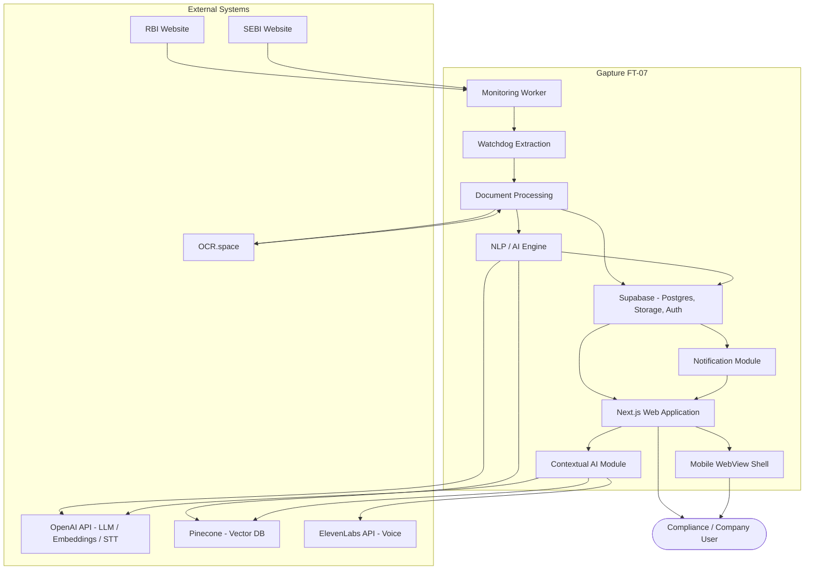

## 5. High-Level Architecture

```text
External Sources (RBI, SEBI)
       ↓
Monitoring Layer        (Node.js background worker — RSS + web retrieval)
       ↓
Ingestion Layer         (OCR → SHA-256 → AES-256 → Original Storage)
       ↓
Document Processing Layer (Cleaning → Normalization → Chunking)
       ↓
AI / Intelligence Layer (Embeddings → Pinecone → OpenAI LLM → 1-Line/Detailed/Summary)
       ↓
Data Layer              (Supabase PostgreSQL + Storage — single system of record)
       ↓
Application/API Layer   (Next.js Route Handlers / Server Actions, Supabase Auth)
       ↓
Presentation Layer      (Next.js Web Application + Notification UI + Voice UI)
       ↓
User (Web + Mobile WebView)
```

External services (OCR.space, OpenAI, Pinecone, ElevenLabs) sit alongside the Ingestion, Document Processing, and AI/Intelligence layers as invoked APIs — they are not Gapture-owned infrastructure.

### Diagram 2 — High-Level Architecture

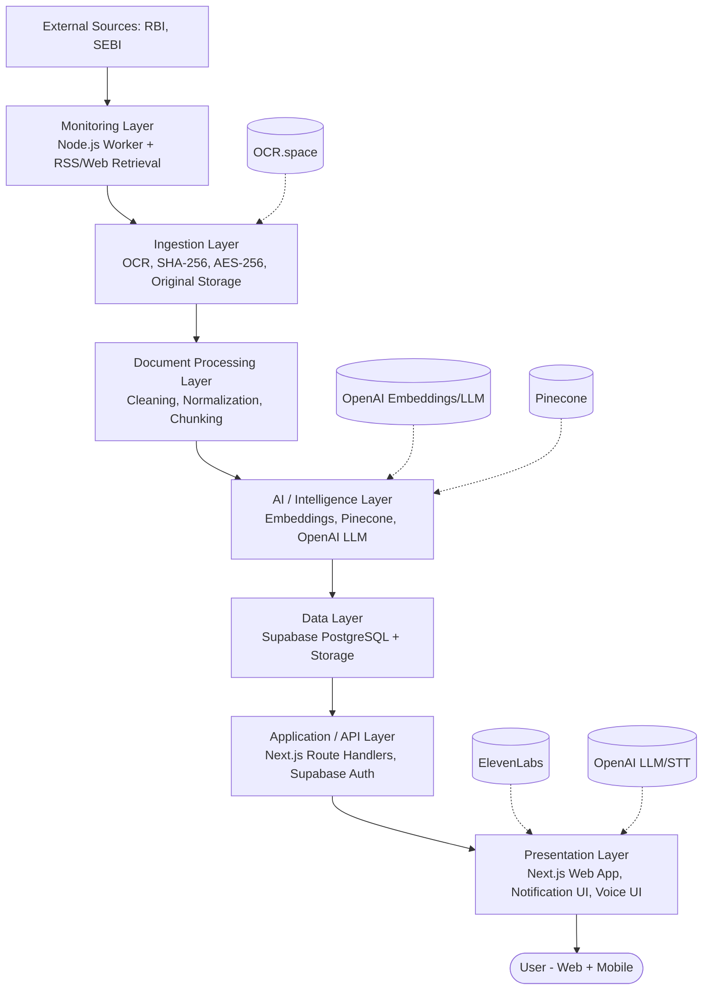

---

## 6. Logical Architecture

### Layer 1 — Regulatory Source Layer
RBI (website), SEBI (website), the RSS feeds each publishes where available, and direct web retrieval where RSS is not available (per PRD FR-02 and Tech Stack "RSS + web retrieval where required").

### Layer 2 — Monitoring Layer
Monitoring Scheduler/Loop; per-source Adapters (RBI Adapter, SEBI Adapter); Watchdog Extraction; New File Detection. Runs continuously as a Node.js background worker (PRD FR-02, FR-05; BRD BO-01/BO-02).

### Layer 3 — Document Ingestion Layer
File Retrieval; Document Validation; OCR (OCR.space); SHA-256 fingerprinting; AES-256 encryption; Original Document Storage (Supabase Storage). (PRD FR-06–FR-09.)

### Layer 4 — Document Intelligence Layer
OCR Data Processing; Document Cleaning; Document Normalization; Chunking. (PRD FR-10.)

### Layer 5 — Knowledge / Retrieval Layer
Embeddings (OpenAI); Pinecone vector index; regulatory-document vectors; company-policy vectors; retrieval-time metadata. (BRD §34–§35.)

### Layer 6 — AI / NLP Layer
Regulatory analysis; company-policy comparison; 1-Line generation; Detailed generation; Summary generation; Contextual Q&A. (PRD FR-11–FR-16, FR-23.)

### Layer 7 — Application Data Layer
Supabase PostgreSQL (system of record); Supabase Storage (original documents); Supabase Auth (identity). (PRD FR-17.)

### Layer 8 — Application/API Layer
Backend APIs (Next.js Route Handlers / Server Actions); Authentication APIs; Regulatory information APIs; Notification APIs; Contextual AI APIs.

### Layer 9 — Presentation Layer
Next.js Web Application; Notification UI; Regulatory detail UI ("View" / "Brief of Detailed NLP Data"); Voice UI (Voice Button). (PRD FR-18, FR-20, FR-21.)

### Layer 10 — Mobile Layer
Mobile App Shell; WebView Container; WebView rendering the same Next.js Web Application. No separate native implementation of regulatory-processing logic. (PRD §8–§14.)

## 7. Component Architecture

Where multiple responsibilities logically belong to one Node.js worker module or one Next.js backend module, that is noted explicitly rather than split into separate services — per Architecture Principle "avoid unnecessary microservices."

| # | Component | Responsibility | Input | Output | Technology | Sync/Async | Failure Consideration |
|---|---|---|---|---|---|---|---|
| 1 | RBI Source Adapter | Poll/fetch RBI website (RSS where available, web retrieval otherwise) | RBI RSS feed / RBI pages | Raw source items | Node.js, RSS parser, HTTP fetch | Async (worker loop) | Source unreachable → logged, loop continues (§21) |
| 2 | SEBI Source Adapter | Poll/fetch SEBI website (RSS where available, web retrieval otherwise) | SEBI RSS feed / SEBI pages | Raw source items | Node.js, RSS parser, HTTP fetch | Async (worker loop) | Same as above |
| 3 | Monitoring Worker | Owns the continuous monitoring loop; schedules adapters; orchestrates Watchdog invocation | Adapter outputs | Candidate items passed to Watchdog | Node.js background worker (single module hosting adapters 1–2) | Async, continuous | Worker crash → process restart; monitoring must not silently stop (BRD RISK-006) |
| 4 | RSS Processor | Parse RSS/Atom feeds into structured candidate-item records | Raw RSS XML | Structured feed items | Node.js RSS parser library | Sync (invoked by adapters) | Malformed feed → skip item, log, continue |
| 5 | Web Retrieval Module | Fetch and parse source pages where no RSS feed exists | Source page URLs | Structured page items | Node.js HTTP fetch + parser | Sync (invoked by adapters) | Page structure change → logged as monitoring anomaly (BRD RISK-001) |
| 6 | Watchdog Extraction | Determine "file found?" from monitoring output | Candidate items | YES (new file) / NO decision | Node.js (same worker process) | Sync (per polling cycle) | Ambiguous/partial item → treated as NO, re-evaluated next cycle |
| 7 | New File Detector | Confirm a detected item is genuinely new (not previously processed) | Candidate file metadata + existing fingerprints | Duplicate / New / Changed classification | Node.js + SHA-256 comparison against Postgres | Sync | Comparison failure → item held for retry, not silently dropped |
| 8 | Document Ingestion | Retrieve the actual file once Watchdog confirms YES | File reference/URL | Raw file bytes | Node.js | Async | Retrieval failure → retry with backoff; item stays in DETECTED state |
| 9 | OCR Service | Extract text/structure from the retrieved file | Raw file bytes | OCR data (text + structure) | OCR.space (external API) | Async (API call) | API failure/timeout → retry; item held at OCR_PROCESSING (§21) |
| 10 | Hashing Service | Compute a SHA-256 fingerprint of the original file for identity/dedup/integrity | Raw file bytes | SHA-256 hash | Node.js crypto (SHA-256) | Sync | Hash failure blocks storage — file cannot be securely stored/verified without it |
| 11 | Encryption Service | Encrypt the original file for storage confidentiality | Raw file bytes | AES-256-encrypted file | Node.js crypto (AES-256) | Sync | Encryption failure blocks storage; plaintext is never persisted |
| 12 | Original Document Storage | Persist the encrypted original file | Encrypted file + metadata | Stored object reference | Supabase Storage | Async | Storage failure → retry; processing branch does not reach TERMINATE until stored |
| 13 | Document Cleaning | Prepare OCR data for NLP (noise/layout cleanup) | OCR data | Cleaned document data | Node.js (backend module) | Async | Cleaning failure → item held at CLEANING, does not proceed to NLP with dirty data |
| 14 | Chunking | Split cleaned document/policy text into retrieval-sized segments | Cleaned document/policy data | Text chunks | Node.js (backend module) | Sync | Chunking failure → embedding step blocked for affected document |
| 15 | Embedding Service | Generate vector embeddings for chunks | Text chunks | Embedding vectors | OpenAI Embeddings API | Async (API call) | API failure → retry; item held at INDEXING |
| 16 | Pinecone Retrieval | Store and query semantic vectors | Embedding vectors (write) / query embedding (read) | Upsert confirmation / ranked matches | Pinecone (managed vector DB) | Async (API call) | Unavailable → analysis/Q&A degrades to "context unavailable," not a fabricated answer |
| 17 | Compliance Policy Context | Provide company-policy chunks/vectors as comparison context | Company policy documents | Policy chunks + policy vectors | Node.js + OpenAI Embeddings + Pinecone (reuses components 13–16) | Async | Same pipeline as regulatory documents; policy quality risk noted in BRD RISK-005 |
| 18 | NLP/LLM Service | Analyze cleaned regulatory data against retrieved policy context | Cleaned OCR data + retrieved policy/regulatory context | Structured analysis result | OpenAI API (LLM) | Async (API call) | API failure/timeout → retry; no partial/unlabeled output surfaced to users |
| 19 | Output Generation | Produce the three NLP outputs from the analysis result | NLP analysis result | 1-Line, Detailed, Summary | OpenAI API (same LLM call/module as #18) | Async | Missing output → item not marked COMPLETED (§24) |
| 20 | Supabase Backend | Single system-of-record backend for the application | All application data | Data accessible to Web Application/API layer | Supabase (PostgreSQL) | — | Outage → Web Application shows degraded/read-only state; worker queues continue writing on retry |
| 21 | Authentication | Authenticate/authorize users and sessions | User credentials / session tokens | Authenticated session | Supabase Auth | Sync | Auth outage → users cannot log in; existing sessions may continue per Supabase Auth session policy |
| 22 | Notification Service | Create/store/serve in-app notifications from NLP outputs | 1-Line (title) + Summary (description) | Notification record | Node.js/Next.js backend + Supabase Postgres | Async (creation) / Sync (read) | Creation failure → NLP output still stored; notification retried separately (§21) |
| 23 | Regulatory Information API | Serve regulatory document/analysis data to the Web Application | API request (authenticated) | Regulatory document + NLP outputs | Next.js Route Handlers | Sync | Standard request-level error handling; never leaks raw DB errors |
| 24 | Contextual Q&A Service | Answer user questions grounded in relevant regulatory/policy context | User question + view context | Contextual answer | Next.js backend + Pinecone + OpenAI | Sync (request/response) | Retrieval/LLM failure → explicit "unable to answer" response, never a fabricated one |
| 25 | Voice Service | Convert user voice interaction to/from text for the Contextual Q&A flow | Voice input / text response | Speech output / transcribed text | ElevenLabs API (voice) + OpenAI (speech-to-text) | Async (API call) | Voice API failure → falls back to text-only Q&A, per BRD RISK-004 |
| 26 | Next.js Frontend | Render the web experience: notifications, regulatory view, voice UI | Data from API layer | Rendered UI | Next.js + TypeScript | Sync (per request) | Standard client-side error boundaries |
| 27 | Mobile WebView | Host the Next.js Web Application inside a mobile app shell | Web Application URL/session | Rendered mobile experience | WebView-based application shell | Sync | No separate native regulatory-processing logic (PRD §12) — failures are Web Application failures |
| 28 | Error Handling / Retry Layer | Cross-cutting retry/backoff and processing-status tracking across worker and API components | Failed operation + component context | Retry attempt / logged failure state | Node.js (worker) + Next.js (API) + Postgres processing-state column | — | See §21 (Reliability and Failure Boundaries) for the full per-component failure matrix |

**Architecture Decision:** Components 1–7 (source adapters, RSS processor, web retrieval, Monitoring Worker, Watchdog, New File Detector) are implemented as a single Node.js background-worker module rather than separate deployable services. Components 13–19 (Document Cleaning through Output Generation) are implemented as a single Node.js/backend "Document Intelligence" module. This keeps the system a modular monolith plus one worker, consistent with Architecture Principle "avoid unnecessary microservices."

## 8. Detailed End-to-End Data Flow

### Flow A — Regulatory Monitoring

```text
RBI / SEBI → RSS / Web Retrieval → Monitoring Worker → Watchdog → New File Detection
```

The Monitoring Worker passes each source's raw feed/page items to the RSS Processor or Web Retrieval Module. Watchdog Extraction evaluates the resulting candidate items and emits a binary decision. On **NO**, the item (or absence of one) is discarded and the loop re-polls on its next cycle (PRD FR-05). On **YES**, a file reference (URL/identifier + source metadata) is handed to Document Ingestion.

### Diagram 3 — Regulatory Monitoring Flow

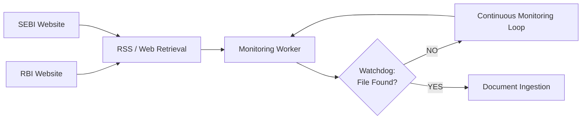

### Flow B — New File Processing

```text
New File → OCR → SHA-256 → AES-256 Encryption → Supabase Storage
```

* **Original file** — the raw bytes retrieved from the source; never persisted unencrypted.
* **Hash** — SHA-256 fingerprint of the original file, used for identity, duplicate detection, and integrity verification (not confidentiality).
* **Encrypted file** — the AES-256-encrypted original, the artifact actually persisted to Supabase Storage.
* **Metadata** — source (RBI/SEBI), retrieval timestamp, hash value, storage reference, file type — persisted in PostgreSQL.
* **Processing status** — the document's position in the processing-state model (§24), persisted in PostgreSQL alongside metadata.

Once the encrypted file is stored and metadata/status are recorded, this branch reaches **Terminate** (PRD FR-09) — the overall monitoring loop keeps running independently.

### Diagram 4 — Document Processing Flow

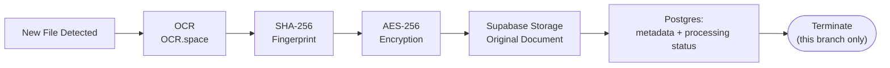

### Flow C — Document Intelligence

```text
OCR → Cleaning → Normalization → Chunking → Embeddings → Pinecone
```

OCR data is cleaned and normalized, then split into retrieval-sized chunks. Each chunk is embedded (OpenAI Embeddings) and upserted into Pinecone with metadata linking it back to its source document/clause location.

| Belongs in PostgreSQL | Belongs in Pinecone |
|---|---|
| Document/user/organization records, processing status, original-document metadata, NLP outputs (1-Line/Detailed/Summary), notifications, contextual Q&A history | Chunk-level vector embeddings of regulatory documents and company policies, plus the minimal metadata needed to resolve a match back to its PostgreSQL record |

---

## 9. PostgreSQL vs Pinecone Architecture

Both exist because they serve two structurally different jobs — one is the **system of record**, the other is a **semantic index**.

### PostgreSQL / Supabase — system-of-record data
users · organizations · regulatory documents · document metadata · processing state · NLP outputs (1-Line/Detailed/Summary) · notifications · policy metadata · contextual interactions (questions/answers).

### Pinecone — semantic retrieval data
regulatory-document embeddings · policy embeddings · chunk-level semantic representations · retrieval metadata (document ID, chunk position, source) needed to resolve a vector match back to PostgreSQL.

**Architecture Decision:** Pinecone is never the primary transactional database and is never queried for anything that requires strong consistency, uniqueness constraints, or relational integrity — those obligations belong to PostgreSQL. Pinecone is queried only to retrieve the *k* most semantically relevant chunks for a given piece of text (a new regulatory document, or a user's question).

---

## 10. Compliance Policy Architecture

Company compliance policies participate in the system as a second retrieval corpus, processed through the same pipeline as regulatory documents:

```text
Company Policy → Storage → Cleaning → Chunking → Embeddings → Pinecone → Retrieval → NLP / LLM
```

* **Storage** — original policy documents in Supabase Storage.
* **Cleaning/Chunking/Embeddings/Pinecone** — reuses components 13–17 from §7 rather than a duplicate pipeline.
* **Retrieval** — at analysis time, policy chunks relevant to the incoming regulatory document are retrieved from Pinecone and passed into the NLP/LLM comparison step (PRD FR-12).

**TBD / Requires Decision** (explicitly undefined by PRD FR-12 and BRD §28): policy upload mechanism, policy file formats, policy-training/re-ingestion mechanism, policy versioning, and policy categorization. This HLSA defines *where* company policy fits in the architecture, not a policy-management product module — no such module is introduced, per PRD §30.2.

### Diagram 5 (part 1) — Company Policy Ingestion into the RAG Layer

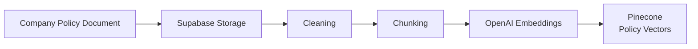

## 11. AI / NLP Architecture

```text
Regulatory Document + Company Compliance Policies
        ↓
Relevant Context Retrieval (Pinecone)
        ↓
OpenAI (LLM)
        ↓
Regulatory Intelligence
        ↓
1-Line / Detailed / Summary
```

**Preprocessing → chunking → embedding → semantic retrieval → context construction → prompt orchestration → LLM generation → output persistence:**

1. *Preprocessing/chunking/embedding* — covered in §8 Flow C and §10.
2. *Semantic retrieval* — the newly ingested regulatory document's chunks (and/or its cleaned full text, per implementation decision) are used to retrieve the most relevant company-policy chunks from Pinecone.
3. *Context construction* — retrieved policy chunks + the cleaned regulatory content are assembled into a single grounded context window.
4. *Prompt orchestration* — the NLP/LLM Service (component 18) issues a structured OpenAI API call against that context, requesting the three defined outputs.
5. *LLM generation* — OpenAI returns the analysis; **Architecture Decision:** the model is prompted for structured output (three explicit fields) rather than free text, to keep 1-Line/Detailed/Summary reliably separable.
6. *Output persistence* — 1-Line, Detailed, and Summary are written to PostgreSQL (component 20), each linked to the source regulatory document record.

### Diagram 5 (part 2) — AI / NLP Analysis Flow

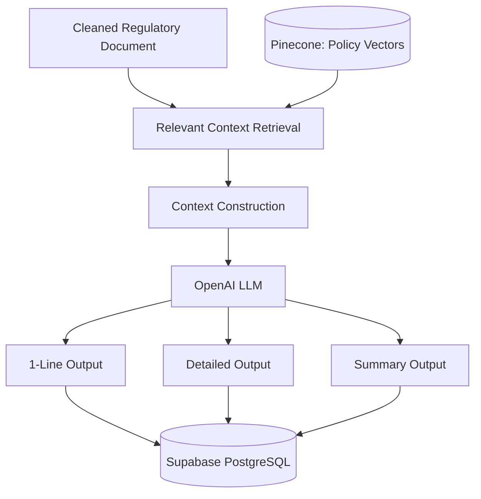

---

## 12. Contextual Q&A Architecture

```text
User Question → Next.js → Backend → Relevant Context Retrieval → Pinecone →
Regulatory + Policy Context → OpenAI → Contextual Answer → User
```

The Contextual Q&A Service (component 24) takes the user's question together with the regulatory document the user is currently viewing, retrieves the most relevant regulatory and policy chunks from Pinecone for that question, and passes question + retrieved context to OpenAI. **Architecture Decision:** the answer is always grounded in retrieved context for the specific document in view — no unrelated general-purpose AI chat functionality is introduced, per PRD FR-23's "with respect to the relevant context" requirement.

### Diagram 8 — Contextual Q&A Flow

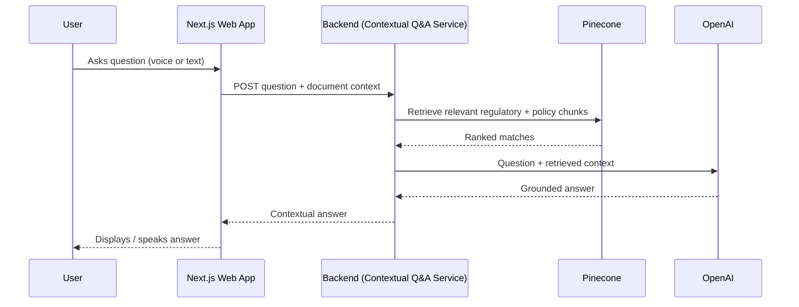

---

## 13. Voice Architecture

```text
User → Voice Button → Voice Interaction → ElevenLabs / Speech Layer → OpenAI → Contextual Response
```

The Voice Button (PRD FR-21) triggers ElevenLabs (FR-22). Where the user's *input* is spoken, speech-to-text is handled by OpenAI before the question reaches the Contextual Q&A Service (§12); ElevenLabs is used for the *voice-out* side of the interaction. The LLM stage (FR-23) is the same Contextual Q&A Service described in §12 — voice is an input/output modality around it, not a separate AI pipeline.

**TBD / Requires Decision** (explicitly undefined by PRD FR-22): specific ElevenLabs voice/model selection, target language(s), audio streaming method, and audio format.

### Diagram 9 — Voice Flow

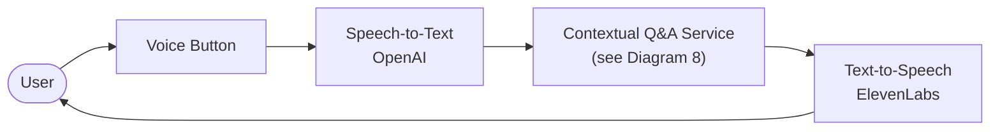

---

## 14. Notification Architecture

```text
NLP Output
   ↓
1-Line → Notification Title
Summary → Notification Description
   ↓
Supabase
   ↓
Next.js
   ↓
In-App Notification
```

**Lifecycle:**

| Stage | Description |
|---|---|
| Creation | Once Output Generation (component 19) produces 1-Line and Summary for a completed analysis, the Notification Service (component 22) creates a notification record. |
| Storage | The notification record (title = 1-Line, description = Summary, reference to the source document) is stored in Supabase PostgreSQL. |
| Retrieval | The Web Application queries Supabase for the current user's notifications via the Regulatory Information API. |
| Display | Next.js renders notifications and prompts the user to log in / view (PRD FR-19). |
| User click | Navigates to the regulatory "View," which shows the **Brief of Detailed NLP Data** (the Detailed output) — PRD FR-20. |
| Destination | The regulatory detail view, from which the Voice Button and Contextual Q&A are reachable. |

**Architecture Decision (per PRD FR-19 and BRD §30):** MVP notification delivery is **in-app only** — no email, SMS, or push-notification provider is introduced for FT-07, per Tech Stack and PRD out-of-scope guidance.

### Diagram 7 — Notification Flow

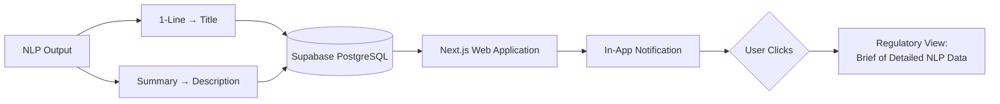

## 15. Authentication and Authorization

**Technology:** Supabase Auth.

* **Authentication boundary** — all user identity and session issuance is handled by Supabase Auth; the Next.js frontend never manages passwords or tokens directly.
* **Session handling** — Supabase Auth issues a session on login; the Next.js frontend and backend both validate this session before serving regulatory data, notifications, or contextual Q&A.
* **Frontend/backend interaction** — the frontend uses the Supabase publishable key for auth flows; privileged/service-role operations happen only in server-side Route Handlers/Server Actions, never in the browser.
* **Authorization boundary** — access to company-scoped data (documents, policies, notifications) is checked server-side against the authenticated session, not trusted from client-supplied identifiers.
* **Access to documents/policies** — a user can only retrieve regulatory documents, NLP outputs, and policy-derived content associated with their own organization/session.

**TBD / Requires Decision:** a detailed organization-level RBAC model (admin vs. standard user permissions) is not defined in the PRD/BRD (BRD §10.3 marks the Platform Administrator persona and its permissions as proposed/TBD). This HLSA does not invent one.

### Diagram 10 — Authentication Flow

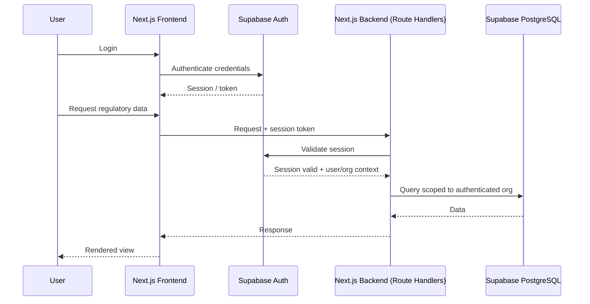

---

## 16. Document Security Architecture

```text
Regulatory File → SHA-256 → AES-256 Encryption → Secure Storage
```

* **Hashing (SHA-256)** — used for document identity, duplicate detection, and integrity verification. **SHA-256 is hashing, not encryption; it provides no confidentiality.**
* **Encryption (AES-256)** — provides confidentiality for the stored original file. Applied after hashing, before persistence.
* **Storage separation** — the encrypted original document (Supabase Storage) is stored separately from OCR/processed text data and separately from NLP outputs (PostgreSQL) — OCR data is never treated as a replacement for the original file (PRD FR-08).
* **Access control** — document access is mediated through the same authenticated-session boundary described in §15; no direct public access to Storage objects.
* **Original document preservation** — the original encrypted file is retained independent of any downstream processing failure, so re-processing never requires re-fetching from the source.

---

## 17. API Architecture

Conceptual API boundaries only — no exact REST paths are prescribed beyond illustrative examples, per PRD §30.3 ("specific API architecture" is left to the architecture stage).

| API Area | Consumer | Purpose | Auth | Downstream Dependencies |
|---|---|---|---|---|
| Authentication | Web App, Mobile WebView | Login/session issuance and validation | Supabase Auth | Supabase Auth |
| Regulatory Documents | Web App | List/retrieve regulatory documents + their NLP outputs | Session-required | Supabase PostgreSQL |
| Document Status | Internal worker, admin views | Expose processing-state of a document (§24) | Session-required (admin views) / internal (worker) | Supabase PostgreSQL |
| Notifications | Web App | List/retrieve/mark-read user notifications | Session-required | Supabase PostgreSQL |
| Compliance-Policy Context | NLP/AI Engine (internal) | Supply retrieved policy context for analysis | Internal (server-side only) | Pinecone, Supabase Storage |
| Contextual Q&A | Web App (Voice UI + text) | Answer a question grounded in the currently-viewed document | Session-required | Pinecone, OpenAI |
| Voice Interaction | Web App (Voice Button) | Convert voice ↔ text around the Contextual Q&A API | Session-required | ElevenLabs, OpenAI (STT) |

**Architecture Decision:** all external-API credentials (OpenAI, OCR.space, Pinecone, ElevenLabs) are used exclusively from server-side code (Route Handlers / Server Actions / the background worker) — never from the browser.

---

## 18. Background Worker Architecture

Continuous regulatory monitoring (PRD §26.1–§26.2) cannot live inside Vercel's request/response execution model, which is designed for short-lived, invocation-triggered functions rather than an always-on polling loop. A **Node.js background worker**, hosted independently of the Vercel-deployed Next.js application, owns the Monitoring, Watchdog, and Ingestion-trigger responsibilities.

```text
Worker → RBI / SEBI Monitoring → Watchdog → Processing Trigger → Backend / Processing Services
```

* **Scheduling** — the worker runs its own polling loop/interval per source (RBI, SEBI); no external cron dependency is required for MVP, though a managed scheduler is an available Architecture Decision if the hosting platform requires it.
* **Continuous execution** — the worker process is long-running, independent of user traffic.
* **Retries** — transient failures (source unreachable, OCR timeout, embedding API timeout) are retried with backoff at the component level (§21); the worker loop itself is never blocked by a single failed item.
* **Failure recovery** — worker crash triggers a process-level restart (host-managed); in-flight processing state is resumable because processing state lives in PostgreSQL, not in worker memory.
* **Duplicate prevention** — the New File Detector (component 7) compares each newly discovered item's SHA-256 fingerprint against existing fingerprints in PostgreSQL before triggering ingestion, preventing reprocessing of an already-seen document.
* **Processing status** — every document's progress through ingestion/intelligence is tracked as a state on its PostgreSQL record (§24), so status is visible without depending on worker memory.

**Architecture Decision:** no Kubernetes or multi-node worker orchestration for MVP — a single long-running Node.js worker process is sufficient at FT-07's scope (RBI + SEBI only).

## 19. Deployment Architecture

| Concern | Deployment Target |
|---|---|
| Application hosting | Vercel (Next.js web application) |
| Worker hosting | Node.js background worker, hosted independently of the Vercel request/response runtime (Architecture Decision — see §18) |
| Managed services | Supabase (PostgreSQL, Storage, Auth), Pinecone |
| External APIs | OpenAI, OCR.space, ElevenLabs |
| Source control | Git + GitHub |

### Diagram 11 — Deployment Architecture

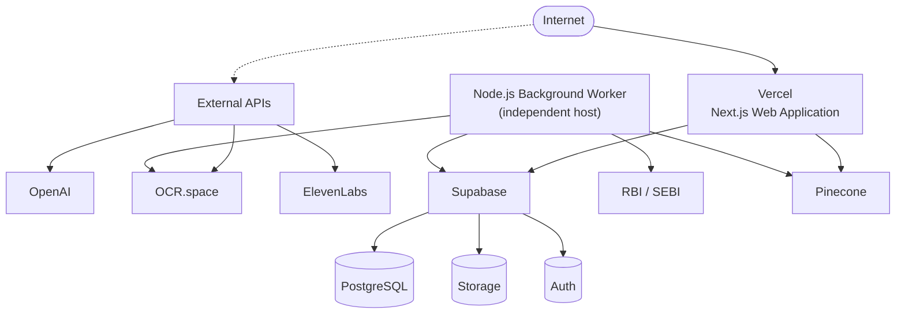

---

## 20. Environment and Configuration Architecture

### Frontend Configuration (public)
Public application configuration only (e.g. public Supabase URL, publishable key) — nothing that grants privileged access.

### Backend Secrets (server-side only)
Supabase service-role credentials · OpenAI API key · OCR.space credentials · Pinecone API key · ElevenLabs API key.

**Security Rule:** private API keys are never exposed to the browser. All server-only secrets are read exclusively inside Route Handlers, Server Actions, or the background worker process.

Exact environment-variable names are an implementation detail for the module-level Deployment/Backend architecture documents, unless already fixed by the hosting platform's conventions.

---

## 21. Reliability and Failure Boundaries

| Failure | Boundary | Retry? | Processing State Impact | Monitoring Loop Continues? | User-Visible Error? |
|---|---|---|---|---|---|
| RBI source unavailable | Monitoring Worker | Yes, next poll cycle | No document affected (nothing detected) | Yes | No |
| SEBI source unavailable | Monitoring Worker | Yes, next poll cycle | No document affected | Yes | No |
| RSS fails | Source Adapter | Yes, falls back to web retrieval if configured, else retries | No document affected | Yes | No |
| Web retrieval fails | Source Adapter | Yes, next poll cycle | No document affected | Yes | No |
| OCR fails | Document Ingestion | Yes, with backoff | Held at `OCR_PROCESSING` | Yes | Not directly; visible only via admin/status view |
| Hashing fails | Hashing Service | Yes (in-process retry) | Held before `SECURED` — storage blocked | Yes | No |
| Encryption fails | Encryption Service | Yes (in-process retry) | Held before `SECURED` — storage blocked | Yes | No |
| Storage fails | Original Document Storage | Yes, with backoff | Held at `SECURED`, not yet `STORED` | Yes | No |
| Document cleaning fails | Document Cleaning | Yes | Held at `CLEANING` | Yes | No |
| Embedding fails | Embedding Service | Yes, with backoff | Held at `INDEXING` | Yes | No |
| Pinecone fails | Pinecone Retrieval | Yes, with backoff (writes); reads degrade to "context unavailable" | Held at `INDEXING` (writes) / analysis or Q&A returns explicit unavailable state (reads) | Yes | Yes, for live Q&A only |
| OpenAI fails | NLP/LLM Service, Contextual Q&A, Embeddings | Yes, with backoff | Held at `ANALYZING` (analysis) / Q&A returns explicit unavailable state | Yes | Yes, for live Q&A only |
| ElevenLabs fails | Voice Service | Yes; falls back to text-only Q&A | No document processing impact | Yes | Yes (voice unavailable, text still works) |
| Supabase fails | Supabase Backend | Yes, with backoff | Worker queues hold state until Supabase recovers | Yes (worker) | Yes (Web App shows degraded state) |
| Notification creation fails | Notification Service | Yes, independent of analysis completion | NLP output remains stored regardless | Yes | No (retried transparently) |

Failure handling is implementation-level, per PRD §25 / BRD §42 — no new user-facing product workflow states are introduced by these boundaries; they only govern retry, status, and continuity.

### Diagram 13 — Failure / Retry Boundary

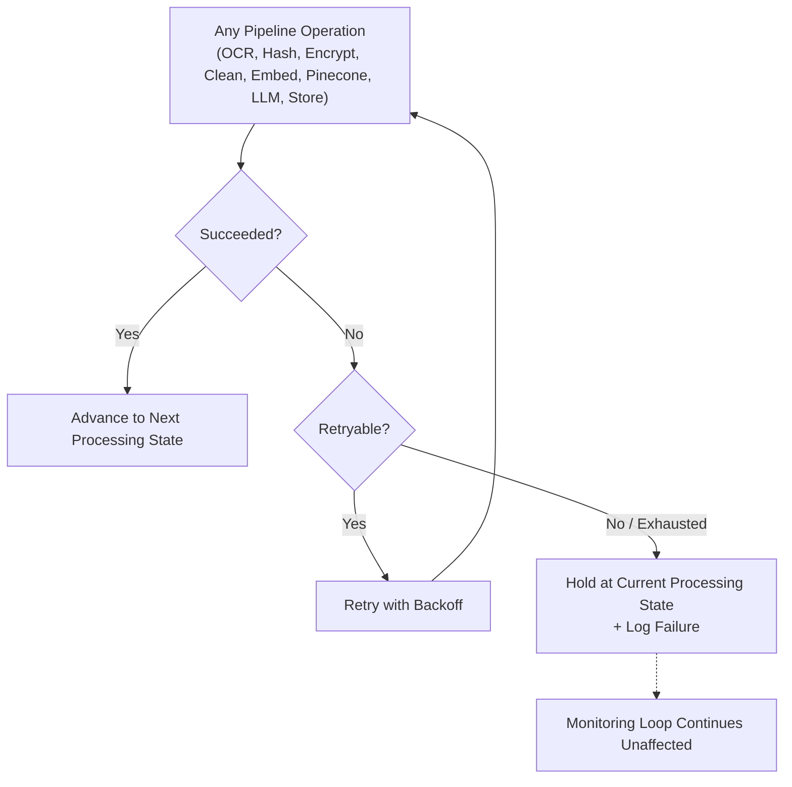

---

## 22. Observability

High-level observability requirements, using logs and processing states rather than a prescribed vendor:

* **Monitoring worker** — poll cycle start/end, source reachability, items found per cycle.
* **Source retrieval** — per-source success/failure, RSS vs. web-retrieval path used.
* **Document processing** — state transitions (§24) per document, with timestamps.
* **OCR** — request/response status, latency, failure reason.
* **AI processing** — embedding and LLM call success/failure, retry counts.
* **Storage** — upload success/failure for original documents.
* **API requests** — standard request logging on Route Handlers (status, latency, auth outcome).
* **Notifications** — creation success/failure, delivery-to-UI confirmation.
* **Contextual AI** — question volume, retrieval hit/miss, "unable to answer" rate.

**Architecture Decision Required (TBD):** specific observability/logging vendor (e.g. hosted log aggregation) is not mandated by the PRD/BRD and is left as a future architecture decision; structured application logs plus the PostgreSQL processing-state column are sufficient for MVP observability.

## 23. Data Lifecycle

```text
Detected → Retrieved → OCR Processed → Hashed → Encrypted → Original Stored →
Cleaned → Chunked → Embedded → Indexed → Analyzed → Outputs Generated →
Stored → Displayed → Contextual Interaction
```

| Stage | Artifact Stored |
|---|---|
| Detected | Source reference (URL/identifier), source metadata — Postgres |
| Retrieved | Raw file bytes — transient, in-memory/worker-local |
| OCR Processed | OCR data (text + structure) — transient until cleaned, or persisted as intermediate per implementation |
| Hashed | SHA-256 fingerprint — Postgres |
| Encrypted | AES-256-encrypted file bytes — transient until stored |
| Original Stored | Encrypted original document — Supabase Storage; storage reference — Postgres |
| Cleaned | Cleaned document data — transient/intermediate |
| Chunked | Text chunks — transient, feeding the embedding step |
| Embedded | Embedding vectors — transient, feeding Pinecone upsert |
| Indexed | Vectors + retrieval metadata — Pinecone |
| Analyzed | LLM analysis result — transient, feeding output generation |
| Outputs Generated | 1-Line, Detailed, Summary — Postgres |
| Stored | Notification record (title/description/reference) — Postgres |
| Displayed | Rendered in Next.js Web Application — no separate persistence |
| Contextual Interaction | Question + answer pairs — Postgres |

### Diagram 12 — Data Lifecycle

```mermaid
flowchart LR
    A["Detected"] --> B["Retrieved"]
    B --> C["OCR Processed"]
    C --> D["Hashed"]
    D --> E["Encrypted"]
    E --> F["Original Stored"]
    F --> G["Cleaned"]
    G --> H["Chunked"]
    H --> I["Embedded"]
    I --> J["Indexed"]
    J --> K["Analyzed"]
    K --> L["Outputs Generated"]
    L --> M["Stored"]
    M --> N["Displayed"]
    N --> O["Contextual Interaction"]
```

---

## 24. Processing State Model

**Architecture Decision** — the following state model is proposed to track a document's progress; it is an implementation mechanism, not a new user-facing product feature (PRD §25 explicitly leaves this open).

```text
DETECTED → RETRIEVED → OCR_PROCESSING → SECURED → STORED →
CLEANING → INDEXING → ANALYZING → COMPLETED
```

| State | Meaning |
|---|---|
| `DETECTED` | Watchdog confirmed a new file; not yet retrieved |
| `RETRIEVED` | Raw file bytes fetched |
| `OCR_PROCESSING` | OCR in progress/complete, awaiting hash+encrypt |
| `SECURED` | SHA-256 hashed and AES-256 encrypted |
| `STORED` | Original document persisted to Supabase Storage |
| `CLEANING` | Document cleaning/normalization in progress |
| `INDEXING` | Chunking + embedding + Pinecone upsert in progress |
| `ANALYZING` | NLP/LLM comparison against policy context in progress |
| `COMPLETED` | 1-Line, Detailed, Summary generated and persisted; notification eligible |

A failure at any state holds the document at that state (§21) rather than silently advancing it. **Architecture Decision:** a `FAILED` sub-state (per stage) may be added at implementation time for operational visibility; this is not a product-facing status.

---

## 25. Duplicate and Change Detection

```text
Document → SHA-256 → Fingerprint → Compare with Existing Fingerprints → Duplicate / New / Changed
```

SHA-256 fingerprints are compared against previously stored fingerprints (New File Detector, component 7) to classify an incoming file as a **duplicate** (already processed, skip), **new** (no prior fingerprint, process), or **changed** (same source item, different fingerprint from a prior version — architecture-level signal only).

**This is strictly an architectural use of the hash for identity/deduplication/integrity — it is not a "regulatory change comparison" product capability.** Clause-level or version-to-version regulatory comparison is explicitly out of scope (PRD §30.2 / §34).

* Duplicate detection — allowed (architecture-level).
* Integrity/fingerprint handling — allowed (architecture-level).
* A separate regulatory change-comparison product feature — out of scope.

---

## 26. Security Architecture

| Boundary | Approach |
|---|---|
| Authentication | Supabase Auth (§15) |
| Authorization | Server-side session validation; org-scoped data access (§15) |
| Secret management | Server-side-only environment variables (§20); never exposed to the browser |
| API security | Session-required Route Handlers; input validation; no raw DB errors leaked to clients |
| Document encryption | AES-256 on original files (§16) |
| Secure storage | Supabase Storage, access mediated through the authenticated-session boundary |
| Database access | Server-side only for privileged operations; Postgres accessed via Supabase with credentials never exposed client-side |
| Vector database access | Pinecone accessed only from server-side code (worker + backend), never from the browser |
| External API credentials | OpenAI, OCR.space, Pinecone, ElevenLabs keys held server-side only (§20) |
| Frontend/backend separation | Next.js Server Components/Route Handlers hold privileged logic; Client Components hold no secrets |

No compliance certifications or legal claims (e.g. SOC 2, ISO 27001) are asserted by this architecture — none are defined in the source documents.

## 27. Scalability Considerations

Ways the architecture could scale without changing FT-07's current product scope:

* **Worker scaling** — the single Node.js monitoring worker could be split per-source (RBI worker, SEBI worker) if polling volume grows; still no orchestration platform required.
* **Document-processing concurrency** — OCR/embedding/LLM calls per document are already async and independently retryable, so multiple documents can be in-flight concurrently without architectural change.
* **Database scaling** — Supabase/PostgreSQL scales vertically and via read replicas as a managed-service capability, if needed.
* **Pinecone scaling** — a managed vector database; index size/QPS scale via Pinecone's own tiering, not custom infrastructure.
* **API scaling** — Vercel scales Next.js request handling automatically as a platform capability.
* **AI request management** — OpenAI/OCR.space/ElevenLabs call volume is managed via request queuing/backoff already described in §21, not new infrastructure.

**Explicitly not required for MVP:** Kafka, Kubernetes, Redis, RabbitMQ, or a microservices decomposition. If any of these are considered later, they should be evaluated against a genuine, demonstrated scaling need — not adopted speculatively.

---

## 28. Performance Considerations

The source PRD defines no numerical SLAs (§26), so this architecture does not invent latency, throughput, or uptime targets. Instead:

* **Monitoring continuity** — the worker loop should run continuously without manual intervention (§18).
* **Processing reliability** — a detected file should reliably progress through the pipeline or be visibly held/retried, never silently lost (§21, §24).
* **Responsive application behavior** — the Web Application should serve already-processed data quickly, since heavy processing (OCR/NLP) happens asynchronously in the worker/backend, not in the request path.
* **Asynchronous processing** — OCR, embedding, and LLM calls are asynchronous relative to the user-facing request/response cycle.

**TBD:** specific latency targets, throughput targets, and uptime percentages.

---

## 29. Architecture Decisions

| ID | Decision | Rationale | Status |
|---|---|---|---|
| AD-01 | Next.js for frontend + backend | Approved stack; unifies UI and API layer in one framework | Approved |
| AD-02 | TypeScript across frontend/backend/worker | Approved stack; type safety across the modular monolith | Approved |
| AD-03 | Node.js for backend and worker runtime | Approved stack; shared language with frontend, good ecosystem for scraping/processing | Approved |
| AD-04 | Supabase / PostgreSQL as the single system of record | Approved stack; satisfies PRD FR-17's "one Supabase Backend" requirement | Approved |
| AD-05 | Supabase Storage for original documents | Approved stack; keeps original-document storage inside the same managed platform as Postgres/Auth | Approved |
| AD-06 | Supabase Auth for authentication | Approved stack; avoids building custom auth | Approved |
| AD-07 | Pinecone as the semantic retrieval layer | Approved stack; managed vector DB, kept separate from the transactional database (§9) | Approved |
| AD-08 | OCR.space for OCR | Approved stack | Approved |
| AD-09 | OpenAI API for LLM, embeddings, and speech-to-text | Approved stack | Approved |
| AD-10 | ElevenLabs API for voice interaction | Approved stack | Approved |
| AD-11 | RSS + web retrieval for regulatory monitoring | Approved stack; matches PRD FR-02's "may use RSS where available" | Approved |
| AD-12 | SHA-256 for fingerprinting/dedup/integrity (not confidentiality) | Approved stack; explicit PRD/BRD instruction that SHA-256 ≠ encryption | Approved |
| AD-13 | AES-256 for document encryption | Approved stack | Approved |
| AD-14 | Vercel for web hosting | Approved stack | Approved |
| AD-15 | Node.js background worker, hosted separately from the Vercel request/response runtime | Continuous monitoring cannot run reliably inside a request-triggered serverless model (§18) | Approved |
| AD-16 | WebView-based mobile application shell | Approved stack; PRD §8–§14 define exactly this path, with no separate native regulatory-processing logic | Approved |
| AD-17 | In-app notifications only for MVP | Approved stack; PRD/BRD do not define email/SMS/push providers | Approved |
| AD-18 | Modular monolith (one Next.js app + one worker) instead of microservices | Architecture Principle; avoids unnecessary infrastructure at MVP scope | Approved |
| AD-19 | Structured (not free-text) LLM output for 1-Line/Detailed/Summary | Keeps the three defined outputs reliably separable and persistable | Approved (Architecture Decision) |
| AD-20 | Nine-state processing-state model (`DETECTED`→`COMPLETED`) | Gives operational visibility into pipeline progress without becoming a user-facing feature | Approved (Architecture Decision) |

---

## 30. Requirements-to-Architecture Traceability

| PRD/BRD Requirement | Architecture Component | Technology | Data Flow |
|---|---|---|---|
| FR-01 Regulatory Source Input (RBI, SEBI) | RBI/SEBI Source Adapters | Node.js, RSS parser, HTTP fetch | Flow A |
| FR-02 Source Monitoring Platform | Monitoring Worker | Node.js background worker | Flow A |
| FR-03 Watchdog Extraction | Watchdog Extraction | Node.js (worker) | Flow A |
| FR-04 If File Found? | Watchdog Extraction decision | Node.js (worker) | Flow A |
| FR-05 Continuous Monitoring Loop | Monitoring Worker loop | Node.js background worker | Flow A |
| FR-06 OCR | OCR Service | OCR.space | Flow B |
| FR-07 SHA256 and Encryption | Hashing Service, Encryption Service | Node.js crypto (SHA-256, AES-256) | Flow B |
| FR-08 Store Original | Original Document Storage | Supabase Storage | Flow B |
| FR-09 Terminate | End of Flow B branch | — | Flow B |
| FR-10 Document Cleaning | Document Cleaning | Node.js (backend module) | Flow C |
| FR-11 NLP Processing | NLP/LLM Service | OpenAI API | §11 |
| FR-12 Trained Company Compliance Policies | Compliance Policy Context | Node.js + OpenAI Embeddings + Pinecone | §10 |
| FR-13 1-Line Output | Output Generation | OpenAI API | §11 |
| FR-14 Detailed Output | Output Generation | OpenAI API | §11 |
| FR-15 Summary Output | Output Generation | OpenAI API | §11 |
| FR-16 NLP Output Structure | Output Generation (structured output) | OpenAI API | §11 |
| FR-17 Supabase Backend (single) | Supabase Backend | Supabase PostgreSQL | §9, §14 |
| FR-18 Web Application | Next.js Frontend | Next.js, TypeScript | §14 |
| FR-19 Notify to Login | Notification Service | Supabase Postgres + Next.js | §14 |
| FR-20 Notification Viewing / Detailed Info | Notification Service + Regulatory Information API | Next.js, Supabase Postgres | §14 |
| FR-21 Voice Button | Voice Service (trigger) | Next.js Frontend | §13 |
| FR-22 ElevenLabs | Voice Service | ElevenLabs API | §13 |
| FR-23 LLM Contextual Question Handling | Contextual Q&A Service | OpenAI API, Pinecone | §12 |
| §8–§14 Mobile Experience | Mobile WebView | WebView-based application shell | §6 Layer 10 |
| §22 Security / Document Handling | Hashing Service, Encryption Service, Storage | SHA-256, AES-256, Supabase Storage | §16 |
| BO-01/BO-02 Continuous Monitoring, New File Detection | Monitoring Worker, Watchdog, New File Detector | Node.js worker | §18 |
| BR-016 Single Supabase Backend | Supabase Backend | Supabase PostgreSQL | §9 |
| BRD §35 Business-Level AI Retrieval Model | Embedding Service, Pinecone Retrieval | OpenAI Embeddings, Pinecone | §9, §11 |

---

## 31. Architecture-to-Technology Traceability

| Architecture Component | Technology | Reason |
|---|---|---|
| Monitoring Worker, Watchdog, New File Detector | Node.js | Approved backend/worker runtime; shares language with backend |
| RSS Processor / Web Retrieval Module | RSS parser + Node.js HTTP fetch | Matches "RSS + web retrieval where required" from Tech Stack |
| OCR Service | OCR.space | Approved OCR technology |
| Hashing Service | SHA-256 (Node.js crypto) | Approved hashing technology; correctly scoped to identity/integrity, not confidentiality |
| Encryption Service | AES-256 (Node.js crypto) | Approved encryption technology |
| Original Document Storage | Supabase Storage | Approved file-storage technology; part of the single Supabase backend |
| Document Cleaning, Chunking | Node.js (backend module) | No dedicated technology specified; implemented in the same backend runtime |
| Embedding Service | OpenAI Embeddings | Approved embeddings technology |
| Pinecone Retrieval | Pinecone | Approved vector database |
| NLP/LLM Service, Output Generation, Contextual Q&A | OpenAI API | Approved LLM technology |
| Voice Service | ElevenLabs API + OpenAI (STT) | Approved voice technology; STT via OpenAI per Tech Stack |
| Supabase Backend | Supabase (PostgreSQL, Storage, Auth) | Approved backend platform; satisfies the single-backend requirement |
| Next.js Frontend / API Layer | Next.js + TypeScript | Approved frontend/backend framework |
| Mobile WebView | WebView-based application shell | Approved mobile architecture |
| Web Hosting | Vercel | Approved hosting platform |
| Source Control | Git + GitHub | Approved source-control tooling |

## 32. MVP Architecture

### Required for MVP
* RBI + SEBI monitoring only (no other regulatory sources).
* Single Node.js background worker for monitoring, Watchdog, and processing triggers.
* Full document-processing pipeline: OCR → SHA-256 → AES-256 → Original Storage.
* Document Intelligence pipeline: Cleaning → Chunking → Embeddings → Pinecone.
* NLP/LLM analysis producing 1-Line, Detailed, and Summary outputs.
* Single Supabase Backend (PostgreSQL + Storage + Auth).
* Next.js Web Application with in-app notifications.
* Voice Button → ElevenLabs → OpenAI contextual Q&A, grounded in Pinecone retrieval.
* WebView-based mobile shell wrapping the Web Application.
* In-app notifications only.

### Future / Production Enhancements
* Additional regulatory sources beyond RBI/SEBI (explicitly future — not current scope).
* Multi-worker/per-source worker scaling.
* Additional notification channels (email/SMS/push).
* Enterprise key-management (KMS) beyond application-managed AES-256.
* Advanced observability/log-aggregation tooling.
* Formal RBAC/organization-role model.
* Production-grade scaling of Pinecone/Postgres beyond MVP tiers.

---

## 33. Future Architecture Considerations

Mentioned only as future considerations — not current requirements:

* Additional regulatory sources (e.g. reintroducing FIU-IND, or other regulators, if a future product decision adds them).
* Larger-scale worker orchestration (multi-node, queue-based) if monitoring volume grows substantially.
* Enterprise KMS for encryption-key management.
* Advanced observability (metrics dashboards, alerting, distributed tracing).
* Additional notification channels.
* Additional policy-management capabilities (upload UI, versioning, categorization).
* Production-grade scaling across all managed services.
* The broader Gapture platform vision — obligation extraction, control mapping, gap scoring, remediation workflow, evidence/audit management — remains a distinct, larger product direction outside FT-07's current scope (see §2).

---

## 34. Explicitly Out-of-Scope Architecture

This architecture does **not** include active modules for:

* FIU / FIU-IND monitoring or processing.
* Risk scoring.
* Risk hierarchy.
* Remediation management.
* Automated compliance-status classification.
* Evidence management.
* Audit management.
* Regulatory change comparison (clause-level or version-to-version).
* Clause-level comparison.
* Knowledge graph.
* Control mapping.
* Department mapping.
* Policy drift detection.

Per PRD §30.2 and BRD §8, none of these are defined by the current workflow; none are represented as active components anywhere in this document. The SHA-256 fingerprinting in §25 supports deduplication and integrity only, and must not be read as an implementation of "regulatory change comparison."

---

## 35. Glossary

| Term | Definition |
|---|---|
| Gapture | The product name for this platform ("Gaps, Captured") |
| FT-07 | The project identifier for the current Regulatory Compliance Intelligence Platform scope |
| RBI | Reserve Bank of India — a monitored regulatory source |
| SEBI | Securities and Exchange Board of India — a monitored regulatory source |
| OCR | Optical Character Recognition — extracting text/structure from a document image/file |
| NLP | Natural Language Processing — the analysis stage comparing regulatory content to company policy |
| LLM | Large Language Model — used for NLP analysis and contextual Q&A (OpenAI) |
| RAG | Retrieval-Augmented Generation — retrieving relevant chunks (via Pinecone) before LLM generation |
| Embedding | A vector representation of text used for semantic search |
| Pinecone | The managed vector database used for semantic retrieval |
| SHA-256 | A cryptographic hash function used here for fingerprinting/identity/integrity, not encryption |
| AES-256 | A symmetric encryption algorithm used here to encrypt stored original documents |
| Supabase | The managed backend platform providing PostgreSQL, Storage, and Auth |
| WebView | A component that renders web content inside a native mobile app shell |
| Watchdog | The component that decides whether a monitoring cycle found a new file |
| Regulatory Document | A file detected from RBI or SEBI and processed through the pipeline |
| Compliance Policy | A company's own policy document, used as comparison context for NLP analysis |

---

## 36. Final Architecture Summary

**Summary.** FT-07 is a modular-monolith architecture: one Next.js web application, one Node.js background worker, and Supabase as the single system-of-record backend, augmented by four external AI/media services (OCR.space, OpenAI, Pinecone, ElevenLabs). The worker continuously monitors RBI and SEBI; detected files are hashed, encrypted, and stored before being cleaned, chunked, embedded, and compared against company policy context via retrieval-augmented LLM analysis. The resulting 1-Line, Detailed, and Summary outputs drive in-app notifications and a detail view, from which a voice-enabled, context-grounded LLM Q&A experience is reachable. The same web experience is delivered to mobile through a WebView shell.

### Complete Architecture Diagram

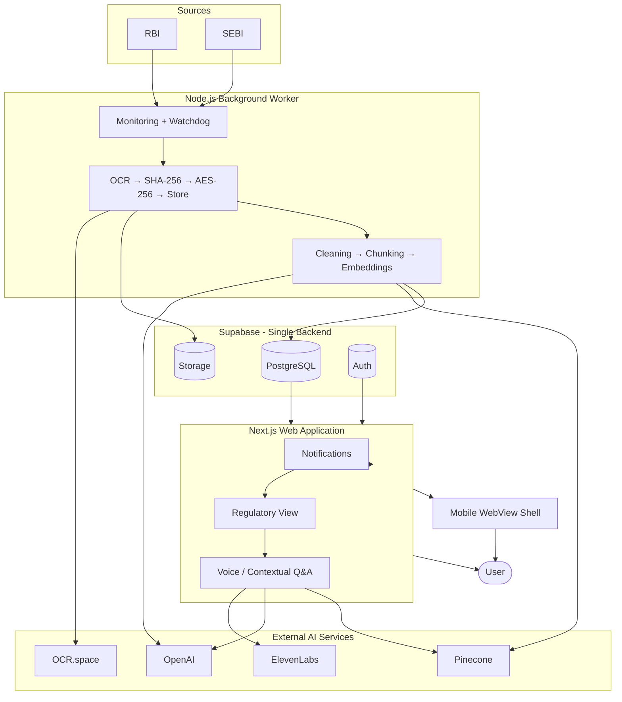

### End-to-End Data-Flow Diagram

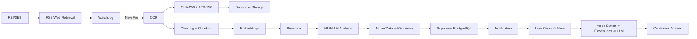

### Technology Stack Summary

Next.js · TypeScript · Node.js · PostgreSQL (Supabase) · Supabase Auth · Supabase Storage · RSS + web retrieval · OCR.space · SHA-256 · AES-256 · Pinecone · OpenAI Embeddings · OpenAI API (LLM + STT) · ElevenLabs · in-app notifications · Vercel · Git/GitHub · WebView-based mobile shell.

### Major Architecture Decisions
See §29 for the full register. Headline decisions: a single Node.js worker (not orchestrated microservices) owns continuous monitoring outside Vercel's request/response model; Pinecone is strictly a semantic-retrieval layer, never the system of record; structured (not free-text) LLM output keeps 1-Line/Detailed/Summary reliably separable; SHA-256 is used only for identity/dedup/integrity, never confidentiality.

### Open TBDs
Policy upload/versioning/categorization mechanism (§10); organization-level RBAC model (§15); ElevenLabs voice/model/language selection and audio format (§13); observability/logging vendor (§22); numerical performance/SLA targets (§28); exact environment-variable naming beyond the frontend/backend split already defined (§20).

---

## 37. Diagram Index

| # | Diagram | Location |
|---|---|---|
| 1 | System Context | §4 |
| 2 | High-Level Architecture | §5 |
| 3 | Regulatory Monitoring Flow | §8 (Flow A) |
| 4 | Document Processing Flow | §8 (Flow B) |
| 5 | AI/NLP Architecture (Policy Ingestion + Analysis) | §10–§11 |
| 6 | RAG/Pinecone Flow | §10 (Diagram 5, part 1) |
| 7 | Notification Flow | §14 |
| 8 | Contextual Q&A Flow | §12 |
| 9 | Voice Flow | §13 |
| 10 | Authentication Flow | §15 |
| 11 | Deployment Architecture | §19 |
| 12 | Data Lifecycle | §23 |
| 13 | Failure/Retry Boundary | §21 |
| — | Complete Architecture Diagram (summary) | §36 |
| — | End-to-End Data-Flow Diagram (summary) | §36 |

---

*End of Gapture FT-07 High-Level System Architecture Document. This document is the parent architecture for the module-level documents listed in §1 (Architecture Status) and should not be treated as a substitute for them.*
