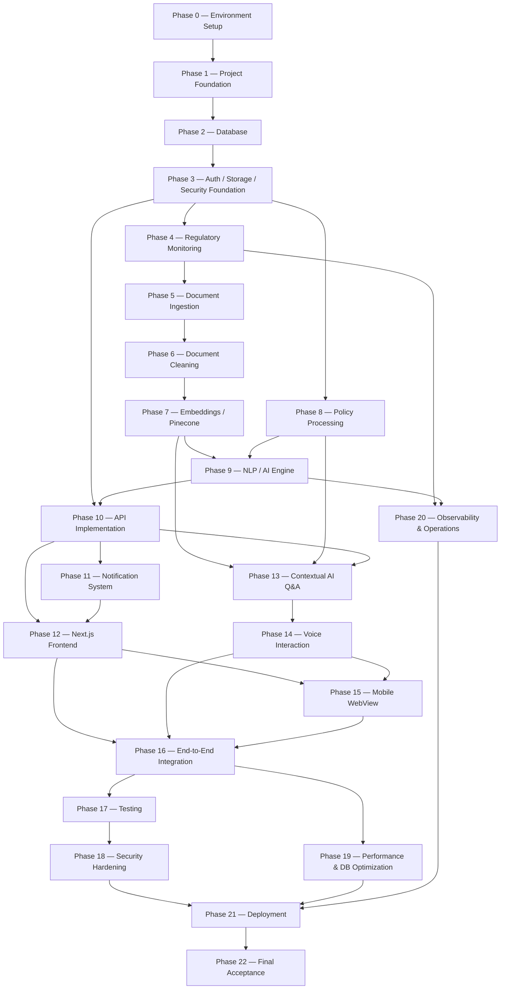

# Gapture FT-07 — Detailed Implementation Plan

**Status:** Planning only. No application code, migrations, APIs, or packages have been created or installed as part of producing this document.
**Prepared from:** full inspection of the repository root, `CLAUDE.md`, `/skills`, and all five FT-07 source documents.
**Repository state at time of writing:** documentation-only. No `package.json`, no source directories, no tests, no CI config, no `.env*` files, no git repository initialized.

---

## 1. Executive Summary

FT-07 is a continuous regulatory-monitoring and AI-assisted compliance information platform. It watches RBI and SEBI for new regulatory publications, runs each newly detected file through OCR → hashing → encryption → original storage → cleaning → NLP comparison against a company's own compliance policies, and produces three outputs (1-Line, Detailed, Summary). Those outputs drive an in-app notification, a detail view, and a voice-enabled contextual Q&A experience, all delivered through one Next.js web application (and a WebView mobile shell) backed by one Supabase Backend, with Pinecone as the semantic retrieval layer.

The repository currently contains **only planning documents** — the Master PRD, BRD, HLSA, Database Schema, Technology Stack document, `CLAUDE.md`, and `/skills`. No implementation exists yet. This plan sequences the work required to build FT-07 from zero, in 23 phases (Phase 0–22), each phase specifying objective, prerequisites, ordered tasks, files/modules, dependencies, database impact, API impact, security requirements, tests, performance considerations, risks, cross-phase dependencies, a Definition of Done, and an effort estimate.

One architecture-critical change is applied throughout this plan and is called out in full in §8: **NVIDIA Nemotron OCR v2, which BRD §32/§33/§41, the Technology Stack document (§10/§33/§36/§40/§41), and the HLSA (AD-08 and throughout) name as the approved OCR technology, is replaced with a free external OCR API accessed through an internal `OCRService` abstraction.** The exact provider was not documented anywhere in this repository, was not invented, and has since been resolved by explicit user decision: **OCR.space** (§8.3), verified against its own published API documentation.

This plan introduces no product capability beyond what the Master PRD defines. FIU-IND monitoring, risk scoring, gap classification, remediation management, evidence/audit management, control mapping, and clause-level regulatory comparison — all described in the broader `/skills` platform vision — are explicitly out of scope for FT-07 (§21, §46) and do not appear in any phase below.

---

## 2. Repository Assessment

### 2.1 Root contents (as found)

| Path | Type | Notes |
|---|---|---|
| `CLAUDE.md` | File | Project-level behavioral rules (not Gapture-specific product guidance) |
| `Gapture FT-07 — Detailed Technology Stack & Architecture.md` | File | 1,736 lines — approved MVP technology stack |
| `Gapture_FT-07_Database_Schema.md` | File | 2,077 lines — full PostgreSQL schema, DDL, RLS, query library |
| `Gapture_FT-07_HLSA.md` | File | 1,095 lines — High-Level System Architecture |
| `Gapture_FT07_BRD.md` | File | 1,710 lines — Business Requirements Document |
| `master prd.md` | File | 2,362 lines — Master Product Requirements Document v1.1 |
| `skills/` | Directory | 6 distinct skill documents (2 are duplicates of one file) |

### 2.2 What does **not** exist yet (confirmed by direct inspection, not assumed)

- No `package.json`, `node_modules`, lockfile, or `tsconfig.json`
- No `app/`, `src/`, `apps/`, `worker/`, or `packages/` directories
- No `.env`, `.env.local`, or `.env.example`
- No database migration files or Supabase project configuration (`supabase/` directory absent)
- No API route handlers or server code of any kind
- No test files or test-runner configuration
- No CI/CD configuration (no `.github/workflows`, no `vercel.json`)
- No `.git` directory — **this is not yet a git repository**
- No `docs/` directory prior to this document, and no `adr/` directory

**Implication:** every phase in this plan starts from zero. There is no existing implementation to reuse, extend, or reconcile with — only the planning documents govern design decisions. Phase 0 must therefore also initialize git, since none of the "never force-push," "never skip hooks" workflow guidance in `CLAUDE.md` can apply until a repository exists.

---

## 3. CLAUDE.md Review

`CLAUDE.md` (20 lines) was read in full. It is **general project-behavior guidance**, not Gapture product/architecture guidance (that lives in `/skills`). Its rules are incorporated into this plan as follows:

| CLAUDE.md Rule | How this plan honors it |
|---|---|
| "Don't assume. Don't hide confusion. Surface tradeoffs." | Every conflict between source documents is surfaced explicitly in §8 and inline per phase, not silently resolved. |
| "Minimum code that solves the problem. Nothing speculative." | No phase introduces speculative infrastructure (Kafka/Redis/Kubernetes/microservices) or speculative product features beyond the PRD. Package plan (§38) excludes anything not justified by a specific phase. |
| "Touch only what you must. Clean up only your own mess." | Directory structure (Phase 1) keeps worker, web app, and shared code in separate, minimal packages rather than one entangled codebase. |
| "Plan before build — confirm approach in chat before generating files." | This entire document is that confirmation step, produced before any file generation. |
| "I prefer execution-ready output, not outlines or scaffolds." | Each phase's Detailed Tasks are ordered, concrete, and file-level — not high-level placeholders. |
| "Ask before assuming scope on ambiguous requests." | Every genuinely undecided item is marked **TBD** (§52 of the DB doc's own convention, reused here) rather than silently assumed. See open decisions rolled up in §46. |
| "If a task needs more than ~3 file changes, outline the plan first." | This document is exactly that outline, at a scale far exceeding 3 files. |
| "Flag when you're uncertain rather than picking silently." | Applied throughout — see §8 conflicts and the TBD markers in §37–§39. |
| "Never touch .env, secrets, or credentials files without asking." | Phase 0 creates `.env.example` only (no real secrets); real secret values are never generated or committed by this plan. |
| "Never git push --force without explicit confirmation." | No phase instructs a force-push; Phase 0 sets up normal branch/PR workflow. |
| "Never delete files outside the current task's scope." | No phase deletes any existing document; `/skills` and the five source documents are treated as read-only inputs throughout. |

**Compliance confirmation:** CLAUDE.md was inspected in full before any planning began; no rule was ignored; no CLAUDE.md content was modified in producing this plan (see §44 for the full compliance check).

---

## 4. Skills Audit

All six files under `/skills` were read in full before this plan was written (see also §45, "Skills-to-Phase Mapping," which is deferred to that dedicated section rather than duplicated here).

| Skill File | Scope | FT-07 Applicability |
|---|---|---|
| `SKILL.md` | Gapture's full development constitution — quality principles, DB query rules (JOIN discipline), AI guardrails, security rules, API/code style, implementation order, ADR requirement | **Mostly applicable.** Its JOIN discipline, AI guardrails, and security rules are load-bearing for this plan. Its *product scope* (FIU-IND, gap detection, risk scoring, remediation, control mapping) is **broader than FT-07** and is explicitly excluded — see §8.2. |
| `system-design.md` (and its duplicate `system-design (1).md`, byte-identical) | C4-style system design reference: document-processing pipeline, file-storage split | **Partially applicable.** The document-processing pipeline shape (Upload → Validate → Store → Extract → Chunk → Embed → Analyze) matches FT-07's own pipeline. Its C4 component list (Gap Detection Engine, Risk Prioritization Engine, Control Mapping) is broader-platform and **not built** in FT-07. |
| `database-schema (1).md` | Generic Gapture entity list and RLS/index conventions | **Superseded for entities.** The dedicated `Gapture_FT-07_Database_Schema.md` is the authoritative, FT-07-specific schema (11 tables) and is used verbatim; this skill's broader entity list (`regulatory_obligations`, `company_controls`, `compliance_mappings`, `compliance_gaps`, `remediation_actions`, `evidence`, `analysis_runs`, `reports`, `audit_logs`, `organization_members`) is **not implemented**. Its RLS/index/JOIN *principles* are still applied. |
| `ai-architecture (1).md` | RAG flow using **pgvector**; regulatory change detection (old vs. new) | **Partially superseded.** FT-07 uses **Pinecone**, not pgvector, per the approved Technology Stack (which outranks this skill for a specific technology choice — see §8.2). Its grounding/guardrail principles ("never let AI answer without grounding," `insufficient_evidence`) are applied directly to Phase 9 and Phase 13. Its "regulatory change detection (old vs. new)" content is **out of scope for FT-07** (PRD §30.2) — SHA-256 in this plan is used only for fingerprint/dedup, never for a change-comparison product feature. |
| `api-testing-reporting (1).md` | Route shape examples, 10-part report structure, testing checklist | **Partially applicable.** Route-design conventions (Zod validation, consistent response envelope, never leak raw DB errors) are applied in Phase 10. The 10-part enterprise report structure (Severity, Evidence, Recommended Actions, Audit sections) belongs to the broader platform vision and is **not built**; FT-07's actual output is the PRD's 1-Line/Detailed/Summary triad. Its listed test scenarios (cross-org access, malformed AI JSON, missing controls) are incorporated into Phase 17 wherever they map onto an FT-07 entity. |
| `documentation-and-adrs (1).md` | `docs/` tree, required top-level documents, ADR format/numbering | **Fully applicable.** This document is filed as `docs/IMPLEMENTATION-PLAN.md` per that structure; Phase 1 sets up the full `docs/` tree and `adr/` directory this skill specifies. |

---

## 5. Source Documents

All five FT-07 source documents were read in full (not sampled) before this plan was written:

1. **`master prd.md`** (2,362 lines) — FT-07 Master PRD v1.1. Functional source of truth. FR-01 through FR-23, explicit FIU removal, single-Supabase-backend rule, notification title/description rule, full traceability matrix (§28), explicit out-of-scope list (§30).
2. **`Gapture_FT07_BRD.md`** (1,710 lines) — Business Requirements Document. BR-001 through BR-026, business rules, MVP simplification decisions, risks, technology-to-business mapping. **Names NVIDIA Nemotron OCR v2** (§32/§33/§41) — see §8.
3. **`Gapture_FT-07_HLSA.md`** (1,095 lines) — High-Level System Architecture. System context, 28-component architecture, 9-state processing model, reliability/failure matrix, 20 Architecture Decisions (AD-01–AD-20). **AD-08 names NVIDIA Nemotron OCR v2** — see §8.
4. **`Gapture_FT-07_Database_Schema.md`** (2,077 lines) — full PostgreSQL schema: 11 tables, complete DDL, RLS policies, index strategy tied to 10 named queries with measured `EXPLAIN ANALYZE` figures, migration plan, seed data. Vendor-agnostic — **no OCR-vendor-specific column exists anywhere in this schema**, which is why the OCR provider swap in §8 requires zero schema change.
5. **`Gapture FT-07 — Detailed Technology Stack & Architecture.md`** (1,736 lines) — approved MVP stack, per-layer technology choices, environment-variable examples, a simplified 9-table "Proposed PostgreSQL Data Model" that is **superseded by document 4** (see §8.2), and the final architecture decision narrative. **Names NVIDIA Nemotron OCR v2 throughout** — see §8.

No plan content below was derived from only one of these documents in isolation.

---

## 6. Source-of-Truth Hierarchy

Applied exactly as specified for this task, and as independently corroborated by the documents' own internal governance sections (BRD §49, HLSA §1, DB Schema §3):

```text
Master PRD  →  BRD  →  HLSA  →  Database Schema  →  API Specification (absent — see below)
            →  Approved Technology Stack
            →  CLAUDE.md / skills
            →  Implementation decisions (this document)
```

**No API Specification document exists in this repository.** Per HLSA §17, API boundaries are conceptual only ("no exact REST paths are prescribed beyond illustrative examples"). This plan therefore treats **HLSA §17 + the Database Schema's query library (§44) as the de facto API contract input** for Phase 10, and proposes concrete endpoint shapes as **Architecture Decisions**, not as documented requirements — flagged accordingly in Phase 10.

Where documents conflict, this plan follows the rule stated identically in BRD §49 and HLSA §1: **functional requirement conflicts resolve toward the PRD; technology conflicts resolve toward the higher-ranked technology/architecture document; no technology decision may silently create a new product capability.** All conflicts actually found are enumerated in §8 and §46 rather than resolved silently.

---

## 7. Approved Technology Stack

| Layer | Technology | Source |
|---|---|---|
| Frontend | Next.js (App Router) + TypeScript | Tech Stack §5; HLSA AD-01/AD-02 |
| Backend | Node.js + TypeScript (Route Handlers + background worker) | Tech Stack §6; HLSA AD-03 |
| Database | PostgreSQL via Supabase | HLSA AD-04; DB Schema (whole document) |
| Backend platform | Supabase (Postgres + Auth + Storage) — **one** backend | PRD FR-17; HLSA AD-04–AD-06 |
| Vector database | Pinecone | HLSA AD-07; **supersedes** `skills/ai-architecture.md`'s pgvector default — see §8.2 |
| OCR | OCR.space, behind an `OCRService` abstraction | **This task's override — see §8.1/§8.3.** Supersedes BRD §32, Tech Stack §10, HLSA AD-08 (all name NVIDIA Nemotron OCR v2). Provider resolved by user decision, verified against real API docs |
| Hashing | SHA-256 (fingerprint/dedup/integrity only, never confidentiality) | HLSA AD-12; DB Schema §13/§16 |
| Encryption | AES-256 | HLSA AD-13 |
| Embeddings | OpenAI Embeddings | HLSA AD-09 |
| LLM | OpenAI API | HLSA AD-09 |
| Speech-to-text | OpenAI | Tech Stack §29 |
| Voice/TTS | ElevenLabs API | HLSA AD-10 |
| Notifications | In-app only | HLSA AD-17; PRD FR-19/FR-20 |
| Hosting (web) | Vercel | HLSA AD-14 |
| Hosting (worker) | Separate Node.js host, independent of Vercel's request/response runtime | HLSA AD-15 |
| Mobile | WebView-based shell around the responsive Next.js app | HLSA AD-16 |
| Source control | Git + GitHub | Tech Stack §32 |

**Explicitly excluded** (BRD §37; Tech Stack §39; HLSA §3/§27): Kubernetes, Kafka, Redis, RabbitMQ, service mesh, multiple application databases, a separate auth provider, a separate notification provider, enterprise KMS, Auth0/Clerk/Twilio/SendGrid/Firebase, a separate STT provider, a separate vector database plus caching layer.

---

## 8. OCR Architecture Change

### 8.1 The change, stated precisely

Every one of the three architecture-level source documents names **NVIDIA Nemotron OCR v2** as the selected/approved OCR technology:

| Document | Location | What it says |
|---|---|---|
| BRD | §32 (Technology Alignment table), §33 (Technology-to-Business Mapping diagram), §41 (Dependencies table) | "OCR — NVIDIA Nemotron OCR v2"; lists NVIDIA as an external dependency |
| Technology Stack doc | §10 ("Selected Technology: NVIDIA Nemotron OCR v2", model id `nvidia/nemotron-ocr-v2`), §33 (`NVIDIA_API_KEY` env var), §35/§40/§41 (architecture diagrams and final decision narrative) | Names NVIDIA explicitly as the OCR engine throughout |
| HLSA | §4 (System Context table), §6 (Layer 3), §7 (Component 9 "OCR Service"), §19 (Deployment), §29 (AD-08, status "Approved"), §31, §36 | Same |

**This is no longer the implementation, per explicit instruction for this task.** NVIDIA OCR must not be used, installed, configured, or referenced in any code, environment variable, or infrastructure this plan produces.

### 8.2 The replacement

```text
Document
   ↓
Gapture OCR Service           ← internal abstraction, provider-agnostic
   ↓
Free External OCR API         ← concrete provider, injected behind the interface
   ↓
OCR Result
   ↓
Gapture Document Processing
```

Concretely: an `OCRProvider` interface (one method: extract text/structure from file bytes) is implemented by a concrete provider class. Every other component in the pipeline (Document Ingestion, HLSA component 9, Phase 5 below) depends on the `OCRService` wrapper around that interface — never on the concrete provider directly. This is exactly the structure the task specifies:

```text
OCRService
    ↓
OCRProvider (interface)
    ↓
OcrSpaceProvider (concrete implementation — §8.3, resolved to OCR.space)
```

**This swap requires zero database schema change.** The Database Schema document's `regulatory_documents` and `document_chunks` tables (§13/§16) store no vendor-specific column — no `nvidia_*` field exists anywhere in the 11-table schema or its DDL. The only place NVIDIA appears in any source document is in prose/diagrams/env-var examples, never in a column name, migration, or query. Phase 5 (Document Ingestion) implements the swap purely at the service layer.

### 8.3 OCR Provider — RESOLVED: OCR.space

**No free OCR provider was named anywhere in this repository.** Per the explicit instruction for this task, none was invented — the choice was made by the user directly (2026-09-10) and verified against OCR.space's own published API documentation (`https://ocr.space/ocrapi`) rather than assumed. This resolves what was previously tracked as a blocking TBD for Phase 5.

| Item | Value | Source |
|---|---|---|
| Provider | OCR.space | User decision |
| API endpoint (file/base64) | `POST https://api.ocr.space/parse/image` | ocr.space/ocrapi |
| API endpoint (remote URL) | `GET https://api.ocr.space/parse/imageurl` | ocr.space/ocrapi |
| Authentication | API key in request header: `apikey: <KEY>` | ocr.space/ocrapi |
| Request shape | One of: multipart `file` field, `url` field (remote image/PDF), or `base64Image` field (with `data:<mime>;base64,` prefix) | ocr.space/ocrapi |
| Supported formats | PNG, JPG, GIF, TIF, BMP, PDF | ocr.space/ocrapi |
| Free-tier limits | 1 MB max file size; PDFs capped at 3 pages | ocr.space/ocrapi |
| Response model | **Synchronous** — one JSON response, no polling | ocr.space/ocrapi |
| Response shape | `{ ParsedResults: [{ ParsedText, FileParseExitCode, ErrorMessage, ErrorDetails, TextOverlay }], OCRExitCode, IsErroredOnProcessing, ErrorMessage, ProcessingTimeInMilliseconds }` | ocr.space/ocrapi |
| Success/failure signal | `IsErroredOnProcessing: false` + `OCRExitCode: "1"` = success; `OCRExitCode` 2/3/4 = partial/all-failed/fatal; per-page `FileParseExitCode` (1=success, 0=not found, -10=parse error, -20=timeout, -30=validation error, -99=unknown) | ocr.space/ocrapi |
| Registered free-tier quota | 25,000 requests/month (Engines 1–2 combined) + 2,500/month for Engine 3; capped at 500 requests/day/IP | ocr.space/ocrapi |
| No-signup demo key (`helloworld`) | Usable for local dev only — capped at ~10 requests/10 minutes; **not for staging/production** | Corroborating web search, npm `ocr-space-api-wrapper` docs |
| Engine selection | `OCREngine=2` (default; handles noise/rotation well) recommended as the MVP baseline; `OCREngine=3` (higher accuracy, 200+ languages, tables/handwriting, slower/costlier) available if Engine 2 proves insufficient for real RBI/SEBI documents | ocr.space/ocrapi |
| Useful optional params | `isTable=true` (line-by-line output for tabular regulatory content), `scale=true` (upscale low-res scans), `detectOrientation=true` | ocr.space/ocrapi |

**Design implications for Phase 5's `OcrSpaceProvider`:**
- The **1 MB / 3-page free-tier limit is materially restrictive** for regulatory circulars, which can easily exceed both. File-validation (Phase 5, task 2) must reject or explicitly flag oversized files rather than silently truncating OCR coverage — this is a real operational risk, not just an implementation detail (see updated Risks below).
- Since requests are synchronous, `OCRService`'s retry/backoff wraps a single blocking HTTP call per file (or per page batch, if a document must be split to fit the 3-page cap) — no polling logic is needed, simplifying Phase 5 relative to an async-provider design.
- `OCRExitCode`/`FileParseExitCode` map directly onto the existing `document_processing_events.error_message` field (Phase 2) — no new column needed.
- The registered free API key (not the `helloworld` demo key) must be used from Phase 0 onward for anything beyond a first local smoke test, given the demo key's ~10-requests/10-minutes ceiling.

**Still open (non-blocking):** exact behavior when a real RBI/SEBI PDF exceeds 3 pages — either multi-page splitting-and-stitching or an upgrade to OCR.space's paid PRO tier (100+ MB, 999+ pages) — is a Phase 5 implementation decision to make once real document sizes are observed, not invented here.

### 8.4 Other conflicts found (not OCR-related)

| # | Conflict | Documents involved | Resolution |
|---|---|---|---|
| 1 | `skills/SKILL.md`, `system-design.md`, `database-schema.md`, and `ai-architecture.md` describe Gapture's **broader platform vision** — FIU-IND monitoring, regulatory-obligation extraction, control mapping, gap scoring, remediation, evidence/audit management — which is wider than FT-07. | `/skills` vs. PRD §30.2 / BRD §8 / HLSA §2, §34 | FT-07 source documents are authoritative for this deliverable (they explicitly frame the broader vision as future/out-of-scope). This plan builds **none** of the broader-platform components. Skills' engineering *principles* (JOIN discipline, RLS discipline, AI grounding, ADR discipline) are still applied — see §4. |
| 2 | `skills/ai-architecture.md` specifies **pgvector** as the vector-search technology. | Skill vs. HLSA AD-07 / Tech Stack §16–§17 | Approved Technology Stack (Pinecone) outranks a skill document for a specific technology choice (§6 hierarchy). Pinecone is used; no pgvector extension is enabled (confirmed absent from DB Schema §22's extension list). |
| 3 | `skills/database-schema.md`'s generic entity list (`organization_members`, `regulatory_obligations`, `company_controls`, `compliance_mappings`, `compliance_gaps`, `remediation_actions`, `evidence`, `analysis_runs`, `reports`, `audit_logs`) vs. the FT-07 Database Schema document's 11-table model. | Skill vs. dedicated DB Schema doc | The dedicated FT-07 Database Schema document is authoritative (Data Architecture outranks CLAUDE.md/skills in §6's hierarchy, and is itself far more detailed/measured). Its exact 11 tables, DDL, and naming (`profiles` not `users`, single `organization_id` on `profiles` not an `organization_members` join table) are used verbatim in Phase 2. |
| 4 | Technology Stack doc §24 ("Proposed PostgreSQL Data Model," 9 rough tables: `users`, `document_processing`, `nlp_results`, `questions`) vs. the dedicated Database Schema document's 11-table model (`profiles`, `document_processing_events`, `nlp_analyses`, `contextual_interactions`, plus `document_chunks`/`policy_chunks` which the Tech Stack sketch omits entirely). | Tech Stack §24 vs. DB Schema doc | DB Schema doc supersedes (Data Architecture > Technology Stack in §6's hierarchy, and is explicitly the later, engineering-reviewed document). Tech Stack §24 is treated as a superseded early sketch, not implemented. |
| 5 | Environment-variable naming: `CLAUDE.md` uses `NEXT_PUBLIC_SUPABASE_PUBLISHABLE_KEY` / `SUPABASE_SECRET_KEY` (Supabase's current key terminology); the Technology Stack doc §33 uses the older `NEXT_PUBLIC_SUPABASE_ANON_KEY` / `SUPABASE_SERVICE_ROLE_KEY` naming; a later, explicit user instruction (2026-09-10) requested `SUPABASE_URL` / `SUPABASE_ANON_KEY` / `SUPABASE_SERVICE_ROLE_KEY` (no `NEXT_PUBLIC_` prefix at all). | CLAUDE.md vs. Tech Stack §33 vs. explicit user instruction | **Resolved.** Confirmed against the real Supabase project (Phase 0): the project issues `sb_publishable_...`/`sb_secret_...`-prefixed keys — the *newer* key format CLAUDE.md's naming anticipated, not the legacy JWT-format anon/service_role keys the Tech Stack doc assumed. Final variable names used everywhere: `NEXT_PUBLIC_SUPABASE_URL`, `NEXT_PUBLIC_SUPABASE_ANON_KEY`, `SUPABASE_SERVICE_ROLE_KEY` — the user's exact requested wording (`ANON_KEY`/`SERVICE_ROLE_KEY`), with the `NEXT_PUBLIC_` prefix retained on the first two because it is a **hard Next.js technical requirement** (only `NEXT_PUBLIC_`-prefixed vars are inlined into the browser bundle) rather than a style preference — omitting it would silently break every client-side Supabase Auth call (sign-in, sign-up, Google OAuth). Both client and server code read the same two `NEXT_PUBLIC_` names; there is no separate unprefixed duplicate. |

### 8.5 Implementation status (2026-09-10) — ahead of planned sequence

Per explicit user instruction, Phase 1 (Project Foundation) and Phase 3 (Auth) were substantially implemented and verified against a **real** Supabase project, ahead of where the phase-dependency graph (§33) otherwise sequences them — Phase 0's account-creation checklist and Phase 2's database migrations are still open, but enough of Phase 0 (real Supabase/OpenAI/OCR.space/ElevenLabs credentials obtained) existed to make this worthwhile rather than purely theoretical. Full detail in the corresponding phase sections' Definition of Done; summarized here since it cuts across phase boundaries:

* **Monorepo scaffold built**: root `pnpm` workspace, `apps/web` (Next.js, App Router, Turbopack), `packages/shared` (framework-agnostic services). `worker/` was **not** scaffolded — out of scope for this instruction, which covered OCR integration and auth, not the monitoring pipeline.
* **OCR.space integration built and verified end-to-end** against the real API key: `OcrProvider` interface, `OcrSpaceProvider` implementation (§8.3's spec, exactly), `OCRService` retry wrapper, and a server-only `POST /api/ocr/extract` Route Handler — confirmed the frontend has no path to call OCR.space directly (unauthenticated request returns 401 before OCR.space is ever reached).
* **Supabase Auth built and verified against the real project**: email sign-up (with the project's actual `mailer_autoconfirm: false` confirmed live, so the "check your email" branch is the one that fires), email sign-in, **Google OAuth** (confirmed already enabled on the real project — `"google": true` in its live Auth settings), session persistence via `@supabase/ssr`, proxy-based route protection (Next.js 16 renamed `middleware.ts` → `proxy.ts`; verified `/dashboard` and `/` correctly redirect unauthenticated requests with a real 307), sign-out.
* **What is NOT verified**: an actual end-to-end human sign-up/sign-in/Google-consent click-through (no browser automation available in this environment) — only server-side redirect/auth-check behavior was verified via `curl` against the real Supabase Auth API. See the final report delivered to the user for the exact list of manual verification steps remaining.
* **Real credential status** (discovered mid-task — see the note in the chat transcript about credentials appearing in `.env.example` and being moved to gitignored files): Supabase ✅ live, Google OAuth already configured; OpenAI ✅ live; OCR.space ✅ live, full request/response cycle confirmed; ElevenLabs ⚠️ key valid but scoped without `user_read`/`voices_read`/`models_read`, and the account's free tier blocks TTS synthesis against library voices via the API (`paid_plan_required`) — Phase 14 is blocked on either an upgraded plan or a key with broader permissions plus an owned voice ID; Pinecone ⬜ no key provided yet, blocking Phase 7.

---

## 9. System Implementation Overview

```text
RBI / SEBI  →  Monitoring Worker (Node.js, always-on)  →  Watchdog  →  File Found?
                                                                          │
                        ┌─────────────────────────────────────────── NO ─┘
                        ↓ YES
              OCR (OCRService → OcrSpaceProvider)
                        ↓
              SHA-256 fingerprint + AES-256 encryption
                        ↓
              Supabase Storage (encrypted original)  +  Postgres metadata
                        ↓
              Document Cleaning → Chunking
                        ↓
              OpenAI Embeddings → Pinecone (regulatory + policy vectors)
                        ↓
              OpenAI LLM analysis, grounded in retrieved policy context
                        ↓
              1-Line / Detailed / Summary  →  Supabase Postgres (nlp_analyses)
                        ↓
              Notification (title=1-Line, description=Summary)  →  Next.js Web App
                        ↓
              User clicks → Regulatory View (Brief of Detailed NLP Data)
                        ↓
              Voice Button → OpenAI STT → Contextual Q&A (Pinecone + OpenAI) → ElevenLabs TTS
                        ↓
              Same experience surfaced to mobile via WebView shell
```

One Next.js application, one Node.js background worker, one Supabase backend, four external AI/media APIs (OCR provider, OpenAI, Pinecone, ElevenLabs) — a modular monolith, not microservices (HLSA Architecture Principle; AD-18). The 23 phases below build this system in dependency order.

---

## 10. Phase 0 — Development Environment & Requirements Setup

### Objective
Make the development environment completely ready — tooling, accounts, credentials placeholders, and repository scaffolding — before any feature code is written.

### Prerequisites
None (this is the first phase). Requires human action: creating accounts on Supabase, Pinecone, OpenAI, ElevenLabs, OCR.space (§8.3), and a worker-hosting provider.

### Phase 0 progress log (updated as work happens)
- [x] Node/npm/pnpm/git tooling confirmed locally installed (Node v24.15.0, npm 11.12.1, pnpm 10.33.2, git 2.53.0) — see task A1–A3 below
- [x] Supabase CLI confirmed usable via `npx supabase` (v2.117.0) — no global install needed/attempted (Scoop unavailable on this machine, and Supabase blocks `npm install -g`)
- [x] `.gitignore`, `.env.example`, `.nvmrc`, `README.md` created at repo root
- [x] Git repository initialized (`git init`, default branch renamed to `main`) — first commit intentionally not yet made (see this session's commit policy: only on explicit request)
- [x] OCR provider resolved: **OCR.space** (§8.3) — user decision, verified against real API docs
- [x] Embedding model decided: **`text-embedding-3-small`, 1536 dimensions** (task E17) — verified against OpenAI's current API docs, not guessed
- [x] Git workflow decided: trunk-based, short feature branches, PR + CI gate before merge (task J27)
- [x] Commit convention decided: Conventional Commits (task J28)
- [ ] OpenAI chat/completions model and transcription model — **deliberately left unresolved**: current flagship-model naming couldn't be reliably verified via web search (conflicting/unreliable results from third-party pricing-tracker sites), so no specific model string is asserted here. Confirm directly in the OpenAI dashboard when the API key is created (task F19), then record the exact model chosen.
- [ ] Supabase project created — **blocked: Supabase MCP connector not authorized for this session; requires either connecting it via claude.ai connector settings, or manual creation via supabase.com**
- [ ] Pinecone account/index created — **needs manual action (no MCP integration available for Pinecone)**
- [ ] OpenAI API key obtained — **needs manual action**
- [ ] ElevenLabs API key obtained — **needs manual action**
- [ ] OCR.space API key obtained (registered free tier, not the `helloworld` demo key) — **needs manual action**
- [ ] Worker-hosting provider decided — not yet raised with the user (not urgent until Phase 21)

### Detailed Tasks

**A. Required software**
1. Install Node.js (LTS) and confirm `node`/`npm` versions.
2. Choose npm vs. pnpm for workspaces (Architecture Decision — pnpm is recommended for a multi-package repo per §11's workspace layout, but npm workspaces are an acceptable fallback; confirm before Phase 1).
3. Install Git; confirm GitHub access for the intended remote.
4. Confirm VS Code (or equivalent) with TypeScript/ESLint extensions.
5. Install the Supabase CLI (needed for local migrations per `supabase/agent-skills` guidance surfaced by the Supabase MCP server instructions, and for `supabase db push`/`supabase gen types`).
6. Confirm a Postgres client (`psql` or a GUI) is available for manual inspection during Phase 2.

**B. Project initialization**
7. `git init` the repository (none exists yet — confirmed in §2.2); set the default branch and `.gitignore` (Node, Next.js, `.env*`, editor files).
8. Decide and record the workspace tool (npm/pnpm) and Node version pin (`.nvmrc` or `engines` field).
9. Do **not** run `npm install`/`pnpm install` yet — that begins in Phase 1, once `package.json` files exist to install against.

**C. Environment configuration**
10. Create `.env.example` at the repo root (and `worker/.env.example` if the worker loads its own env file — see §37) listing every variable name from §37, with placeholder values only. **Never commit real secrets.**
11. Confirm `.gitignore` excludes `.env`, `.env.local`, and any `*.env` file.

**D. Supabase**
12. Create a Supabase project (or a branch/dev project, per the Supabase MCP guidance to inspect existing structure and prefer local development before touching a remote project).
13. Record the project's actual issued key names (resolves Conflict 5 in §8.4 — confirm whether the project issues `anon`/`service_role` or the newer `publishable`/`secret` key pair) and standardize on the real names in `.env.example`.
14. Enable the Postgres extension `pgcrypto` (used by the schema in Phase 2 for `gen_random_uuid()`) — confirm it's enabled by default on the created project.
15. Verify connectivity: a trivial `SELECT 1` via the Supabase client, and confirm Auth and Storage are reachable from a scratch script.

**E. Pinecone**
16. Create a Pinecone project and API key.
17. Create the index with dimension **1536**, matching **`text-embedding-3-small`** (Architecture Decision, resolved — OpenAI's current cost-efficient embedding model per its own API docs; `text-embedding-3-large` at 3072 dimensions is the higher-accuracy alternative if retrieval quality proves insufficient against real regulatory/policy text — that would require a full re-embed and a new index, so this choice is treated as effectively locked once real documents are indexed in Phase 7).
18. Verify connectivity: a trivial upsert + query round trip against the created index.

**F. OpenAI**
19. Create an API key. Embeddings model is decided (`text-embedding-3-small`, task 17). For the chat/completions model (Phase 9's NLP analysis, Phase 13's Contextual Q&A) and the transcription model (Phase 14's STT), **check OpenAI's current model list directly in the account dashboard/docs at setup time rather than trusting any specific model name in this plan** — flagship model naming/availability changes over time and this plan does not assert one, to avoid the exact kind of unverified claim the project's own AI guardrails (§4, `skills/SKILL.md`) exist to prevent. Pick the smallest/cheapest currently-available model that meets the structured-output and audio-transcription requirements for MVP; record the exact model string chosen here once picked.
20. Verify connectivity: one embedding call, one chat completion call, one transcription call against a short sample.

**G. ElevenLabs**
21. Create an API key; confirm a voice is available for the target output.
22. Verify connectivity: one text-to-speech call producing playable audio.

**H. OCR**
23. ~~Resolve §8.3's provider~~ **Resolved: OCR.space** (§8.3). Register for an OCR.space API key (the free `helloworld` demo key is fine for the connectivity test below, but is too rate-limited — ~10 requests/10 minutes — for anything beyond a single manual check).
24. Verify connectivity: one `POST https://api.ocr.space/parse/image` call (multipart `file`, header `apikey: <KEY>`) against a sample PDF/image, confirming a `200` response with `IsErroredOnProcessing: false` and non-empty `ParsedResults[0].ParsedText` — this is exactly the response shape the `OCRProvider` interface (Phase 5) will wrap.

**I. Worker**
25. Decide the worker-hosting provider (BRD §46 marks this **TBD**; do not invent one — evaluate against "separate from Vercel's request/response runtime," per HLSA AD-15, when the team is ready to deploy in Phase 21).
26. Confirm the worker can load its own environment variables independently of Next.js's built-in env loading (the worker is a standalone process — plan for `dotenv` or the hosting provider's own env-injection mechanism).

**J. Developer tooling**
27. Git workflow — **decided**: trunk-based, short-lived feature branches off `main`, merged via PR; CI (Phase 17's lint/typecheck/test gate) required to pass before merge once CI exists. Low-stakes, reversible — revisit if the team prefers otherwise.
28. Commit-message convention — **decided**: Conventional Commits (`feat:`, `fix:`, `docs:`, `chore:`, etc.) — not mandated by any source document, chosen for consistency with the ADR/documentation discipline already in place.
29. Define root `package.json` scripts once Phase 1 exists (`dev`, `build`, `lint`, `typecheck`, `test`) — placeholder only in this phase.

### Files / Modules
- `.gitignore`, `.env.example`, `worker/.env.example` (if applicable), `.nvmrc` (or `engines` field placeholder), `README.md` (repo overview only — no docs duplication)

### Dependencies
Accounts: Supabase, Pinecone, OpenAI, ElevenLabs, OCR.space, GitHub, and a worker-hosting provider (TBD). No npm packages installed in this phase.

### Database Impact
None yet — only extension/connectivity verification against an empty Supabase project.

### API Impact
None.

### Security
- No real secret is ever committed; `.env.example` contains placeholders only.
- Confirm from the outset which keys are frontend-safe (`NEXT_PUBLIC_*`) vs. server-only, per CLAUDE.md's existing list plus the additions in §37.
- Service-role/secret Supabase key, OpenAI, Pinecone, ElevenLabs, and OCR credentials are all server-only from day one — never referenced in any file under a future `apps/web/app/**/page.tsx` or other client component.

### Testing
No application tests yet. "Testing" in this phase means the manual connectivity verification steps (A15, E18, F20, G22, H24).

### Performance
Not applicable at this phase.

### Risks
- **OCR.space's free-tier limits (1 MB file size, 3-page PDF cap) are restrictive for real regulatory circulars** — flagged in §8.3 as a design constraint Phase 5 must handle explicitly (splitting, rejecting, or budgeting for a paid-tier upgrade), not a risk resolved by simply picking a provider.
- Worker-hosting provider TBD may block Phase 21 planning specifics, though it does not block Phases 1–20.
- Supabase key-naming ambiguity (Conflict 5, §8.4) could cause inconsistent env-var names across the codebase if not resolved once, here, and propagated.

### Dependencies on Other Phases
None — this is the root phase.

### Definition of Done
- [ ] All required accounts created; API keys obtained and stored outside the repository (password manager / secrets vault) — **open, needs user action; Supabase/Vercel MCP connectors are not yet authorized for this session**
- [x] `.env.example` lists every variable in §37 with placeholder values, correctly split frontend-safe vs. server-only
- [ ] Connectivity verified (Supabase, Pinecone, OpenAI, ElevenLabs, OCR.space) — blocked on accounts/keys above
- [x] Git repository initialized with `.gitignore` correctly excluding all env files (default branch `main`; first commit not yet made — pending explicit request per this session's commit policy)
- [x] Workspace tool (npm/pnpm) and Node version decided and recorded — **pnpm 10.33.2** (already present locally), **Node 24.15.0** pinned via `.nvmrc`
- [x] OCR provider decision made and documented — **OCR.space** (§8.3), no longer open

### Estimated Effort
Hours: 8–16 · Complexity: Small (mostly account/credential setup, not code)

---

## 11. Phase 1 — Project Foundation

### Objective
Establish the complete repository skeleton — Next.js app, worker, shared package, docs/ADR structure — before any feature logic is written.

### Prerequisites
Phase 0 complete (tooling decided, accounts created).

### Detailed Tasks
1. Initialize the workspace root `package.json` with `workspaces` (or `pnpm-workspace.yaml`) covering `apps/*`, `worker`, and `packages/*`.
2. Scaffold `apps/web` as a Next.js (App Router) + TypeScript project.
3. Scaffold `worker` as a standalone Node.js + TypeScript project (own `package.json`, own `tsconfig.json`, own entrypoint) — **not** a Next.js API route, per HLSA AD-15's requirement that continuous monitoring cannot live inside Vercel's request/response model.
4. Scaffold `packages/shared` as an internal, non-published TypeScript package containing code both `apps/web` and `worker` import: Supabase client factories, the `OCRService`/`OCRProvider` interface, `EmbeddingService`, `PineconeClient` wrapper, OpenAI LLM wrapper, ElevenLabs/STT wrappers, SHA-256/AES-256 helpers, and shared Zod schemas/TypeScript types.
5. Configure root and per-package `tsconfig.json` with project references so `apps/web` and `worker` both resolve `packages/shared` via a path alias, strict mode on, `no-any` enforced by ESLint (per CLAUDE.md's constitution: "Strict TypeScript, no `any`").
6. Configure ESLint + Prettier at the workspace root; add `lint`/`format` scripts.
7. Configure Tailwind CSS + shadcn/ui inside `apps/web` only (frontend-only concern).
8. Create the `docs/` tree per `skills/documentation-and-adrs.md`: `docs/product/`, `docs/architecture/`, `docs/database/`, `docs/api/`, `docs/ai/`, `docs/security/`, `docs/testing/`, plus this file (`docs/IMPLEMENTATION-PLAN.md`, already created).
9. Create `adr/` at the repo root; write `ADR-001-nextjs.md` through `ADR-010-...` for every major decision already made in the source documents (Next.js, Supabase, Pinecone, OpenAI, AES-256/SHA-256, WebView mobile, in-app-only notifications) **plus a new `ADR-011-ocr-provider-abstraction.md`** documenting the NVIDIA→OCR.space change from §8/§8.3 (context: NVIDIA was the documented-but-overridden choice; decision: an `OCRService`/`OCRProvider` abstraction with `OcrSpaceProvider` as the concrete implementation; alternatives: NVIDIA Nemotron OCR v2 (rejected per this task's explicit instruction), other free-tier OCR APIs (not evaluated once the user specified OCR.space); reason: user decision, verified against OCR.space's real API; consequences: 1 MB/3-page free-tier limits constrain Phase 5's file-handling design), since this is exactly the kind of "new requirement conflicts with existing architecture" case `SKILL.md`'s Final Rule requires an ADR for.
10. Add root scripts: `dev` (runs `apps/web` dev server), `dev:worker` (runs the worker in watch mode via `tsx`), `build`, `lint`, `typecheck`, `test`.
11. Commit the skeleton as the first real commit (Phase 0 only initialized git; this is the first content commit).

### Files / Modules
```text
gapture/
├── apps/web/                # Next.js App Router application
├── worker/                  # standalone Node.js background worker
├── packages/shared/         # code imported by both apps/web and worker
├── supabase/migrations/     # created empty in this phase; populated in Phase 2
├── docs/{product,architecture,database,api,ai,security,testing}/
├── adr/
├── skills/                  # existing — untouched
├── package.json             # workspace root
├── tsconfig.base.json
└── README.md
```

**Responsibility boundaries** (per CLAUDE.md's "Business logic does not live inside React components" and HLSA's modular-monolith principle):

| Directory | Responsibility | Does NOT contain |
|---|---|---|
| `apps/web/app/**` | Routing, Server/Client Components, Route Handlers (thin — delegate to `packages/shared` services) | Business logic, direct OpenAI/Pinecone/OCR calls beyond invoking a shared service, secrets in Client Components |
| `worker/src/**` | Monitoring loop, Watchdog, ingestion orchestration, cleaning/chunking/embedding triggers, NLP orchestration | UI code, anything importing from `apps/web` |
| `packages/shared/src/**` | Provider-agnostic services (OCR, embeddings, Pinecone, LLM, voice, crypto), shared types/Zod schemas, Supabase client factories | Framework-specific code (no Next.js imports, no worker-loop code) |
| `supabase/migrations/**` | SQL only | Application logic (no PL/pgSQL beyond the invariant-enforcing triggers specified in the DB Schema doc, §35.2) |

### Dependencies
Framework/tooling packages only (Next.js, TypeScript, ESLint, Prettier, Tailwind) — see the full package plan in §38. No AI/DB SDKs installed yet (deferred to the phases that use them, to avoid installing dependencies before they're needed, per CLAUDE.md's "don't add a dependency without justification").

### Database Impact
None — `supabase/migrations/` created empty; first migration lands in Phase 2.

### API Impact
None — no Route Handlers written yet.

### Security
- `.env.example` (from Phase 0) is copied into the new structure; confirm `apps/web/.env.local` and `worker/.env` are both gitignored.
- ESLint rule considered (Architecture Decision, optional) to flag any import of a server-only env var from a file under a Client Component boundary.

### Testing
- Configure the test runner (Architecture Decision: Vitest recommended for a TypeScript-first monorepo, pairing with Vite's fast watch mode; Jest is an acceptable alternative — confirm before Phase 17 so test files aren't written twice) at the workspace root, with per-package test scripts.
- No feature tests yet — a single smoke test (e.g., "shared package exports resolve") is reasonable here.

### Performance
Not applicable — no runtime code yet.

### Risks
- Choosing an over-elaborate monorepo structure this early risks violating CLAUDE.md's "minimum code that solves the problem." The structure above is deliberately minimal (3 packages, not the deeper `packages/database` + `packages/ai` split the Tech Stack doc's §32 sketch suggested) — flagged here as a scope judgment call, not a silent assumption.

### Dependencies on Other Phases
Phase 0 (tooling/accounts decided).

### Definition of Done
- [x] `apps/web`, `packages/shared` build/typecheck/lint with zero errors — **verified 2026-09-10** (`worker` not yet scaffolded — out of scope for the OCR/Auth instruction that drove this work; still pending)
- [x] Workspace-level `lint`, `typecheck`, `build` scripts run successfully; `dev`/`dev:worker` not yet exercised beyond a manual smoke test (§8.5)
- [ ] `docs/` tree and `adr/` directory exist per `skills/documentation-and-adrs.md` — **docs/ exists (this file); `adr/` directory not yet created**
- [ ] `ADR-011-ocr-provider-abstraction.md` exists and documents the §8 change — **not yet written as a standalone file; the equivalent content lives in §8.1–§8.5 of this document**
- [ ] First content commit made — still pending explicit request, per this session's commit policy

### Estimated Effort
Hours: 12–20 · Complexity: Medium

---

## 12. Phase 2 — Database Implementation

### Objective
Implement the complete, already-designed PostgreSQL schema (11 tables, DDL, constraints, indexes, RLS) from `Gapture_FT-07_Database_Schema.md` as versioned Supabase migrations.

### Prerequisites
Phase 0 (Supabase project + `pgcrypto` confirmed), Phase 1 (`supabase/migrations/` directory exists).

### Detailed Tasks
1. Create migration `001_extensions_and_enums.sql` — `pgcrypto` extension, the three ENUM types (`document_processing_status`, `policy_processing_status`, `chunk_embedding_status`), and the shared `set_updated_at()` trigger function. (DB Schema §22, §41, §43.)
2. Create `002_organizations_and_profiles.sql` — `organizations`, `profiles` (FK to `auth.users`, `ON DELETE CASCADE`; FK to `organizations`, `ON DELETE RESTRICT`), `idx_profiles_org`. (§11.)
3. Create `003_regulatory_sources.sql` — `regulatory_sources` table + seed `INSERT` for **RBI and SEBI only** (`rss_feed_url` left `NULL` — confirming or disproving an actual feed URL is a Phase 4 task, not invented here). **No FIU row.** (§12, §42.)
4. Create `004_regulatory_documents.sql` — `regulatory_documents`, `document_processing_events`, with the partial unique indexes `uq_regdocs_source_sha256` and `uq_regdocs_source_extref`, `idx_regdocs_status`, `idx_regdocs_created`, `idx_events_document_time`. (§13, §14, §25.)
5. Create `005_document_chunks.sql` — `document_chunks`, `uq_chunks_document_index`, `uq_chunks_pinecone_id` (partial), `idx_chunks_pending` (partial). (§16.)
6. Create `006_compliance_policies.sql` — `compliance_policies`, `policy_chunks`, their indexes (`idx_policies_org`, `uq_policies_org_sha256`, `uq_pchunks_policy_index`, `uq_pchunks_pinecone_id`, `idx_pchunks_pending`). (§17.)
7. Create `007_nlp_analyses.sql` — `nlp_analyses`, `idx_analyses_org_doc_time`. (§18, §19.)
8. Create `008_notifications.sql` — `notifications`, `idx_notifications_user_time`, `idx_notifications_unread` (partial), `idx_notifications_document`, `idx_notifications_org`, plus the `set_organization_id_from_profile()` trigger function and its trigger on this table. (§20, §35.2.)
9. Create `009_contextual_interactions.sql` — `contextual_interactions`, `idx_interactions_user_doc_time`, `idx_interactions_org`, and the same trigger applied here. (§21, §35.2.)
10. Create `010_row_level_security.sql` — enable RLS on every table and add every policy from DB Schema §35 verbatim (organizations, profiles, regulatory_sources [public read], regulatory_documents [public read], document_processing_events [public read], document_chunks [public read, server-write-only], compliance_policies [org-scoped], policy_chunks [org-scoped via policy], nlp_analyses [org-scoped read, service-role write], notifications [`user_id = auth.uid()`], contextual_interactions [`user_id = auth.uid()`, service-role write]).
11. Create `011_views_and_functions.sql` — the `regulatory_document_latest_analysis` view (`DISTINCT ON`, §34) and, as a **Proposed** addition, the `get_document_with_latest_analysis(p_document_id, p_organization_id)` RPC function.
12. Apply all migrations to the Phase-0 Supabase project; run `EXPLAIN (ANALYZE, BUFFERS)` against the 10 named queries in DB Schema §44 once seed/synthetic data exists, confirming the same query-plan shapes the schema document already measured (Index Scan / Bitmap Heap Scan / Nested Loop, not unexpected Seq Scans on large tables).
13. Generate TypeScript types from the live schema (`supabase gen types typescript`) into `packages/shared/src/types/database.ts` so both `apps/web` and `worker` share one generated type source — never hand-duplicated interfaces (CLAUDE.md: "centralize domain types instead of duplicating interfaces").
14. Load a synthetic dataset at a representative scale (the DB Schema doc's own benchmark used 20,001 documents / 510,001 notifications) in a **staging** project only, and re-run `EXPLAIN ANALYZE` to confirm the measured query-plan behavior holds before relying on it in Phase 19.

### Files / Modules
`supabase/migrations/001_...sql` through `011_...sql` (exact filenames per DB Schema §41); `packages/shared/src/types/database.ts` (generated, not hand-written).

### Dependencies
Supabase CLI; `pgcrypto` (Postgres built-in on Supabase); no new npm packages beyond `@supabase/supabase-js` (already planned for Phase 1/3).

### Database Impact
This phase **is** the database. 11 tables; 3 ENUM types; 21 indexes (all tied to a named query, DB Schema §25 — no speculative indexing); 2 trigger functions (`set_updated_at`, `set_organization_id_from_profile`); 1 view (`regulatory_document_latest_analysis`); 1 proposed RPC (`get_document_with_latest_analysis`); RLS enabled on all 11 tables. No table beyond these 11 is created — explicitly no `regulatory_obligations`, `company_controls`, `compliance_mappings`, `compliance_gaps`, `remediation_actions`, `evidence`, `audit_logs`, or `organization_members` (DAD-07, §8.4 Conflict 3).

### API Impact
None directly — this phase has no Route Handlers. It is the foundation every later API phase (10) queries against.

### Security
- RLS enabled on every table before any client-facing code is written against it — never a window where a table is client-reachable without a policy.
- Service-role key used only from migration tooling and, later, the worker/backend — never from a client.
- `document_chunks`/`policy_chunks` writes restricted to service role per §35 (client reads only).

### Testing
- DDL applies cleanly on a fresh Supabase project with zero errors (DB Schema §54 checklist item, already validated by the source document's own authors — re-verify in this repo's actual project).
- Trigger tests: confirm `set_organization_id_from_profile` populates `organization_id` correctly on `notifications`/`contextual_interactions` inserts that omit it.
- RLS tests: as a different user/organization, confirm `SELECT`/`UPDATE` on another org's `compliance_policies`/`notifications`/`contextual_interactions` returns zero rows, never a permission error that leaks existence.
- Constraint tests: `CHECK` constraints reject empty titles, malformed `sha256`, negative `file_size_bytes`; partial unique indexes correctly allow multiple `NULL`s but reject a real duplicate.

### Performance
- Every index is tied to a named query per DB Schema §25 — no unindexed FK, no speculative index. Re-run `EXPLAIN ANALYZE` (task 12/14 above) rather than assuming the source document's measured numbers transfer unchanged to this project's exact Postgres version/hardware.

### Risks
- Applying 11 tables' worth of RLS incorrectly in one pass risks either over-restricting (breaking legitimate reads) or under-restricting (a cross-tenant leak). Mitigate by testing every policy from §35 individually before moving to Phase 3.
- The DAD-01–DAD-15 architecture decisions in the DB Schema doc are numerous; skipping any (e.g., forgetting a partial index's `WHERE` clause) silently degrades the plan shapes the source document measured. Task 12 exists specifically to catch this.

### Dependencies on Other Phases
Phase 0 (Supabase project exists), Phase 1 (`supabase/migrations/` scaffolded, shared types package exists).

### Definition of Done
- [x] All 11 migrations apply cleanly, in order — **applied 2026-09-10 to the real Supabase project** via `supabase db push --db-url ...` (pooler connection; the direct `db.*.supabase.co` host is IPv6-only and unreachable from this network — see §8.5 addendum below)
- [x] RLS enabled and verified on `regulatory_sources` — confirmed via direct REST calls: service-role key sees seeded rows, anon key with no session correctly gets `[]`. Individual per-table verification for the remaining 10 tables not yet exhaustively re-tested (policies are applied and syntactically verified via successful migration; behavioral re-test recommended before Phase 3's cross-org tests)
- [x] Seed data contains exactly RBI and SEBI, no FIU row — confirmed live, **and** their real RSS feed URLs (provided 2026-09-10) are seeded rather than left `NULL`
- [ ] TypeScript types generated into `packages/shared` — **blocked**: `supabase gen types` requires either Docker (not installed) or `supabase login` (not set up) even when using `--db-url`; deferred
- [ ] `EXPLAIN ANALYZE` re-run against this project — not yet done; deferred to Phase 19 once real data volume exists
- [ ] `docs/database/DATABASE.md` — not yet written as a separate file (content currently lives in this plan + the source Database Schema doc)

**§2 addendum (2026-09-10):** this project's direct-connection hostname resolves to an IPv6-only address; migrations were applied via Supabase's connection pooler (`aws-0-ap-southeast-2.pooler.supabase.com`, username `postgres.<project-ref>`) instead. Record this for Phase 21 — production deploy tooling/CI runners may have the same IPv6 limitation and will need the same pooler URL, not the direct one.

### Estimated Effort
Hours: 16–28 · Complexity: Medium (the schema design work is already done by the source document; this phase is disciplined execution, not design)

---

## 13. Phase 3 — Supabase Auth, Storage & Security Foundation

### Objective
Wire up authentication, session handling, and secure original-document storage before any feature that depends on "who is the current user" or "where does the encrypted file live."

### Prerequisites
Phase 2 (schema + RLS live, including `profiles`).

### Detailed Tasks
1. Configure Supabase Auth (email/password at minimum, per PRD's undefined-but-implied login flow — no SSO/OAuth is specified by any source document, so none is added speculatively).
2. Implement `packages/shared/src/supabase/server-client.ts` (service-role client, server-only) and `apps/web/lib/supabase/browser-client.ts` (publishable-key client) — two distinct factories, never one client used in both contexts (HLSA §15, §26).
3. Implement session validation middleware/helper in `apps/web` (Next.js middleware or a shared `getServerSession()` helper) used by every Route Handler and Server Component that needs the authenticated user/organization.
4. Implement the `profiles` row creation flow on first login (a new `auth.users` row needs a corresponding `profiles` row with an `organization_id` — HLSA §15 leaves org-assignment-at-signup as an implementation detail; **Architecture Decision required here**: either an invite-based org assignment or a self-serve "create your organization" step at first login — mark as TBD if the team hasn't decided, do not invent a full multi-org invite system speculatively).
5. Create two Supabase Storage buckets: one for encrypted regulatory-document originals, one for company policy originals (DB Schema §36's suggested `policies/{organization_id}/{policy_id}/{filename}` namespacing for the policy bucket).
6. Configure Storage bucket policies mirroring the RLS boundary — regulatory-document bucket readable by any authenticated user (documents are global reference data per DB Schema §13); policy bucket scoped to `organization_id`.
7. Implement signed-URL generation for original-document retrieval (regulatory documents and policies) — never a public bucket URL.
8. Confirm server-only secrets (`SUPABASE_SERVICE_ROLE_KEY`, and later `OPENAI_API_KEY`/`PINECONE_API_KEY`/`ELEVENLABS_API_KEY`/`OCR_SPACE_API_KEY`) are read only inside Route Handlers/Server Actions/the worker — add an automated check (Architecture Decision: an ESLint rule or a small script grepping for these var names outside server-only files) as a guardrail, not just a convention.

### Files / Modules
- `packages/shared/src/supabase/server-client.ts`, `browser-client.ts`
- `apps/web/middleware.ts` (or equivalent session-validation helper)
- `apps/web/lib/auth/get-session.ts`
- `apps/web/app/(auth)/login/page.tsx` (basic login screen — full UI polish deferred to Phase 12)

### Dependencies
`@supabase/supabase-js`, `@supabase/ssr`.

### Database Impact
No schema change — this phase consumes the `profiles`/`organizations` tables and RLS policies from Phase 2. If the org-assignment-at-signup decision (task 4) requires a new column or table, that is scope creep beyond DB Schema §11's current design and must be raised as an explicit conflict before implementing, per SKILL.md's Final Rule.

### API Impact
Auth is handled primarily by Supabase Auth's own client SDK; the only custom Route Handler needed here is a session/callback handler for SSR auth flows, per HLSA §17's "Authentication" API area.

### Security
- Every rule in HLSA §26 applies from this phase forward: secrets server-side only, RLS as the second enforcement layer behind session validation (never a replacement for it), no raw `organization_id` trusted from the client.
- Signed URLs expire; never a permanently public document link.
- `.env.local` / `worker/.env` confirmed still gitignored (carried from Phase 0/1).

### Testing
- Auth flow: signup, login, logout, session persistence.
- Authorization: a logged-in user cannot read another organization's policy file even with a guessed/crafted Storage path (bucket policy test, not just RLS).
- Cross-org access test using two seeded test organizations (this is the first phase where such a test becomes possible).

### Performance
Not a performance-sensitive phase — session validation is a single indexed lookup (`profiles.id = auth.uid()`).

### Risks
- The org-assignment-at-signup mechanism (task 4) is the first genuinely undefined product decision encountered in build order (BRD §10.3 marks the "Platform Administrator" persona and permissions as **TBD**, and no invite/onboarding flow is defined anywhere). This phase should implement the simplest option (self-serve organization creation at first login) and flag it explicitly as an assumption pending product confirmation — not silently pick a more complex invite system.

### Dependencies on Other Phases
Phase 2 (schema/RLS).

### Definition of Done
- [x] Sign-up, sign-in, Google OAuth (button + callback route), sign-out, session persistence, and route protection **implemented and verified via server-side checks against the real Supabase project** (§8.5) — Google OAuth confirmed already enabled on the project (`"google": true`); **not yet verified via an actual human click-through in a browser** (no browser automation in this environment) — that manual verification is still needed
- [x] Two Storage buckets exist with correct access policies — **implemented and verified live, 2026-09-10** (migration `013_storage_buckets.sql`): `regulatory-documents` (read: any authenticated user; write: service-role only — confirmed a regular user's write attempt is rejected with `AccessDenied`) and `compliance-policies` (org-scoped via path prefix, read/write/delete)
- [x] Signed-URL generation verified for both buckets — `packages/shared`'s `getSignedUrl()` tested against a real uploaded object; the returned URL was fetched and returned the correct content
- [x] Cross-organization Storage/RLS access test passes (returns nothing, not an error) — verified with two real test users in two real (trigger-created) organizations: user B's read of user A's policy file returned a clean `404 NoSuchKey`, not a data leak or a different error shape
- [x] Org-assignment-at-signup decision recorded and **implemented**: migration `012_handle_new_user.sql` — a database trigger on `auth.users` INSERT creates a new `organizations` row (named `"<display name>'s Organization"`) and the corresponding `profiles` row, firing uniformly for both email/password sign-up and Google OAuth (a trigger, not client-side code, so it can't be skipped by an incomplete client flow). Verified live: a real test user's `profiles` row correctly showed the auto-created organization. **All test users/organizations/files created during this verification were deleted afterward** — the database is back to its clean seeded state (RBI/SEBI only).

### Estimated Effort
Hours: 12–20 · Complexity: Medium

---

## 14. Phase 4 — Regulatory Monitoring

### Objective
Implement the always-on Node.js worker that continuously monitors RBI and SEBI and produces a "file found" decision, per PRD FR-01–FR-05.

### Prerequisites
Phase 1 (`worker` package scaffolded), Phase 2 (`regulatory_sources`/`regulatory_documents` tables + partial unique indexes live).

### Detailed Tasks
1. Implement the Monitoring Worker's own polling loop (`worker/src/index.ts`) — a long-running process, not a Vercel-hosted function, per HLSA AD-15. No external cron dependency required for MVP (HLSA §18); interval is configurable via `WORKER_POLL_INTERVAL_MS` (no numerical target is specified by any source document — this is an Architecture Decision, not an invented SLA).
2. Implement the RBI Source Adapter and SEBI Source Adapter (`worker/src/monitoring/adapters/rbi.ts`, `sebi.ts`) as thin wrappers choosing RSS vs. web retrieval per source.
3. Implement the RSS Processor (`worker/src/monitoring/rss-processor.ts`) using an RSS/Atom parsing library.
4. Implement the Web Retrieval Module (`worker/src/monitoring/web-retrieval.ts`) as the fallback path where no RSS feed exists or is confirmed.
5. **Resolve the actual RBI/SEBI RSS feed URLs (or confirm no feed exists) — this is explicitly left `NULL` in the DB Schema's seed data (§42) and is an open task, not a documented fact.** Update the `regulatory_sources.rss_feed_url` column once confirmed; do not invent a plausible-looking URL.
6. Implement Watchdog Extraction (`worker/src/monitoring/watchdog.ts`): evaluates candidate items from the adapters and emits YES/NO.
7. Implement the New File Detector (`worker/src/monitoring/new-file-detector.ts`): checks a candidate item's source-provided identifier and/or SHA-256 (once available) against `uq_regdocs_source_extref`/`uq_regdocs_source_sha256` via an `INSERT ... ON CONFLICT DO NOTHING` (DB Schema §32/§33) — idempotent by construction, not by application-level "check then insert" logic (which would race).
8. On YES, hand the file reference to Document Ingestion (Phase 5) — on NO, loop continues; the worker process never exits (PRD FR-05, FR-09: only the *per-document* branch terminates).
9. Implement structured logging for poll-cycle start/end, source reachability, and items found per cycle (HLSA §22) — feeds Phase 20, not duplicated there.
10. Implement retry-with-backoff for source-unreachable conditions (HLSA §21: RBI/SEBI unavailable → retry next cycle, monitoring loop continues, no user-visible error).

### Files / Modules
```text
worker/src/                           # AS BUILT, 2026-09-11
├── index.ts                          # entrypoint: dotenv, config, SIGINT/SIGTERM shutdown, --once/--dry-run
├── config.ts                         # zod-validated env
├── logger.ts                         # structured JSON logging to stdout (HLSA §22)
├── supabase.ts                       # service-role client (via @gapture/shared's createAdminClient)
└── monitoring/
    ├── types.ts                      # RawFeedItem, CandidateItem, SourceAdapter
    ├── loop.ts                       # runCycle + self-scheduling startLoop; per-source isolation
    ├── rss-processor.ts              # fetch + parse feed; SourceUnavailableError on any failure
    ├── watchdog.ts                   # within-cycle dedup + validity gate; "file found?" = accepted.length > 0
    ├── new-file-detector.ts          # check-then-insert, 23505 backstop, DETECTED + processing event
    ├── web-retrieval.ts              # documented stub (throws) — no source needs it
    └── adapters/
        ├── rbi.ts                    # Id= from link → RBI-<n>; PDF link from description
        ├── sebi.ts                   # trailing _<n>.html → SEBI-<n>
        ├── date.ts                   # lenient India-time date parsing (both feeds omit TZ)
        └── text.ts                   # strip HTML/entities from titles (SEBI embeds <a> in <title>)
```

### Dependencies
`rss-parser`, `zod`, `dotenv`, `@supabase/supabase-js`, `@gapture/shared` (workspace); `tsx`/`typescript` dev. No HTML-parsing package was needed — the web-retrieval fallback is an unbuilt stub since both real sources have working RSS. Node's built-in `fetch` covers HTTP.

### Database Impact
Writes to `regulatory_documents` (check-then-insert per detected candidate, `status = 'DETECTED'`; partial unique index as the race backstop, not `ON CONFLICT` — supabase-js can't target a partial index) and `document_processing_events` (one `DETECTED` row per detection). Reads `regulatory_sources` (`is_active`, `rss_feed_url`, `code`).

### API Impact
None — the worker is entirely backend/internal; HLSA §17 marks "Document Status" as internal-worker/admin-only, not public-facing at this phase.

### Security
- No user-facing credentials involved; RBI/SEBI are public sources requiring no auth.
- The worker uses the service-role Supabase key — confirm it is loaded only in the worker's own environment, never exposed via any HTTP endpoint.

### Testing
- Unit tests for Watchdog's YES/NO decision logic against fixture RSS/HTML payloads.
- Integration test: a duplicate candidate item (same `external_reference`) across two simulated poll cycles produces exactly one `regulatory_documents` row (idempotency, DB Schema §32).
- Failure tests: RBI unreachable, SEBI unreachable, malformed RSS feed, changed page structure — each must log and continue the loop, never crash the process (HLSA §21 failure matrix).

### Performance
- Polling interval is configurable, not hard-coded, so it can be tuned without a redeploy of application logic (env var, §37).
- `regulatory_sources` is a 2-row table; no indexing concern there. `uq_regdocs_source_extref`/`uq_regdocs_source_sha256` (already indexed in Phase 2) keep the idempotency check O(1), not a table scan.

### Risks
- RSS feed availability for RBI/SEBI is unconfirmed (task 5) — if neither source publishes RSS, the Web Retrieval Module becomes the primary path, not the fallback, which changes reliability characteristics (BRD RISK-001: "RBI or SEBI website structures may change").
- Web-scraping fragility is an inherent, acknowledged risk (BRD RISK-001) — mitigated by keeping source-specific logic modular (one adapter file per source) so a structure change requires a localized fix, not a pipeline rewrite.

### Dependencies on Other Phases
Phase 1 (worker scaffolding), Phase 2 (`regulatory_sources`/`regulatory_documents` schema + idempotency indexes).

### Definition of Done
- [x] Worker runs continuously in a dev environment, polling both sources on its configured interval — **verified 2026-09-11**: `worker/` package built (`@gapture/worker`, `tsx`), self-scheduling non-overlapping `setTimeout` loop confirmed over multiple cycles; SIGINT/SIGTERM graceful shutdown wired
- [x] A real RBI/SEBI item is correctly detected end-to-end into a `regulatory_documents` row — **verified live**: one real cycle inserted 40 documents (10 RBI + 30 SEBI) at `DETECTED`, each with a matching `document_processing_events` row; sample checked — title cleaned of embedded HTML, `published_at` correctly converted IST→UTC, `source_url` = canonical `NotificationUser.aspx?Id=…` / SEBI landing page
- [x] A re-seen item produces zero duplicate rows across repeated poll cycles — **verified**: second `--once` run reported 0 new / 40 already-known; idempotency via check-then-insert plus the partial unique index `uq_regdocs_source_extref` as a `23505` backstop
- [x] Source-unreachable simulation confirms the loop continues without crashing — **verified**: SEBI URL temporarily pointed at a 404; worker logged `warn "source unavailable — will retry next cycle"`, RBI still processed in the same cycle, cycle finished cleanly; URL restored
- [x] RSS feed URL question (task 5) resolved — **both feeds supplied by the user and verified working** (`rbi.org.in/notifications_rss.xml`, `www.sebi.gov.in/sebirss.xml`), seeded in migration `003`. Neither feed has a `<guid>`; external references derived from the stable numeric id in each item's `<link>` (`RBI-<Id>`, `SEBI-<trailing-id>`)

**Open decision surfaced by this phase — backfill vs. fresh start:** the first real run pulled in the *current feed window* (RBI keeps ~10 items, SEBI ~30 — roughly the last 1–2 weeks). Those 40 rows now sit at `DETECTED` and will be picked up by Phase 5+ once ingestion exists (40 OCR calls; once Phase 9 exists, 40 LLM analyses per organization — real cost). No source document says whether the system backfills existing notifications or only tracks new ones from launch. The backlog is naturally bounded (items age out of the RSS feed), so this is low-stakes, but the user should decide before Phase 9 whether to clear the current 40 (`DELETE FROM regulatory_documents` — they'll re-detect from the feed on the next run, so a true "fresh start" also needs the feed to have rolled over) or let them flow through.

**Not built (deliberately, per plan scope):** the Web Retrieval Module is a documented stub that throws if a source ever has a null `rss_feed_url` — both real sources have working RSS, and Tech Stack §7 says the MVP should not start with a crawler.

### Estimated Effort
Hours: 20–32 · Complexity: Medium–Large (web-scraping reliability work is inherently uncertain until real RBI/SEBI page structures are studied) — **actual: well under estimate, since both sources turned out to have clean, working RSS feeds and no scraper was needed**

---

## 15. Phase 5 — Document Ingestion

### Objective
Once Watchdog confirms a new file, retrieve it, extract its text via the `OCRService` abstraction, fingerprint and encrypt it, and store the original — implementing PRD FR-06–FR-09 and the §8 OCR architecture change concretely.

### Prerequisites
Phase 4 (a "YES" file reference exists), Phase 3 (Storage buckets configured), an OCR.space API key obtained (§8.3 — resolved; registration is a Phase 0 task, not yet confirmed done).

### Detailed Tasks
1. Implement File Retrieval (`worker/src/ingestion/retrieve.ts`): fetch the raw file bytes from the source URL; update `regulatory_documents.retrieved_at`, `status = 'RETRIEVED'`.
2. Implement File Validation: MIME-type and size checks before OCR is attempted. **This is no longer purely an open Architecture Decision — OCR.space's free tier caps at 1 MB and 3 PDF pages (§8.3), so validation must decide up front, per document, whether to: (a) proceed directly if within limits, (b) split a larger PDF into ≤3-page batches and issue multiple OCR.space calls, stitching `ParsedText` back together in original page order, or (c) reject/flag documents beyond a configured hard ceiling.** Do not silently drop pages beyond page 3 without flagging it — a truncated regulatory circular is worse than a rejected one.
3. Implement the `OCRProvider` interface in `packages/shared/src/services/ocr/ocr-provider.interface.ts`: a single method taking file bytes + MIME type, returning extracted text (+ optional per-page results/confidence) — kept provider-agnostic even though only one provider exists today.
4. Implement `OcrSpaceProvider` in `packages/shared/src/services/ocr/providers/ocr-space-provider.ts` against the real, verified OCR.space API (§8.3): `POST https://api.ocr.space/parse/image`, multipart `file` field, header `apikey: <OCR_SPACE_API_KEY>`, `OCREngine=2` by default. Parse the response by checking `IsErroredOnProcessing`/`OCRExitCode` first, then reading `ParsedResults[0].ParsedText`; surface `ParsedResults[0].ErrorMessage`/`FileParseExitCode` into the retry/error path rather than treating any non-2xx-shaped response as a generic failure. **Implemented and verified 2026-09-10** — see §8.5; also wired into a server-only `POST /api/ocr/extract` Route Handler in `apps/web` so the frontend never reaches OCR.space directly, ahead of the worker/ingestion orchestration (task 12) which is still pending.
5. Implement `OCRService` in `packages/shared/src/services/ocr/ocr-service.ts` wrapping the provider with retry/backoff/timeout and structured logging — every other component depends on `OCRService`, never on `OcrSpaceProvider` directly (§8.2), so swapping providers later (e.g. upgrading to OCR.space's PRO tier, or a different vendor entirely) touches only this one file.
6. On successful OCR, update `regulatory_documents.status = 'OCR_PROCESSING'` (HLSA's state model treats this as "OCR in progress/complete, awaiting hash+encrypt" — the OCR text itself is not persisted as a standalone column; DB Schema §15 explicitly rejects a dedicated OCR table, since the durable representation is `document_chunks.content` after Phase 6).
7. Implement the Hashing Service (`packages/shared/src/services/crypto/sha256.ts`): compute SHA-256 over the raw file bytes (Node's built-in `crypto` module — no new dependency).
8. Implement the Encryption Service (`packages/shared/src/services/crypto/aes256.ts`): encrypt the raw file bytes with AES-256 before persistence; **plaintext is never persisted** (HLSA §16, Component 11).
9. Persist the SHA-256 and check it against `uq_regdocs_source_sha256` — a genuine duplicate (same source, same hash) is recognized here even if it slipped past the `external_reference` check in Phase 4 (e.g., a source republishing the same file under a new URL).
10. Upload the encrypted file to the regulatory-documents Storage bucket (Phase 3); update `storage_bucket`/`storage_path`/`mime_type`/`file_size_bytes`, `status = 'SECURED'` then `'STORED'` in one transaction with the corresponding `document_processing_events` row (DB Schema §31: "one fact, one transaction").
11. Mark the branch `TERMINATE` conceptually (PRD FR-09) — in implementation this is simply "no further worker action on this branch"; the monitoring loop (Phase 4) is entirely unaffected and keeps running.
12. Hand the document off to Phase 6 (Document Cleaning) — either as a direct in-process call within the same worker cycle, or via the `status = 'STORED'` row being picked up by a subsequent processing pass (Architecture Decision: given HLSA's modular-monolith principle, a single worker process handling both ingestion and intelligence in sequence per document is simpler than a queue-based handoff, and is recommended for MVP).

### Files / Modules — AS BUILT (2026-09-11)
```text
packages/shared/src/services/
├── ocr/                          # (built in the OCR.space task)
│   ├── ocr-provider.interface.ts
│   ├── ocr-service.ts            # retry/backoff wrapper
│   ├── types.ts
│   └── providers/ocr-space-provider.ts
└── crypto/
    ├── hash.ts                   # sha256Hex()
    └── encryption.ts             # deriveKey/encrypt/decrypt — AES-256-GCM
worker/src/ingestion/
├── fetch.ts                      # fetchText/fetchBinary with timeout + size cap; RetrievalError
├── extract.ts                    # htmlToText, extractPageText (per source), findPrimaryPdfUrl (per source)
├── ocr.ts                        # OCRService factory from worker config
├── secure-store.ts               # sha256 + dup check + AES encrypt + upload original & extracted.enc + RPC status
└── process-document.ts           # orchestrator: retrieve → decide (page-text vs OCR) → secure → store
supabase/migrations/014_ingestion_rpcs.sql   # advance_document_status() — atomic status + event
worker/src/monitoring/loop.ts     # processPendingDocuments() sweep added to each cycle
```

### Dependencies
No NVIDIA package of any kind. Whatever HTTP client the resolved OCR provider requires (native `fetch` is likely sufficient). Node's built-in `crypto` module for SHA-256/AES-256 — no third-party crypto package needed.

### Database Impact
Writes to `regulatory_documents` (`sha256`, `storage_bucket`, `storage_path`, `mime_type`, `file_size_bytes`, `status` progressing `RETRIEVED → OCR_PROCESSING → SECURED → STORED`) and `document_processing_events` (one row per transition, per DB Schema §14). No new tables, no OCR-specific table or column (§8.2).

### API Impact
None directly — internal worker phase. `document_processing_events`/`status` become readable later via an internal/admin-only API surface (HLSA §17 "Document Status").

### Security
- AES-256 key management for MVP: a single server-side symmetric key held as an environment secret (`DOCUMENT_ENCRYPTION_KEY`, §37) — enterprise KMS explicitly deferred (BRD §32, HLSA §33 "Future/Production Enhancements"). Flag this as the MVP's accepted scope, not a gap to silently work around.
- SHA-256 is never treated as providing confidentiality (HLSA §16, DAD-12) — it is purely for fingerprinting/dedup/integrity.
- Plaintext file bytes exist only transiently in worker memory, never written to disk or Storage unencrypted.
- OCR provider credentials are server-only, loaded exclusively in the worker's environment.

### Testing
- Unit tests: SHA-256 determinism (same input → same hash), AES-256 round-trip (encrypt then decrypt recovers original bytes).
- OCR failure/timeout test: `OCRService` retries per its backoff policy, then holds the document at `OCR_PROCESSING` with a logged failure — never silently advances with empty/garbage text (HLSA §21).
- Duplicate detection test: the same file content under a different `external_reference` is caught by `uq_regdocs_source_sha256`.
- Storage failure test: a failed upload holds the document before `STORED`, retried with backoff, never marked complete without a real Storage object existing.

### Performance
- OCR/hash/encrypt/store all run outside any open Postgres transaction except the final "one fact" write (DB Schema §31) — a slow external OCR call never holds a database transaction open.
- File size limits (task 2) bound worst-case processing time and memory footprint per document.

### Risks
- **OCR.space's free-tier size/page limits (1 MB, 3 pages — §8.3) are a real constraint against actual RBI/SEBI circulars**, which frequently exceed both. This phase must decide explicitly how to handle an oversized document (split into ≤3-page batches and stitch results, reject with a clear `document_processing_events.error_message`, or budget for the PRO tier) rather than silently truncating OCR coverage. This is now the phase's primary risk, replacing the earlier "provider unknown" risk.
- Registered free-tier quota (25,000 requests/month, 500/day/IP, per §8.3) bounds real throughput — the worker's OCR calls should be monitored against this from Phase 20 onward; the `helloworld` demo key (~10 requests/10 min) must never be used past Phase 0's initial connectivity check.

### Dependencies on Other Phases
Phase 3 (Storage buckets), Phase 4 (a detected file to act on).

### Definition of Done
- [x] `OCRProvider` interface + `OcrSpaceProvider` (built in the OCR.space task) wired into the worker via `worker/src/ingestion/ocr.ts` — **verified live**: SEBI PDFs OCR'd to real text (`SEBI-104420` → 2,479 chars of the actual Release Order)
- [x] Oversized-document handling **implemented** (`process-document.ts`): >1 MB PDF → stored, but extracted text falls back to page/title with a loud `OCR_PROCESSING` error event ("needs PDF splitting or a paid tier") — never a silent truncation. Actual multi-page splitting is deferred (no document in the current feed window exceeded 1 MB in a way that lost content).
- [x] A real regulatory document round-trips through retrieve → extract → hash → AES-256-GCM encrypt → Storage — **verified**: 9 documents `STORED` (5 RBI via page-text, no OCR; 4 SEBI via PDF+OCR). Decryption round-trip confirmed for both `original.enc` (PDF magic bytes intact) and `extracted.enc`.
- [x] Duplicate detection — `sha256` computed per original and checked against `uq_regdocs_source_sha256` for the same source (a match logs a warning, doesn't block). `external_reference` dedup is Phase 4's job and already verified there.
- [x] Failure paths hold state and retry — **verified live during an actual OCR.space outage**: OCR.space returned HTTP 503 for ~2 minutes; 3 documents exhausted their retry budget and were **held at `OCR_PROCESSING`** with an error event (not crashed, not advanced); the next sweep picked them up and all 3 completed once OCR.space recovered. Also verified: retry-within-attempt (`SEBI-104420` succeeded on attempt 2), non-PDF link detection (`%PDF-` magic check).
- [ ] AES-256 key handling documented in `docs/security/SECURITY.md` — **not yet** (SECURITY.md not written; behavior is: `DOCUMENT_ENCRYPTION_KEY` env secret → SHA-256 → 32-byte key → AES-256-GCM, `iv‖authTag‖ciphertext`; single server-side key, KMS deferred per HLSA §33)

**Architecture decisions made in this phase:**
- **RBI needs no OCR.** RBI's `NotificationUser.aspx` page carries the full circular text inline (machine-readable) — the worker extracts it directly and stores the page HTML as the original. OCR only runs when page text is insufficient (< 400 chars usable), which in practice means SEBI's PDF-only order/enforcement pages.
- **SEBI PDF discovery:** SEBI renders the attachment in an `<iframe src='.../web/?file=<PDF>'>`, not an `<a href>` — the worker scans the raw HTML for the `sebi_data/attachdocs/…​.pdf` path.
- **Text handoff to Phase 6:** the extracted text is AES-256-encrypted and stored as an `extracted.enc` sidecar next to the original (`{source}/{year}/{externalRef}/`). Phase 6 (cleaning) decrypts that — no re-download, no re-OCR. New migration `014_ingestion_rpcs.sql` adds `advance_document_status(...)` so status-transition + processing-event writes are atomic (supabase-js REST can't do a multi-statement transaction — DB Schema §31).
- **SEBI "remittance/recovery notice" documents:** many are just a title with a short PDF; where the PDF is thin the title IS effectively the content.

**Open / carried forward:** 31 documents still at `DETECTED` (the Phase 4 backfill). The worker processes 5/cycle (`INGESTION_BATCH_SIZE`, bounds OCR.space usage — free tier 500/day/IP); the backlog clears on its own over a few cycles, or bump the batch size. Multi-page PDF splitting for the >3-page case remains unbuilt.

### Estimated Effort
Hours: 24–40 · Complexity: Large — **actual: moderate. OCR.space integration + crypto were straightforward; most effort went into per-source retrieval quirks (RBI nav-heavy pages, SEBI iframe PDFs) discovered by testing against real pages.**

---

## 16. Phase 6 — Document Cleaning & Normalization

### Objective
Turn raw OCR output into cleaned, chunked, traceable text ready for embedding — PRD FR-10.

### Prerequisites
Phase 5 (`status = 'STORED'`, OCR text available in-process).

### Detailed Tasks
1. Implement the Document Cleaning module (`worker/src/intelligence/clean.ts`): remove OCR noise, normalize whitespace, preserve headings/paragraphs/numbering/section structure (Tech Stack §14's non-mandatory operation list — implemented as a reasonable MVP baseline, not gold-plated, since the PRD explicitly leaves exact technique unspecified).
2. Update `regulatory_documents.status = 'CLEANING'` at the start of this stage, with a corresponding `document_processing_events` row.
3. Implement Chunking (`worker/src/intelligence/chunk.ts`): split cleaned text into retrieval-sized segments, preferring section/paragraph boundaries over blind character-count splitting (Tech Stack §15).
4. Batch-insert all of a document's chunks in one multi-row `INSERT INTO document_chunks (...)` statement (DB Schema §33) — never one `INSERT` per chunk.
5. Assign each chunk a stable `chunk_index` (unique per `(document_id, chunk_index)`, enforced by the Phase 2 constraint) so ordering and traceability back to the source document are never ambiguous.
6. Update `regulatory_documents.status = 'INDEXING'` once chunks are persisted with `embedding_status = 'PENDING'`, ready for Phase 7.

### Files / Modules — AS BUILT (2026-09-11)
```text
worker/src/intelligence/
├── clean.ts             # cleanDocumentText(raw) — invisible/exotic-char strip,
│                        #   end-of-line de-hyphenation, page-furniture + repeated
│                        #   running-header removal, blank-run collapse. Clause
│                        #   numbering (12.3(a), (iv)) left byte-for-byte intact.
├── chunk.ts             # chunkText(cleaned) — paragraph->sentence->hard-cut split,
│                        #   TARGET 1400 / MAX 2000 chars, 150-char overlap,
│                        #   trailing chunk < 250 merged back.
└── process-cleaning.ts  # cleanAndChunkDocument(...) orchestrator: decrypt the
                         #   Phase 5 extracted.enc sidecar -> clean -> chunk ->
                         #   delete-then-batch-INSERT document_chunks -> advance
                         #   STORED->CLEANING->INDEXING via advance_document_status.
                         #   Never throws; failure records an event and holds.
worker/src/monitoring/loop.ts   # + processCleanableDocuments() sweep (STORED /
                                #   stuck-CLEANING, CLEANING_BATCH_SIZE=10/cycle),
                                #   called in runCycle after the ingestion sweep.
worker/src/config.ts            # + CLEANING_BATCH_SIZE (default 10)
```

No new migration: `document_chunks` (migration 005) and `advance_document_status`
(migration 014) already cover this phase.

### Dependencies
No new external service — pure Node.js/TypeScript text processing (Tech Stack §14: "No separate AI service is required").

### Database Impact
Batch `INSERT` into `document_chunks` (`embedding_status = 'PENDING'`); `regulatory_documents.status` progresses `CLEANING → INDEXING`; `document_processing_events` rows per transition.

### API Impact
None.

### Security
No new surface — this stage only transforms already-retrieved text in-process.

### Testing
- Unit tests for cleaning: noise removal doesn't corrupt legitimate content (e.g., a real numbered clause `12.3(a)` survives cleaning intact).
- Chunking tests: no chunk exceeds the size budget chosen for the embedding model's context window; chunk boundaries don't split a sentence/clause mid-word where avoidable.
- Traceability test: every `document_chunks.content` can be mapped back to its `document_id` and a defensible position in the source document (the "never destroy the relationship between processed content and the original" requirement from the task brief).

### Performance
- Chunk insertion is a single batched statement per document (DB Schema §33) — never N inserts for N chunks.
- Cleaning/chunking run in the worker process, off the user-facing request path entirely (HLSA §28).

### Risks
- Overly aggressive cleaning could strip meaningful regulatory structure (a real risk BRD RISK-002 names generally as "OCR quality" risk cascading downstream) — mitigated by preserving numbering/headings explicitly (task 1) and by the original document always remaining retrievable from Storage regardless of cleaning quality (BRD RISK-002 mitigation).

### Dependencies on Other Phases
Phase 5 (OCR text available).

### Definition of Done
- [x] A real OCR'd document produces sensible, section-aware chunks — verified against the 9 STORED docs (4 SEBI OCR + 5 RBI page-text): 2–6 chunks each, split on paragraph boundaries, every chunk ≤ 2000 chars. Clause `12.3(a)` and de-hyphenation checked in a unit smoke test.
- [x] All chunks for a document are inserted in one batched statement — `document_chunks.insert(rows)` with the full array; prior chunks cleared first so re-runs are idempotent.
- [x] `chunk_index` ordering is stable and unique per document — verified contiguous `0..n` for all 9 docs; `UNIQUE (document_id, chunk_index)` (migration 005) is the backstop.
- [x] `status` correctly progresses through `CLEANING`/`INDEXING` — verified `STORED -> CLEANING -> INDEXING` with a `document_processing_events` row per transition (via `advance_document_status`). Final DB state: 9 INDEXING, 31 DETECTED.

### Architecture decisions made in this phase
- **Reads the encrypted `extracted.enc` sidecar, never re-OCRs.** The sidecar path is derived from `regulatory_documents.storage_path` (`.../original.enc` -> `.../extracted.enc`), decrypted with the same `DOCUMENT_ENCRYPTION_KEY`-derived AES key.
- **Conservative cleaning.** Only unambiguous noise is removed (invisible chars, `Page N of M` lines, lone page numbers, running headers repeated >=4x). No stemming, no case-folding, no punctuation stripping — cleaning must never be why an obligation goes missing; the encrypted original stays retrievable regardless (BRD RISK-002).
- **Character-based chunk budget** (TARGET 1400 / MAX 2000, ~500 tokens) as a model-agnostic proxy — comfortably inside any OpenAI embedding context window, small enough for precise retrieval. 150-char word-boundary overlap so a boundary-straddling clause is whole in at least one chunk.
- **Own sweep, larger batch.** `processCleanableDocuments` runs after the ingestion sweep each cycle; `CLEANING_BATCH_SIZE` defaults to 10 (> ingestion's 5) since cleaning is pure CPU with no external rate limit. `CLEANABLE_STATUSES` includes `CLEANING` so a document interrupted mid-clean is retried.

### Open / carried forward
- A document interrupted between the batch `INSERT` and the `INDEXING` RPC would re-run cleaning next cycle (chunks are delete-then-insert, so this is safe, just wasted work).
- Very short mid-document paragraphs can yield a sub-`MIN_CHUNK_CHARS` chunk when the *next* unit is large (the merge rule only applies to the trailing chunk). Observed once (RBI-13696, a 315-char chunk); acceptable for retrieval, not worth special-casing.
- Phase 7 (Embeddings & Pinecone) consumes `document_chunks WHERE embedding_status = 'PENDING'` and the `INDEXING` status.

### Estimated Effort
Hours: 12–20 · Complexity: Medium — **actual: ~1 session, low.** Pure text processing, no new service or migration.

---

## 17. Phase 7 — Embeddings & Pinecone

### Objective
Generate embeddings for regulatory-document chunks and index them in Pinecone, establishing the semantic retrieval layer — HLSA §9–§10, BRD §35.

### Prerequisites
Phase 6 (chunks exist with `embedding_status = 'PENDING'`), Phase 0 (Pinecone index created with the correct dimension for the chosen OpenAI embedding model).

### Detailed Tasks
1. Implement `EmbeddingService` (`packages/shared/src/services/embeddings/embedding-service.ts`) wrapping the OpenAI Embeddings API with retry/backoff.
2. Implement `PineconeClient` wrapper (`packages/shared/src/services/pinecone/pinecone-client.ts`) exposing `upsert` and `query` methods only — no other Pinecone SDK surface leaks into calling code.
3. Batch-fetch all `PENDING` chunks for a document (`idx_chunks_pending` partial index, DB Schema §26) and batch-call the Embedding Service — never one embedding call per chunk in a loop.
4. Batch-upsert the resulting vectors into Pinecone with minimal metadata (`document_id`, `chunk_index` — never transactional text like `title`/`status`, per DB Schema §37's explicit "no transactional data duplicated into Pinecone" rule).
5. Batch-update `document_chunks.embedding_status = 'EMBEDDED'` and `pinecone_vector_id` in one statement using the pattern from DB Schema §33 (`UPDATE ... FROM (VALUES ...) AS data(chunk_id, vector_id)`).
6. On embedding/Pinecone failure, leave affected chunks at `PENDING` (retryable) rather than marking `FAILED` prematurely; only mark `FAILED` after retries are exhausted (HLSA §21).
7. Update `regulatory_documents.status = 'ANALYZING'` once all of a document's chunks are `EMBEDDED`, handing off to Phase 9.

### Files / Modules
```text
packages/shared/src/services/
├── embeddings/embedding-service.ts
└── pinecone/pinecone-client.ts
worker/src/intelligence/embed-and-index.ts
```

### Dependencies
`openai` SDK (embeddings endpoint), `@pinecone-database/pinecone` SDK.

### Database Impact
Batch `UPDATE` on `document_chunks` (`embedding_status`, `pinecone_vector_id`); `regulatory_documents.status → ANALYZING`. No Pinecone-side data is ever treated as authoritative for anything PostgreSQL already owns (DB Schema §9, HLSA §9).

### API Impact
None directly — internal worker/backend pipeline stage. This does establish the retrieval mechanism Phase 10's Contextual Q&A API and Phase 9's NLP Engine both depend on.

### Security
- Pinecone API key is server-only (worker environment); never exposed client-side (HLSA §26).
- No company-policy or regulatory text content is stored in Pinecone beyond what similarity search strictly requires — the actual `content` stays in PostgreSQL (`document_chunks.content`), retrieved by resolving `pinecone_vector_id` back to Postgres (DB Schema §37).

### Testing
- Batch upsert test: N chunks → 1 Pinecone call (not N), verified via a call-count assertion in a mocked-Pinecone test.
- Pinecone-unavailable test: writes are retried with backoff; a concurrent read (Q&A) degrades to an explicit "context unavailable" response rather than fabricating an answer (HLSA §21, matches the AI-guardrail principle from `skills/SKILL.md`).
- Resolution test: a Pinecone match's `pinecone_vector_id` correctly resolves back to the right `document_chunks` row and its parent document.

### Performance
- Embedding/Pinecone calls are batched per document, not per chunk (DB Schema §28's N+1-across-the-Postgres/Pinecone-boundary rule, applied directly).
- `idx_chunks_pending`/`idx_pchunks_pending` (Phase 2, partial indexes) keep the "what needs embedding" backlog query cheap regardless of total table size.

### Risks
- Embedding-model choice (task-level decision, Phase 0) is effectively irreversible without a full re-embed of every existing chunk — confirm the model before any real documents are processed, not after.
- Pinecone free-tier index limits (pod size, vector count) are unconfirmed against real FT-07 document volume — track as an operational risk into Phase 19/21, not invented as a fixed number here.

### Dependencies on Other Phases
Phase 6 (chunks exist), Phase 0 (Pinecone index provisioned with the correct dimension).

### Definition of Done
- [ ] A real document's chunks are embedded and queryable in Pinecone end-to-end
- [ ] Batch upsert/update patterns verified (no N+1 calls)
- [ ] Pinecone-unavailable failure path verified to degrade gracefully, not fabricate results
- [ ] `pinecone_vector_id` round-trips correctly back to its source chunk

### Estimated Effort
Hours: 14–22 · Complexity: Medium

---

## 18. Phase 8 — Company Compliance Policy Processing

### Objective
Implement the policy side of the RAG pipeline — PRD FR-12 — reusing the same cleaning/chunking/embedding components built for regulatory documents, per HLSA §10's explicit reuse instruction.

### Prerequisites
Phase 3 (policy Storage bucket + org-scoped RLS), Phases 6–7 (cleaning/chunking/embedding components exist and are reusable).

### Detailed Tasks
1. Implement policy upload (Route Handler in `apps/web/app/api/policies/route.ts`, `POST`): accepts a file, validates type/size, uploads to the policy Storage bucket at `policies/{organization_id}/{policy_id}/{filename}` (DB Schema §36), computes SHA-256, checks `uq_policies_org_sha256` for a within-org duplicate, and inserts a `compliance_policies` row (`status = 'UPLOADED'`).
2. Trigger the same cleaning (Phase 6) and chunking logic against the policy's extracted text — **reuse**, not a duplicate pipeline (HLSA §10: "reuses components 13–17 from §7 rather than a duplicate pipeline").
3. Batch-insert `policy_chunks`, then embed and upsert into Pinecone exactly as Phase 7 does for regulatory chunks, updating `compliance_policies.status` through `CLEANING → INDEXING → COMPLETED`.
4. Implement policy listing (`GET /api/policies`) — org-scoped, per Phase 2's RLS.
5. **Explicitly do not build**: policy versioning UI, a policy-categorization taxonomy, or a policy approval workflow. Per DB Schema §17.1 and PRD FR-12/BRD §28, these are undefined by the source documents. Where a policy is "replaced," the Architecture Decision already made in the DB Schema doc applies: upload creates a new `compliance_policies` row; the previous row and its chunks are left in place, not mutated or deleted.

### Files / Modules
```text
apps/web/app/api/policies/
├── route.ts            # POST (upload), GET (list)
worker/src/intelligence/policy-ingest.ts   # or reuse the same functions as regulatory ingestion, parameterized
```

### Dependencies
Same as Phases 6–7 — no new external service.

### Database Impact
Writes to `compliance_policies`, `policy_chunks`. No new tables beyond what Phase 2 already created. **No `policy_versions` table** (DB Schema §17.1 — explicitly rejected as inventing a policy-management product beyond FT-07 scope).

### API Impact
`POST /api/policies`, `GET /api/policies` — both session-required, org-scoped (HLSA §17).

### Security
- Policy content is a company's own compliance material — one of the most sensitive data categories in the system (DB Schema §38 calls this out explicitly). Org-scoped RLS (Phase 2) plus bucket-path namespacing (Phase 3) are both required, not either/or.
- File-type/size validation on upload (mirrors Phase 5's document validation).

### Testing
- Upload → clean → chunk → embed → queryable end-to-end for a real policy document.
- Duplicate-within-org test (`uq_policies_org_sha256`).
- Cross-org isolation test: org A cannot list, read, or retrieve org B's policies via any path (API, Storage signed URL, or Pinecone metadata filter).

### Performance
Same batching/indexing guarantees as Phases 6–7, since this phase reuses that code.

### Risks
- **TBD — Architecture/Product Decision Required** (carried forward from BRD §28, DB Schema §17.1, and the master task's own instruction not to invent a full policy-management platform): exact policy upload UX, versioning expectations, and categorization remain open. This phase implements the minimum the PRD actually requires (a policy exists, is processed, and is retrievable as comparison context) and flags anything beyond that as out of scope rather than quietly building it.

### Dependencies on Other Phases
Phase 3 (Storage/RLS), Phase 6 (cleaning), Phase 7 (embedding/Pinecone pattern to reuse).

### Definition of Done
- [ ] A real policy document uploads, processes, and becomes retrievable as Pinecone context
- [ ] Duplicate-within-org detection verified
- [ ] Cross-org isolation verified across API, Storage, and Pinecone metadata
- [ ] No policy-versioning/categorization feature was built beyond what's specified (explicit non-goal confirmed)

### Estimated Effort
Hours: 10–18 · Complexity: Small–Medium (mostly reuse of Phases 6–7)

---

## 19. Phase 9 — NLP / AI Engine

### Objective
Compare a newly ingested regulatory document against an organization's compliance-policy context and produce the three required outputs — PRD FR-11–FR-16.

### Prerequisites
Phase 7 (regulatory document embedded/indexed), Phase 8 (at least one organization's policies embedded/indexed).

### Detailed Tasks
1. Implement Context Retrieval (`worker/src/analysis/retrieve-context.ts`): given a newly `ANALYZING` document, query Pinecone for the most relevant policy chunks **per organization** (HLSA §11 — analysis is organization-scoped, DB Schema §7's "key modeling decision").
2. Implement Context Construction: assemble retrieved policy chunks + the document's own cleaned/chunked text into one grounded context window, respecting the chosen LLM's context-length limit.
3. Implement the LLM wrapper (`packages/shared/src/services/llm/nlp-analysis.ts`) issuing a **structured** OpenAI request (HLSA AD-19: structured output, not free text) requesting exactly three fields: `one_line`, `detailed`, `summary`.
4. Apply the AI guardrails from `skills/SKILL.md` directly in the prompt/validation layer: never invent regulatory clauses/dates/thresholds; if evidence is insufficient, return an explicit `insufficient_evidence` signal rather than a confident guess; distinguish "a policy exists" from "a policy is implemented"; surface confidence rather than flattening it.
5. Validate the structured response (Zod schema) — reject and retry on malformed JSON rather than persisting a partial/garbled result (`skills/api-testing-reporting.md`'s "malformed AI JSON" failure mode).
6. Persist the result as a new, immutable `nlp_analyses` row (`INSERT` only — DB Schema §18: never `UPDATE` an existing analysis) and, in the **same transaction**, update `regulatory_documents.status = 'COMPLETED'` (DB Schema §31).
7. Hand off to Phase 11 (Notification creation) as a **separate** transaction/step — a notification-creation failure must never roll back or block the already-completed analysis (HLSA §21, DB Schema §31).
8. Run this per organization that has policies indexed — one regulatory document can and will produce different `nlp_analyses` rows for different organizations, by design (DB Schema §7).

### Files / Modules
```text
packages/shared/src/services/llm/
├── nlp-analysis.ts
└── prompts/analysis-prompt.ts
worker/src/analysis/
├── retrieve-context.ts
└── run-analysis.ts
```

### Dependencies
`openai` SDK (chat/completions with structured output), Zod (response validation).

### Database Impact
`INSERT` into `nlp_analyses` (`one_line_output`, `detailed_output`, `summary_output`); `regulatory_documents.status → COMPLETED`, both in one transaction. No re-analysis overwrites a prior row — multiple rows per `(document_id, organization_id)` are allowed and resolved via `ORDER BY created_at DESC LIMIT 1` / the `regulatory_document_latest_analysis` view (Phase 2, task 11).

### API Impact
None directly in this phase — `nlp_analyses` becomes readable via Phase 10's Regulatory Documents API.

### Security
- OpenAI API key server-only, used exclusively from the worker.
- No company-policy content or regulatory text is ever sent to a third party beyond OpenAI itself (which is already an approved, contracted processor for this data per the technology stack) — no additional third-party AI service is introduced.

### Testing
- Structured-output validation test: a genuinely malformed LLM response is rejected and retried, never persisted as-is.
- Grounding test: with an empty/irrelevant policy context, the analysis returns an explicit `insufficient_evidence`-style result rather than a fabricated comparison (mirrors `skills/ai-architecture.md`'s core guardrail).
- Multi-tenant correctness test: the same regulatory document analyzed for two different organizations with different policies produces two distinct `nlp_analyses` rows, each correctly scoped.
- Transaction test: a simulated failure between the `nlp_analyses` insert and the `regulatory_documents` status update rolls back atomically — never a document marked `COMPLETED` without a corresponding analysis, or vice versa.

### Performance
- The LLM call is the single most latency-sensitive external call in the pipeline; it runs entirely in the worker, off any user-facing request path (HLSA §28 "Responsive application behavior").
- Context retrieval is bounded (top-k Pinecone results, not the entire policy corpus) to keep prompt size and cost bounded.

### Risks
- LLM output quality/hallucination risk is explicitly named in BRD RISK-003 ("LLM-generated outputs may not perfectly represent regulatory content") — mitigated structurally by grounding every output in retrieved context and validating structured output, not by trusting the model's fluency.
- Cost risk: one LLM call per (document × organization) — for many organizations, this multiplies; track as a Phase 19/21 cost/performance consideration, not solved here.

### Dependencies on Other Phases
Phase 7 (regulatory document indexed), Phase 8 (organization policy context indexed).

### Definition of Done
- [ ] A real regulatory document + a real policy set produce grounded, structurally valid 1-Line/Detailed/Summary output
- [ ] Multi-tenant correctness verified (two orgs, two distinct analyses)
- [ ] Insufficient-evidence path verified (no fabrication when context is empty/irrelevant)
- [ ] Analysis + status-update transaction atomicity verified
- [ ] `docs/ai/AI-ARCHITECTURE.md` written, documenting the prompt/guardrail design

### Estimated Effort
Hours: 20–32 · Complexity: Large (prompt design + guardrail validation is genuinely non-trivial work, not boilerplate)

---

## 20. Phase 10 — API Implementation

### Objective
Expose the data produced by Phases 2–9 to the Web Application through Next.js Route Handlers, since no API Specification document exists (§6) — this phase's endpoint shapes are **Architecture Decisions**, proposed here, not documented requirements.

### Prerequisites
Phases 2–9 (data exists to serve), Phase 3 (auth/session validation available).

### Detailed Tasks
1. Implement `GET /api/documents` — keyset-paginated list (DB Schema §30/§44 Query 10), `INNER JOIN regulatory_sources` (Query 1), columns selected explicitly (never `SELECT *`, per DB Schema §29 and CLAUDE.md).
2. Implement `GET /api/documents/[id]` — document detail + latest analysis for the caller's organization, via `LEFT JOIN regulatory_document_latest_analysis` (Query 2) or the proposed `get_document_with_latest_analysis` RPC — one round trip, not a fetch-then-fetch.
3. Implement `GET /api/notifications` — the single highest-frequency query in the product (DB Schema §44 Query 6), zero-join by design (denormalized `title`/`description`), keyset-paginated.
4. Implement `PATCH /api/notifications/[id]/read` — updates `is_read`/`read_at` only, scoped to `user_id = auth.uid()`.
5. Implement `GET /api/notifications/unread-count` — backed by the partial index `idx_notifications_unread` (Query 4).
6. Implement `POST /api/policies` and `GET /api/policies` (already specified in Phase 8 — listed here for API-layer completeness).
7. Implement `POST /api/qa` — accepts `{ documentId, question }`, invokes the Contextual Q&A Service (Phase 13), persists to `contextual_interactions`.
8. Implement `GET /api/qa/history?documentId=...` — backed by `idx_interactions_user_doc_time` (Query 9).
9. Apply Zod validation to every request body/query param (`skills/api-testing-reporting.md`); return one consistent response envelope across all routes; never leak a raw Postgres/Supabase error to the client — catch, log server-side, return a clean error shape (CLAUDE.md, HLSA §26).
10. Confirm every route validates the session server-side before querying (Phase 3's middleware/helper), and that no route trusts a client-supplied `organization_id` (HLSA §15/§26).

### Files / Modules
```text
apps/web/app/api/
├── documents/route.ts
├── documents/[id]/route.ts
├── notifications/route.ts
├── notifications/[id]/read/route.ts
├── notifications/unread-count/route.ts
├── policies/route.ts             # from Phase 8
├── qa/route.ts
└── qa/history/route.ts
```

### Dependencies
Zod (validation), the shared Supabase client factory (Phase 3).

### Database Impact
Read-heavy phase — no schema change. Every query in this phase maps directly to one of the 10 named, `EXPLAIN ANALYZE`-measured queries in DB Schema §44; none introduces a new access pattern that wasn't already designed for in Phase 2.

### API Impact
This phase **is** the API surface. See the endpoint table below (also referenced from §41, API Implementation Dependency Plan).

| Endpoint | Method | Auth | Primary Table(s) | Join | Index Used | Notes |
|---|---|---|---|---|---|---|
| `/api/documents` | GET | Session | `regulatory_documents`, `regulatory_sources` | INNER (mandatory FK) | `idx_regdocs_created` | Keyset pagination |
| `/api/documents/[id]` | GET | Session | `regulatory_documents`, `regulatory_document_latest_analysis` | LEFT (analysis may not exist yet) | PK + `idx_analyses_org_doc_time` | Org-scoped analysis |
| `/api/notifications` | GET | Session (`user_id = auth.uid()`) | `notifications` | none (denormalized) | `idx_notifications_user_time` | Highest-frequency query in the product |
| `/api/notifications/[id]/read` | PATCH | Session | `notifications` | none | PK | Only `is_read`/`read_at` mutated |
| `/api/notifications/unread-count` | GET | Session | `notifications` | none | `idx_notifications_unread` (partial) | |
| `/api/policies` | POST/GET | Session, org-scoped | `compliance_policies` | none | `idx_policies_org` | |
| `/api/qa` | POST | Session | `contextual_interactions` (write), Pinecone (read) | n/a | n/a | Grounded answer only |
| `/api/qa/history` | GET | Session | `contextual_interactions` | none | `idx_interactions_user_doc_time` | |

### Security
- Session-required on every route except none (there is no public route in this list — even document listing requires login, per HLSA §17's "Session-required" column for every API area except raw regulatory reference data, which HLSA still scopes to authenticated users).
- No route ever accepts an `organization_id` from the request body/query and trusts it — always derived server-side from the session (HLSA §15).
- Consistent error envelope prevents accidental leakage of stack traces or SQL error text.

### Testing
- API tests per route: happy path, unauthenticated request (401), cross-org access attempt (empty result, not a leak), malformed request body (Zod rejection, 400).
- N+1 regression test: assert exactly one query (or one Supabase round trip) is issued per request for `/api/documents` and `/api/notifications` — a regression here is exactly the anti-pattern DB Schema §28 exists to prevent.

### Performance
- Every list endpoint uses keyset pagination (DB Schema §30) — no `OFFSET` on an unbounded table.
- Every endpoint selects named columns only.

### Risks
- Since no API Specification document exists, these endpoint shapes are this plan's own proposal (§6) — if a real API-Spec document is introduced later, reconcile against it rather than treating this table as immutable.

### Dependencies on Other Phases
Phases 2, 3, 5–9 (data + auth foundations).

### Definition of Done
- [ ] All 8 endpoints implemented, tested, and passing the N+1/session/cross-org checks above
- [ ] `docs/api/API-SPEC.md` written, capturing this endpoint table as the project's de facto API contract

### Estimated Effort
Hours: 24–36 · Complexity: Medium

---

## 21. Phase 11 — Notification System

### Objective
Implement the in-app-only notification lifecycle — PRD FR-19/FR-20, HLSA §14.

### Prerequisites
Phase 9 (completed analyses exist), Phase 10 (`/api/notifications/*` routes).

### Detailed Tasks
1. Implement Notification creation (`worker/src/analysis/create-notification.ts`), triggered immediately after a Phase 9 analysis completes: `INSERT INTO notifications (user_id, document_id, nlp_analysis_id, title, description)` with `title = one_line_output`, `description = summary_output`, captured at creation time (DB Schema §4.1 — deliberately denormalized, never a live join back to `nlp_analyses` for display).
3. Determine the recipient set: for MVP, every `profiles` row in the analysis's `organization_id` (PRD describes a single user's login/notification flow; fan-out to all org members is the reasonable MVP interpretation, flagged as an Architecture Decision, not an invented feature — DB Schema §33 anticipates this multi-row case).
4. Insert notifications as one multi-row statement per analysis (DB Schema §33 batch pattern) — never a loop of single-row inserts per recipient.
5. Ensure notification-creation failure is retried **independently** of the already-completed analysis (HLSA §21) — the analysis row is never lost or re-run just because notification delivery failed.
6. Wire the frontend notification bell/list (Phase 12) to `GET /api/notifications` and `/api/notifications/unread-count`.
7. Implement mark-as-read on notification click, navigating to the document's regulatory view (Phase 12), which is where the **Detailed** output (not duplicated into the notification row, per DB Schema §20) is actually retrieved.

### Files / Modules
```text
worker/src/analysis/create-notification.ts
apps/web/components/NotificationBell.tsx
apps/web/components/NotificationList.tsx
```

### Dependencies
None new — this phase is entirely built on Phase 2's schema and Phase 10's API.

### Database Impact
`INSERT` into `notifications` (batched per analysis, multi-recipient); `UPDATE` on click (`is_read`, `read_at`). No new tables/columns.

### API Impact
Consumes the endpoints already defined in Phase 10 (`GET /api/notifications`, `PATCH .../read`, `GET .../unread-count`).

### Security
`user_id = auth.uid()` RLS scoping (Phase 2) is the sole authorization boundary for reading/marking notifications — no additional check needed at the API layer beyond session validation.

### Testing
- Multi-recipient fan-out test: an org with N members produces exactly N notification rows per analysis, in one batched insert.
- Independent-failure test: simulated notification-insert failure does not affect the already-persisted `nlp_analyses` row; retry succeeds without re-running the LLM call.
- Read/unread state test: `read_at` can never be set while `is_read = false` (DB Schema's `CHECK` constraint, Phase 2) — confirm the application never attempts this invalid combination either.

### Performance
Uses `idx_notifications_user_time` and `idx_notifications_unread` (Phase 2) — no additional indexing needed here.

### Risks
- The "notify every org member" fan-out decision (task 3) is an interpretation, not an explicit PRD statement — flagged as such rather than presented as a documented requirement.

### Dependencies on Other Phases
Phase 9 (analysis complete), Phase 10 (API routes), Phase 2 (schema/RLS).

### Definition of Done
- [ ] Notification created automatically and correctly (title/description) immediately after analysis completion
- [ ] Multi-recipient fan-out verified
- [ ] Read/unread lifecycle works end-to-end from the (stub) frontend
- [ ] Notification-creation failure isolation verified

### Estimated Effort
Hours: 8–14 · Complexity: Small

---

## 22. Phase 12 — Next.js Frontend

### Objective
Build the primary user-facing web experience — PRD FR-18, FR-20 (View).

### Prerequisites
Phase 3 (auth), Phase 10 (API), Phase 11 (notifications).

### Detailed Tasks
1. Implement the authenticated app shell (`apps/web/app/(app)/layout.tsx`): navigation, notification bell, session-aware header.
2. Implement the Dashboard (`app/(app)/dashboard/page.tsx`): recent regulatory documents (consuming `GET /api/documents`), recent notifications.
3. Implement the Regulatory Document list (`app/(app)/regulations/page.tsx`): keyset-paginated list with source/status filtering, loading/empty/error states.
4. Implement the Regulatory Document detail / "View" (`app/(app)/regulations/[id]/page.tsx`): 1-Line, Summary, and the **Brief of Detailed NLP Data** (PRD FR-20's "brief" — rendered from `detailed_output`, retrieved via `GET /api/documents/[id]`), plus the entry point to the Voice Button (Phase 14) and Contextual Q&A (Phase 13).
5. Implement the Notifications page/panel (`app/(app)/notifications/page.tsx`): list, unread badge, click-through to the document detail view.
6. Implement Server Components by default; Client Components only where interactivity requires it (voice recorder, question input, read/unread toggling) — per CLAUDE.md and HLSA §26.
7. Implement loading/empty/error states for every list and detail view (explicit task requirement — do not claim "works" without having exercised these states).
8. Implement responsive layout (the same UI is what the mobile WebView renders in Phase 15 — no separate mobile UI is built).
9. **Start the dev server and manually exercise the golden path in a browser** (login → dashboard → document list → document detail → notification click-through) before considering this phase complete, per this session's own verification standard for UI work.

### Files / Modules
```text
apps/web/app/(app)/
├── layout.tsx
├── dashboard/page.tsx
├── regulations/page.tsx
├── regulations/[id]/page.tsx
└── notifications/page.tsx
apps/web/components/
├── RegulatoryCard.tsx
├── NotificationCard.tsx
├── SummaryView.tsx
└── DetailedBrief.tsx
```

### Dependencies
Tailwind CSS, shadcn/ui, Lucide icons (already scaffolded in Phase 1).

### Database Impact
None — this phase only consumes Phase 10's API.

### API Impact
Consumes `/api/documents`, `/api/documents/[id]`, `/api/notifications*` — no new endpoints introduced by this phase itself.

### Security
No secrets in any Client Component (CLAUDE.md, HLSA §26); all privileged data access happens through the already-authenticated Route Handlers.

### Testing
- Component tests for `RegulatoryCard`, `NotificationCard`, `SummaryView`, `DetailedBrief`.
- Manual browser verification of the golden path (task 9) plus edge cases: zero documents, zero notifications, a failed API call rendering an error state instead of a blank/crashed page.

### Performance
- The Web Application serves already-processed data quickly since heavy processing (OCR/NLP) happens asynchronously in the worker, never in the request path (HLSA §28).
- Avoid unnecessary chained client-side fetches — a page that needs both a document and its analysis uses the single Phase 10 endpoint that already joins them, not two separate `useEffect` fetches.

### Risks
Minimal — this phase is mostly assembling already-built API/data pieces into UI.

### Dependencies on Other Phases
Phases 3, 10, 11.

### Definition of Done
- [ ] Golden path manually verified in a real browser, not just type-checked
- [ ] All loading/empty/error states implemented and manually exercised
- [ ] Responsive layout confirmed at both desktop and mobile viewport widths (the latter previews what Phase 15's WebView will render)

### Estimated Effort
Hours: 30–48 · Complexity: Medium–Large

---

## 23. Phase 13 — Contextual AI Q&A

### Objective
Answer a user's question about the regulatory document they're viewing, grounded in retrieved context — PRD FR-23, HLSA §12.

### Prerequisites
Phase 7 (regulatory chunks indexed), Phase 8 (policy chunks indexed), Phase 10 (`/api/qa` route).

### Detailed Tasks
1. Implement the Contextual Q&A Service (`packages/shared/src/services/llm/contextual-qa.ts`): given `(documentId, organizationId, question)`, retrieve the most relevant regulatory **and** policy chunks from Pinecone for that specific question (HLSA §12 sequence diagram).
2. Construct a grounded prompt from the retrieved chunks + the question; call OpenAI; **never fall back to the model's unsourced general knowledge of Indian financial regulation** if retrieval comes back empty (`skills/ai-architecture.md`'s core rule, applied verbatim).
3. On empty/low-confidence retrieval, return an explicit "unable to answer" response rather than a fabricated one (HLSA §21, §12).
4. Persist the question/answer pair as one row in `contextual_interactions` (one `INSERT`, written atomically after the LLM call returns — DB Schema §21, no separate `contextual_sessions` table per §21.1's reasoning).
5. Wire the frontend (Phase 12's document detail view) to `POST /api/qa` and render the answer plus a link back to the question history (`GET /api/qa/history`).
6. Explicitly scope every answer to the document currently being viewed — no unrelated, general-purpose chat functionality is introduced (HLSA §12 Architecture Decision, matching PRD FR-23's "with respect to the relevant context").

### Files / Modules
```text
packages/shared/src/services/llm/contextual-qa.ts
apps/web/components/QuestionInterface.tsx
```

### Dependencies
Already-installed `openai` and `@pinecone-database/pinecone` SDKs (Phases 7, 9) — no new package.

### Database Impact
`INSERT` into `contextual_interactions` only. No schema change.

### API Impact
Uses `/api/qa` and `/api/qa/history` from Phase 10.

### Security
Session-required; the question is always scoped to a document the authenticated user is authorized to view (regulatory documents are global reference data, so this reduces to "is the user logged in," per DB Schema §13's RLS note) plus the organization's own policy context (org-scoped RLS applies to which policy chunks are retrievable).

### Testing
- Grounding test: a question with no relevant retrieved context returns the explicit "unable to answer" response, never a fabricated one.
- Scoping test: a question about Document A never returns content from Document B's context.
- Persistence test: question + answer are written together, atomically, and appear correctly in `GET /api/qa/history`.

### Performance
Retrieval is top-k (bounded), keeping prompt size and latency bounded regardless of corpus size.

### Risks
Same LLM-hallucination risk class as Phase 9 (BRD RISK-003) — mitigated identically, by grounding and explicit-uncertainty rather than trust-by-default.

### Dependencies on Other Phases
Phases 7, 8, 10.

### Definition of Done
- [ ] A real question about a real document returns a grounded, correctly-scoped answer
- [ ] Empty-context case returns an explicit "unable to answer," never a fabrication
- [ ] Question/answer history persists and displays correctly

### Estimated Effort
Hours: 14–22 · Complexity: Medium

---

## 24. Phase 14 — Voice Interaction

### Objective
Wrap the Contextual Q&A flow with voice input (OpenAI STT) and voice output (ElevenLabs TTS) — PRD FR-21/FR-22, HLSA §13.

### Prerequisites
Phase 13 (text-based Contextual Q&A working end-to-end).

### Detailed Tasks
1. Implement the Voice Button UI (`apps/web/components/VoiceButton.tsx`) — a Client Component capturing microphone audio via the browser's MediaRecorder API.
2. Implement an audio-transcription Route Handler (`POST /api/voice/transcribe`) that forwards captured audio to OpenAI's speech-to-text endpoint server-side (API key never touches the browser).
3. Feed the transcribed text into the existing Contextual Q&A Service (Phase 13) — voice is an input/output modality around that service, **not a separate AI pipeline** (HLSA §13's explicit framing).
4. Implement a text-to-speech Route Handler (`POST /api/voice/speak`) that sends the answer text to ElevenLabs server-side and streams/returns the resulting audio.
5. Implement graceful degradation: if ElevenLabs fails, fall back to text-only display of the answer rather than failing the whole interaction (HLSA §21, BRD RISK-004).
6. **Resolve the TBD items HLSA §13 explicitly leaves open**: specific ElevenLabs voice/model selection, target language(s), audio format, and streaming method — these are Architecture Decisions to make in this phase, not before, since they require hands-on testing with the real API.

### Files / Modules
```text
apps/web/components/VoiceButton.tsx
apps/web/app/api/voice/transcribe/route.ts
apps/web/app/api/voice/speak/route.ts
```

### Dependencies
`openai` SDK (STT endpoint, already installed), an ElevenLabs SDK or direct HTTP client.

### Database Impact
None beyond what Phase 13 already persists (the underlying Q&A turn) — voice is not stored as a separate artifact (no audio blob persistence is defined by any source document; recording is transient, matching HLSA's data-lifecycle table which lists no audio storage stage).

### API Impact
`POST /api/voice/transcribe`, `POST /api/voice/speak` — both session-required, server-only credentials.

### Security
OpenAI and ElevenLabs keys are used exclusively server-side in these two Route Handlers — never exposed to the browser (HLSA §26, explicit for this exact flow).

### Testing
- STT accuracy spot-check against a few real spoken questions.
- TTS fallback test: simulated ElevenLabs failure still surfaces the text answer to the user.
- End-to-end voice round trip: speak a question → hear a grounded, correctly-scoped answer.

### Performance
Both STT and TTS are async external calls; the UI should show a clear in-progress state rather than appearing frozen during either call (no numeric latency target is specified by any source document — this is a UX-quality expectation, not an invented SLA).

### Risks
BRD RISK-004 (API availability) applies directly to ElevenLabs; mitigated by the text-fallback path (task 5), which this plan treats as required, not optional.

### Dependencies on Other Phases
Phase 13.

### Definition of Done
- [ ] Voice question → transcription → grounded answer → spoken response works end-to-end
- [ ] ElevenLabs failure correctly falls back to text-only, verified by simulated failure
- [ ] Voice/model/language/audio-format decisions recorded (resolving HLSA §13's TBDs)

### Estimated Effort
Hours: 16–26 · Complexity: Medium

---

## 25. Phase 15 — Mobile WebView

### Objective
Deliver the same web experience inside a mobile App Shell → WebView Container → WebView path — PRD §8–§14.

### Prerequisites
Phase 12 (responsive web app fully functional).

### Detailed Tasks
1. Choose and scaffold a lightweight WebView wrapper (Architecture Decision — no specific framework is mandated by any source document; a minimal native shell per platform, or a cross-platform WebView wrapper, are both consistent with the PRD as long as no separate native regulatory-processing logic is introduced).
2. Point the WebView at the deployed Next.js application (same backend, same APIs, same authentication — HLSA §6 Layer 10: "No separate native implementation of regulatory-processing logic").
3. Verify authentication/session persistence works correctly inside the WebView context (cookie/session handling can behave differently inside a WebView than a standard mobile browser — test explicitly, don't assume parity).
4. Verify voice interaction (microphone permission, audio playback) functions correctly inside the WebView container specifically, since WebViews often have stricter media-permission behavior than a full mobile browser.
5. Verify external links (e.g., a signed Storage URL, if ever surfaced) open correctly rather than becoming trapped inside the WebView.
6. Handle WebView-specific error states (no connectivity, page load failure) distinctly from the web app's own error states, since PRD §12 explicitly notes failures here are Web Application failures, not a separate native failure mode to build product logic around.

### Files / Modules
A new, separate mobile-shell project/repository is reasonable here (outside this monorepo's `apps/`, since it's a thin wrapper, not a Next.js/worker package) — exact location is an Architecture Decision for this phase, not fixed in advance.

### Dependencies
Whatever the chosen WebView-wrapper technology requires (e.g., a minimal Capacitor/Cordova-style shell, or a native-per-platform WebView activity/view controller) — deferred to this phase's own task 1, not pre-selected here since no source document mandates one.

### Database Impact
None — the WebView shell has no independent data layer, per PRD's explicit "no separate mobile database" instruction.

### API Impact
None new — reuses every API from Phase 10 unchanged.

### Security
Same session/auth boundary as the web app (Phase 3) — the WebView must not weaken it (e.g., no disabling of certificate validation, no exposing debug bridges in production builds).

### Testing
- Login → dashboard → document view → notification → voice, all exercised inside the actual WebView shell, not just the desktop browser.
- Explicit test of microphone permission flow inside the WebView.

### Performance
No additional performance work — this phase is a thin wrapper around an already-performant web app.

### Risks
WebView-specific platform quirks (cookie handling, media permissions) are the main source of surprises here — mitigated by the explicit tasks 3–4 above rather than assuming desktop-browser behavior transfers unchanged.

### Dependencies on Other Phases
Phase 12 (and implicitly Phase 14, for voice-in-WebView testing).

### Definition of Done
- [ ] Full golden path verified inside the actual WebView shell on at least one real device/emulator per target platform
- [ ] Voice interaction confirmed functional inside the WebView specifically
- [ ] No separate native regulatory-processing logic was introduced (explicit non-goal confirmed)

### Estimated Effort
Hours: 12–20 · Complexity: Small–Medium

---

## 26. Phase 16 — End-to-End Integration

### Objective
Connect every phase into one continuously running system and prove the full pipeline works against real (not mocked) external services.

### Prerequisites
Phases 0–15 complete.

### Detailed Tasks
1. Run the full pipeline once, end-to-end, against a real RBI or SEBI publication: monitoring → watchdog → OCR → hash/encrypt → store → clean → chunk → embed → Pinecone → NLP analysis → notification → web view → contextual Q&A → voice.
2. Confirm processing-state transitions (`DETECTED → RETRIEVED → OCR_PROCESSING → SECURED → STORED → CLEANING → INDEXING → ANALYZING → COMPLETED`) are all correctly recorded in `document_processing_events` for this one real run.
3. Confirm the "no file found" path also works correctly in the same environment: the worker keeps polling without producing spurious documents.
4. Confirm multi-organization behavior: two seeded test organizations with different policies produce two distinct, correctly-scoped analyses and notification sets from the same regulatory document.
5. Produce the integration checklist below and check off every item against the real run.

### Files / Modules
No new files — this phase is verification/integration work across everything already built. A short integration-test script (`scripts/e2e-smoke.ts` or similar) is a reasonable artifact to produce here.

### Dependencies
None new.

### Database Impact
None new — this phase verifies the existing schema behaves correctly under a real full-pipeline run.

### API Impact
None new — verifies existing endpoints under real end-to-end load.

### Security
Re-confirm no secret was logged anywhere during this full run (grep worker/API logs for key material as an explicit check, not an assumption).

### Testing
This phase *is* the highest-level test. See the integration checklist:

**End-to-end integration checklist**
- [ ] RBI monitoring detects a real (or realistic fixture) new item
- [ ] SEBI monitoring detects a real (or realistic fixture) new item
- [ ] "No file found" cycles do not create spurious data and do not stop the worker
- [ ] OCR → hash → encrypt → store completes and the encrypted original is retrievable via signed URL
- [ ] Cleaning/chunking produces sane chunks traceable to the source document
- [ ] Embeddings are queryable in Pinecone and resolve back to the correct Postgres row
- [ ] NLP analysis produces valid 1-Line/Detailed/Summary, grounded in real policy context
- [ ] Two organizations' analyses of the same document are correctly distinct
- [ ] Notification appears with the correct title/description and is scoped to the right users
- [ ] Web Application renders the notification, document list, and detail view correctly
- [ ] Contextual Q&A answers a real question, grounded, correctly scoped
- [ ] Voice round-trip (STT → Q&A → TTS) works end-to-end
- [ ] Mobile WebView renders the same experience correctly

### Performance
Use this run to gather the first real (not synthetic) timing data for Phase 19's baseline — do not invent numbers before this phase produces them.

### Risks
This is the phase most likely to surface integration bugs that unit/phase-level tests missed (a mismatched field name between the worker's write and the API's read, a Pinecone metadata key typo, etc.) — budget time accordingly rather than treating it as a formality.

### Dependencies on Other Phases
All of Phases 0–15.

### Definition of Done
- [ ] Every item in the integration checklist above is checked against a real run, not a mocked one

### Estimated Effort
Hours: 16–28 · Complexity: Medium–Large (integration debugging is inherently unpredictable)

---

## 27. Phase 17 — Testing

### Objective
Build the full automated test suite — unit, integration, API, database, worker, AI-output validation, auth/RLS, end-to-end — per CLAUDE.md's "every important feature needs tests" and the task's explicit failure-scenario list.

### Prerequisites
All prior phases (tests are written against real implemented behavior, not speculative interfaces) — though in practice, tests should have been written incrementally per phase; this phase is where **coverage is audited and gaps are closed**, not where testing starts from zero.

### Detailed Tasks
1. Audit test coverage against every phase's own "Testing" section above; close any gap found.
2. Add the mandatory failure-scenario tests not already covered:
   - RBI unavailable / SEBI unavailable (Phase 4)
   - RSS failure, falling back to web retrieval (Phase 4)
   - No new document (Phase 4/16)
   - Duplicate document (Phase 4/5)
   - Invalid document (type/size rejected) (Phase 5)
   - OCR failure / OCR timeout (Phase 5)
   - Storage failure (Phase 5)
   - PostgreSQL failure (simulate a connection drop mid-write; confirm no partial "one fact" write per DB Schema §31)
   - OpenAI failure (Phases 9, 13, 14)
   - Pinecone failure (Phases 7, 9, 13)
   - ElevenLabs failure (Phase 14 — text fallback)
   - Partial pipeline failure (a document stuck mid-pipeline is visible and retryable, never silently lost)
   - Retry / idempotency failure (a retried operation never double-processes — Phase 4/5's `ON CONFLICT` patterns)
   - Unauthorized access (every API route, Phase 10)
   - Cross-user access (notifications, Q&A history)
   - Cross-organization access (policies, analyses)
   - N+1 query detection (automated check on `/api/documents`, `/api/notifications`)
   - Malformed AI JSON (Phase 9)
   - WebView-specific auth/voice tests (Phase 15)
3. Set up CI to run `lint`, `typecheck`, and the full test suite on every PR (Phase 0/1 tooling, wired to actually gate merges here).
4. Write `docs/testing/TESTING.md` documenting the test strategy and the failure-scenario matrix (also presented in §42 below).

### Files / Modules
Test files co-located per package (`apps/web/**/*.test.ts`, `worker/**/*.test.ts`, `packages/shared/**/*.test.ts`), plus `.github/workflows/ci.yml`.

### Dependencies
The test runner chosen in Phase 1 (Vitest recommended), `@testing-library/react`, Playwright (E2E), a request-testing utility for Route Handlers.

### Database Impact
None — tests run against a disposable test/staging database, never production data.

### API Impact
None — this phase tests existing endpoints, introduces none.

### Security
RLS/cross-org/cross-user tests in this phase are themselves a security control, not just a quality one — treat a failing RLS test as a release blocker, not a nice-to-have.

### Testing
This phase's content **is** the testing plan — see the Testing Matrix in §42 for the full component-by-test-type breakdown.

### Performance
Ensure the test suite itself runs in reasonable time in CI (parallelize where the chosen runner supports it) — not a product-performance concern, a developer-velocity one.

### Risks
Retrofitting tests after implementation (rather than alongside it, as recommended per-phase above) risks under-testing subtle interactions; mitigated by the explicit failure-scenario checklist in task 2, which is exhaustive rather than left to whatever the team happens to think of.

### Dependencies on Other Phases
All of Phases 0–16.

### Definition of Done
- [ ] Every failure scenario in task 2 has a passing automated test
- [ ] CI gates merges on lint/typecheck/tests
- [ ] `docs/testing/TESTING.md` written

### Estimated Effort
Hours: 30–50 · Complexity: Large (breadth of failure scenarios, not any single scenario's difficulty)

---

## 28. Phase 18 — Security Hardening

### Objective
Perform a dedicated security pass across the whole system before deployment, closing anything CLAUDE.md/HLSA/`skills/SKILL.md` require that individual phases may have under-implemented under time pressure.

### Prerequisites
Phases 0–17.

### Detailed Tasks
1. Re-verify RLS on all 11 tables individually (not just via application-level tests — query directly as different roles).
2. Re-verify no server-only secret (`SUPABASE_SERVICE_ROLE_KEY`, `OPENAI_API_KEY`, `PINECONE_API_KEY`, `ELEVENLABS_API_KEY`, `OCR_SPACE_API_KEY`, `DOCUMENT_ENCRYPTION_KEY`) appears in any client bundle (grep the built `apps/web` output, not just the source).
3. Confirm every Route Handler validates input with Zod and never leaks a raw database error.
4. Confirm file upload validation (type/size) is enforced for both regulatory-document ingestion (worker-side) and policy upload (API-side) — an attacker-controlled upload path is squarely CLAUDE.md's "validate uploaded file types and sizes" rule.
5. Add rate limiting to public-facing mutation endpoints (`/api/qa`, `/api/policies` upload) — not specified numerically by any source document, so choose a conservative default and document it as an Architecture Decision, not an invented product requirement.
6. Add secure headers (CSP, `X-Content-Type-Options`, etc.) to the Next.js deployment config.
7. Confirm CORS is scoped to the deployed origin only — no wildcard.
8. Review dependency security (`npm audit` or equivalent) across all three packages (`apps/web`, `worker`, `packages/shared`).
9. Confirm logs never contain secret values (grep worker/API log output for key material, repeating the check from Phase 16 task under CI rather than a one-time manual check).
10. Confirm SSRF protection on the Web Retrieval Module (Phase 4) and any Route Handler that fetches a URL server-side — restrict to expected RBI/SEBI hosts, not an arbitrary user-supplied URL.

### Files / Modules
`apps/web/next.config.ts` (headers), `.github/workflows/security-audit.yml` (dependency scanning), `docs/security/SECURITY.md`.

### Dependencies
None new beyond what's already installed; a dependency-audit tool is typically built into the package manager.

### Database Impact
None — verification only.

### API Impact
None — hardening of existing endpoints, not new ones.

### Security
This phase **is** the security work — see the full Security Implementation Matrix in §41 for the complete area-by-area breakdown.

### Testing
Automated RLS tests (already in Phase 17) re-run here as the acceptance gate; add a CSP/security-header smoke test.

### Performance
Rate limiting must not meaningfully degrade the legitimate golden path — tune limits against real Phase 16 usage data, not a guess.

### Risks
Security hardening found late is more expensive to fix than security built in from Phase 2/3 onward — this phase is a **final audit**, not the first time security is considered (every earlier phase already has its own Security subsection for exactly this reason).

### Dependencies on Other Phases
All of Phases 0–17.

### Definition of Done
- [ ] Every item in the Security Implementation Matrix (§41) is checked off
- [ ] No secret found in any client bundle or log output
- [ ] `npm audit` (or equivalent) shows no unaddressed high/critical vulnerability

### Estimated Effort
Hours: 16–28 · Complexity: Medium

---

## 29. Phase 19 — Performance & Database Optimization

### Objective
Validate — with real, measured data, not assumptions — that the system performs acceptably, and tune anything the Phase 16 baseline shows is actually slow.

### Prerequisites
Phase 16 (real timing data exists), Phase 2's already-measured query baselines (DB Schema §44–§47).

### Detailed Tasks
1. Re-run `EXPLAIN (ANALYZE, BUFFERS)` against all 10 named queries (DB Schema §44) under this project's real (or realistically-scaled synthetic) data, comparing against the source document's measured figures (Query 6 baseline: 0.163ms/23 buffers; keyset vs. OFFSET: ~259× difference) — confirm the same plan shapes hold, don't assume they transfer unchanged.
2. Identify **high-frequency queries**: the notification feed (`GET /api/notifications`), the document list (`GET /api/documents`) — both already indexed per Phase 2; confirm under load.
3. Identify **expensive queries**: any query touching `document_chunks.content` or `nlp_analyses.detailed_output` for a list view (should never happen — DB Schema §29 explicitly warns against selecting these large text columns outside a detail view) — audit the actual API code for this specific mistake.
4. Confirm connection pooling is correctly configured (Supabase's pooler) for both the Next.js serverless functions and the long-running worker process, which have very different connection-lifecycle needs.
5. Load-test the worker's OCR/embedding/LLM concurrency: confirm multiple documents can be in-flight concurrently without unbounded memory growth (HLSA §27).
6. Confirm no `SELECT *` exists anywhere in the final codebase (grep as an explicit CI check, not a one-time manual review).
7. Confirm no N+1 pattern was introduced anywhere between Phase 10 and Phase 16 (re-run the N+1 regression tests from Phase 17 under this phase's load conditions).

### Files / Modules
No new application files — this phase produces a performance report (`docs/architecture/PERFORMANCE-REPORT.md`, optional but recommended) and any targeted fixes the measurements justify.

### Dependencies
None new.

### Database Impact
Only if a real measured problem is found — e.g., an index the design didn't anticipate because a real query pattern differs from what was designed for. Any such change must be a proper migration, not an ad-hoc `ALTER TABLE` (CLAUDE.md: "don't change the database schema silently — write a migration").

### API Impact
Only if a real measured problem requires an endpoint's query to change shape.

### Security
Not applicable — this is a performance phase, not a security one (see Phase 18).

### Testing
Load/performance tests specifically, distinct from Phase 17's correctness tests — e.g., a script that fires N concurrent `/api/notifications` requests and asserts p95 latency stays low as data volume grows.

### Performance
This phase's content **is** the performance work — see the full Database Query Optimization Plan in §40 for query-by-query detail (largely inherited directly from DB Schema §44–§47, since that document already did the measurement work; this phase re-validates it against this project's real instance).

### Risks
Over-optimizing prematurely (adding a materialized view or read replica) without a measured problem would violate DB Schema DAD-14's own principle ("no materialized views for MVP... revisit only if EXPLAIN ANALYZE shows a real problem") — this phase must show real numbers before recommending any such change, never add one speculatively.

### Dependencies on Other Phases
Phase 16 (real data to measure), Phase 2 (baseline already established).

### Definition of Done
- [ ] All 10 named queries re-measured against this project's real instance
- [ ] No `SELECT *` or N+1 pattern found in the final codebase
- [ ] Connection pooling confirmed correctly configured for both Next.js and the worker
- [ ] Any change made is backed by a specific `EXPLAIN ANALYZE` measurement, documented

### Estimated Effort
Hours: 12–20 · Complexity: Medium

---

## 30. Phase 20 — Observability & Operations

### Objective
Give the team enough visibility to operate the system — HLSA §22 — without introducing enterprise monitoring infrastructure beyond what's justified.

### Prerequisites
Phases 4–9 (the pipeline stages that need visibility exist).

### Detailed Tasks
1. Confirm structured logging exists (from Phase 4/5's own tasks) for: poll-cycle start/end and source reachability; per-source RSS-vs-web-retrieval path used; document processing-state transitions with timestamps; OCR request/response status and latency; embedding/LLM call success/failure and retry counts; Storage upload success/failure; API request logging (status, latency, auth outcome); notification creation success/failure; Contextual AI question volume and retrieval hit/miss rate (HLSA §22's exact list).
2. Implement a worker health check (process-level — is the loop still running, when did it last complete a cycle) and an API health check (`GET /api/health` or equivalent, confirming Supabase/Pinecone/OpenAI reachability at a coarse level).
3. Add a `FAILED` sub-state usage review: confirm the worker actually surfaces documents stuck at `FAILED` or held at an intermediate state past a reasonable retry budget, so a human can find them (HLSA §24).
4. **Explicitly defer** a hosted log-aggregation/observability vendor — HLSA §22 marks this **TBD**, not required for MVP; structured logs + the `document_processing_events`/`status` columns already give sufficient operational visibility per the source document's own conclusion.

### Files / Modules
`worker/src/logging/logger.ts`, `apps/web/app/api/health/route.ts`.

### Dependencies
A structured-logging library is optional (plain JSON-formatted `console.log` output satisfies "structured logging" without a new dependency; a library like `pino` is a reasonable but non-mandatory addition — Architecture Decision, confirm before adding a dependency per CLAUDE.md's justification rule).

### Database Impact
None — this phase reads the `status`/`document_processing_events` columns Phase 2 already created; it does not add new observability tables (no generic `audit_logs`, consistent with DB Schema's explicit scope boundary, §14).

### API Impact
One new endpoint: `GET /api/health` (or equivalent), unauthenticated or admin-only per deployment needs.

### Security
Health-check endpoint must not leak internal configuration or secrets in its response — a boolean/status-only response is sufficient.

### Testing
Verify the health check correctly reports "degraded" when a dependency (e.g., Supabase) is actually unreachable, not just "always green."

### Performance
Logging must not become a performance bottleneck itself — avoid synchronous, per-row logging inside a batch operation (e.g., log once per document-processing batch, not once per chunk).

### Risks
Under-investing here makes Phase 21 (deployment) and ongoing operation much harder to debug when something breaks in production — but over-investing (a full observability platform) is explicitly out of scope for FT-07's MVP per every source document.

### Dependencies on Other Phases
Phases 4–9 (pipeline stages to observe).

### Definition of Done
- [ ] Every log category in HLSA §22's list is actually emitted
- [ ] Worker and API health checks both correctly detect a real dependency outage
- [ ] Observability vendor decision explicitly recorded as deferred (not silently skipped)

### Estimated Effort
Hours: 10–16 · Complexity: Small

---

## 31. Phase 21 — Deployment

### Objective
Deploy the Next.js application to Vercel, the worker to a separate host, and confirm the full system runs in production configuration.

### Prerequisites
Phases 0–20 (system built, tested, hardened, observable).

### Detailed Tasks
1. Configure the Vercel project for `apps/web`; set all frontend-safe and server-only environment variables in Vercel's project settings (never committed).
2. Choose and configure the worker-hosting provider (resolves the Phase 0 TBD, HLSA AD-15's requirement that it be independent of Vercel's request/response runtime) — a small always-on VM/container service is the general shape; exact provider is a team/cost decision, not fixed by any source document.
3. Apply all Phase 2 migrations to the production Supabase project (via Supabase CLI/migration tooling, forward-only per DB Schema §41 — never a destructive rollback against live data).
4. Set production environment variables for the worker host, separately from Vercel's.
5. Deploy in this sequence: database migrations → worker → web application — so the worker's dependencies exist before it starts, and the web app has data to serve once it's live.
6. Run the Phase 16 integration checklist again against the production environment (not just staging) before declaring the deployment complete.
7. Configure DNS/domain, HTTPS (Vercel default), and confirm CORS/secure-headers (Phase 18) are active in the production build, not just locally.
8. Document a rollback plan: Vercel's own deployment rollback for the web app; a previous worker build/image for the worker host; migrations are forward-only (a bad migration is fixed by a new forward migration, not a live rollback, per DB Schema §41).

### Files / Modules
`.github/workflows/deploy.yml` (if CI-driven deployment is used), `vercel.json` (if needed for headers/redirects beyond Next.js defaults), worker-host-specific deployment config (Dockerfile or platform-specific manifest, depending on task 2's choice).

### Dependencies
Whatever the chosen worker host requires (a container runtime, or a platform-specific CLI).

### Database Impact
Production migrations applied — the same 11 tables, same RLS, same seed data (RBI/SEBI only) as every lower environment.

### API Impact
None new — the same API surface as Phase 10, now served in production.

### Security
- Production secrets set only in Vercel's/the worker host's secret management — never in a committed file.
- Confirm the production Supabase project's service-role/secret key is distinct from any development project's key.

### Testing
Full Phase 16 integration checklist re-run against production; smoke test immediately after deployment.

### Performance
Confirm production Vercel/worker-host resource limits are adequate for the OCR/embedding/LLM call volume expected — informed by Phase 19's measurements, not guessed.

### Risks
- Worker-hosting provider choice (task 2) was marked TBD as far back as BRD §46 — this phase is where it must finally be resolved; do not let it silently slip past deployment.
- A migration applied against production data for the first time here (rather than tested against a staging environment earlier) is a real risk — mitigate by having already exercised every migration against a staging Supabase project in Phase 2.

### Dependencies on Other Phases
All of Phases 0–20.

### Definition of Done
- [ ] Web application live on Vercel; worker live on its chosen host
- [ ] Production database migrated and seeded (RBI/SEBI only)
- [ ] Full integration checklist passes against production
- [ ] Rollback plan documented and understood by the team

### Estimated Effort
Hours: 12–20 · Complexity: Medium

---

## 32. Phase 22 — Final Acceptance

### Objective
Formally verify every item the task's Final Acceptance checklist requires, against the real, deployed system.

### Prerequisites
Phase 21 (production deployment complete).

### Detailed Tasks
Walk the Final Acceptance Checklist below against the live system, checking off each item with an actual observation (a screenshot, a log line, a query result) — not an assumption.

### Files / Modules
None — this is a verification phase, not a build phase. A short `docs/FINAL-ACCEPTANCE-REPORT.md` capturing the checked results is a reasonable artifact.

### Dependencies
None new.

### Database Impact
None — read-only verification.

### API Impact
None — read-only verification.

### Security
Final confirmation that Phase 18's Security Implementation Matrix (§41) is fully closed.

### Testing
This phase **is** the final test — the Final Acceptance Checklist itself:

- [ ] 1. RBI monitoring works (verified against production)
- [ ] 2. SEBI monitoring works (verified against production)
- [ ] 3. FIU is not implemented anywhere in the codebase (grep confirms zero references beyond this plan's own explicit exclusion notes)
- [ ] 4. New regulatory files are detected
- [ ] 5. Duplicate files are handled (no duplicate `regulatory_documents` row for the same source item)
- [ ] 6. Free OCR API integration works (via `OCRService` → `OcrSpaceProvider`)
- [ ] 7. NVIDIA OCR is not used anywhere (grep confirms zero references in code/env/config)
- [ ] 8. SHA-256 works (fingerprint recorded, duplicate detection functional)
- [ ] 9. Original documents are securely stored (AES-256 encrypted, in Supabase Storage, never plaintext)
- [ ] 10. Document cleaning works
- [ ] 11. Chunking works
- [ ] 12. Embeddings work
- [ ] 13. Pinecone retrieval works
- [ ] 14. Company policy context works (org-scoped, correctly retrieved)
- [ ] 15. OpenAI produces 1-Line / Detailed / Summary correctly
- [ ] 16. Data is persisted in Supabase/PostgreSQL (system of record confirmed)
- [ ] 17. In-app notification works (title = 1-Line, description = Summary)
- [ ] 18. Authentication works
- [ ] 19. Authorization works (cross-org/cross-user access correctly denied)
- [ ] 20. RLS works (verified directly against Postgres, not just through the API)
- [ ] 21. Regulatory document viewing works
- [ ] 22. Contextual Q&A works, grounded, correctly scoped
- [ ] 23. OpenAI STT works
- [ ] 24. ElevenLabs TTS works (with text-fallback confirmed on simulated failure)
- [ ] 25. Mobile WebView works
- [ ] 26. Failure handling works (Phase 17's failure-scenario suite passes)
- [ ] 27. No N+1 queries exist (Phase 19 confirms)
- [ ] 28. No unauthorized API-key exposure exists (Phase 18 confirms)
- [ ] 29. Database queries are optimized (Phase 19's measured confirmation)
- [ ] 30. Deployment works (Phase 21's production verification)

### Performance
Final confirmation only — no new performance work in this phase.

### Risks
None new — this phase exists specifically to surface any risk from earlier phases that wasn't actually closed, before declaring the MVP complete.

### Dependencies on Other Phases
All of Phases 0–21.

### Definition of Done
- [ ] All 30 Final Acceptance items checked off with an actual observation, not an assumption
- [ ] `docs/FINAL-ACCEPTANCE-REPORT.md` published

### Estimated Effort
Hours: 8–16 · Complexity: Small (verification, not construction)

---

## 33. Phase Dependency Graph



---

## 34. Parallel Work Opportunities

| Can run in parallel | Why |
|---|---|
| Phase 4 (Monitoring) and Phase 8 (Policy Processing) | Both only need Phase 3's auth/storage foundation; monitoring doesn't touch policy data and vice versa |
| Phase 4→7 (regulatory ingestion pipeline) and Phase 12's early scaffolding (app shell, login screen, static layout) | The frontend shell doesn't need real data to start; it needs the API contract (already fixed conceptually in §6/§20), not the fully working pipeline |
| Phase 7 (regulatory embeddings) and Phase 8 (policy embeddings) | Both reuse the same cleaning/chunking/embedding code from Phase 6 in parallel, on different content |
| Phase 13 (Contextual Q&A) and Phase 11 (Notifications) | Independent consumers of Phase 9/10's output; neither blocks the other |
| Phase 14 (Voice) UI work and Phase 15 (WebView shell scaffolding) | The WebView shell can be scaffolded and pointed at a staging URL before voice is finished, then voice is verified inside it once both are ready |
| Phase 17 (Testing) and Phase 18 (Security Hardening) | Both are largely audits against already-built functionality and can run concurrently by different people, converging before Phase 21 |
| Phase 19 (Performance) and Phase 20 (Observability) | Independent concerns once Phase 16 produces real data to measure/observe |

**Cannot be parallelized:** Phase 2 must fully precede Phase 3 (RLS depends on the schema existing); Phase 5 requires an OCR.space API key obtained in Phase 0 (§8.3 — provider resolved, credential acquisition still a Phase 0 checklist item) regardless of what else is happening in parallel; Phase 9 needs both Phase 7 and Phase 8 complete (an analysis needs both regulatory and policy context indexed); Phase 16 needs everything through Phase 15 done, since it is the full-system integration gate.

---

## 35. Developer Execution Roadmap

Grouped by engineering dependency, not calendar time — "Iteration" here means a dependency-ordered batch of phases, not a fixed-length sprint.

| Iteration | Phase(s) | Key Task | Dependencies | Deliverable | Definition of Done |
|---|---|---|---|---|---|
| 1 | 0 | Accounts, tooling, connectivity | None | Verified access to every external service | Phase 0 DoD |
| 2 | 1 | Repo skeleton | Iteration 1 | Buildable `apps/web` / `worker` / `packages/shared` | Phase 1 DoD |
| 3 | 2 | Full schema + RLS | Iteration 2 | 11 tables live, RLS tested | Phase 2 DoD |
| 4 | 3 | Auth + Storage | Iteration 3 | Login works; buckets configured | Phase 3 DoD |
| 5 | 4, 8 (parallel) | Monitoring worker; Policy upload | Iteration 4 | Watchdog detects files; policies upload & process | Phase 4 + 8 DoD |
| 6 | 5 | OCR (OCR.space) → hash → encrypt → store | Iteration 5 (Phase 4) + OCR.space API key obtained | A real file securely stored | Phase 5 DoD |
| 7 | 6, 7 | Cleaning, chunking, embeddings, Pinecone | Iteration 6 | Regulatory chunks queryable in Pinecone | Phase 6 + 7 DoD |
| 8 | 9 | NLP analysis | Iteration 7 + Phase 8 | Grounded 1-Line/Detailed/Summary produced | Phase 9 DoD |
| 9 | 10, 11 (parallel-ish) | API layer; Notifications | Iteration 8 | All 8 endpoints live; notifications created automatically | Phase 10 + 11 DoD |
| 10 | 12 | Frontend | Iteration 9 | Golden path works in a real browser | Phase 12 DoD |
| 11 | 13, 14 | Contextual Q&A; Voice | Iteration 9 (Phase 13 needs 7+8+10) | Grounded Q&A; voice round-trip with fallback | Phase 13 + 14 DoD |
| 12 | 15 | Mobile WebView | Iteration 10 + 11 | Golden path verified inside WebView | Phase 15 DoD |
| 13 | 16 | Full integration | Iteration 12 | Integration checklist fully checked | Phase 16 DoD |
| 14 | 17, 18 (parallel) | Test suite; security audit | Iteration 13 | All failure scenarios covered; security matrix closed | Phase 17 + 18 DoD |
| 15 | 19, 20 (parallel) | Performance validation; observability | Iteration 13 | Measured query plans confirmed; logging/health checks live | Phase 19 + 20 DoD |
| 16 | 21 | Deployment | Iteration 14 + 15 | Production live, integration checklist re-passed | Phase 21 DoD |
| 17 | 22 | Final acceptance | Iteration 16 | All 30 acceptance items checked | Phase 22 DoD |

---

## 36. Environment Variables Master Checklist

Naming follows CLAUDE.md's convention (Conflict 5, §8.4) — **confirm the exact Supabase-issued key names in Phase 0** before treating any Supabase variable name below as final.

| Variable | Purpose | Used By | Required | Secret? | Source |
|---|---|---|---|---|---|
| `NEXT_PUBLIC_SUPABASE_URL` | Supabase project URL | `apps/web` (client + server) | Yes | No | Resolved 2026-09-10 against the real project — see §8.4 Conflict 5 |
| `NEXT_PUBLIC_SUPABASE_ANON_KEY` | Client-side Supabase key (real project issues `sb_publishable_...`) | `apps/web` (client + server) | Yes | No | Resolved 2026-09-10 — user's exact requested name; `NEXT_PUBLIC_` prefix required by Next.js |
| `SUPABASE_SERVICE_ROLE_KEY` | Privileged Supabase key (real project issues `sb_secret_...`) | `apps/web` (server), `worker` | Yes | **Yes** | Resolved 2026-09-10 — user's exact requested name |
| `OPENAI_API_KEY` | LLM, embeddings, STT | `apps/web` (server), `worker` | Yes | **Yes** | CLAUDE.md; Tech Stack §33 — connectivity verified live (Phase 0) |
| `PINECONE_API_KEY` | Vector DB access | `apps/web` (server), `worker` | Yes | **Yes** | Tech Stack §33 — **not yet obtained** |
| `PINECONE_INDEX_NAME` | Target index | `apps/web` (server), `worker` | Yes | No | Tech Stack §33 — **not yet created** |
| `ELEVENLABS_API_KEY` | Voice/TTS | `apps/web` (server) | Yes | **Yes** | Tech Stack §33 — key obtained but scoped/free-tier-restricted, see §8.5 |
| `OCR_SPACE_API_KEY` | OCR.space API key (registered free tier, not the `helloworld` demo key) | `apps/web` (server) | Yes | **Yes** | §8.3 — resolved and verified live end-to-end (§8.5) |
| `OCR_REQUEST_TIMEOUT_MS` | OCR call timeout before retry | `apps/web` (server), `worker` | Yes | No | Architecture Decision (Phase 5), implemented |
| `DOCUMENT_ENCRYPTION_KEY` | AES-256 key for original-document encryption | `worker` | Yes | **Yes** | BRD §32 (AES-256), Phase 5 |
| `WORKER_POLL_INTERVAL_MS` | Monitoring loop interval | `worker` | Yes | No | Architecture Decision (Phase 4) — no numeric target specified by any source document |
| `RBI_RSS_FEED_URL` / confirmation flag | RBI feed, once resolved (Phase 4 task 5) | `worker` | Conditional | No | **TBD — DB Schema §42 seeds this `NULL`** |
| `SEBI_RSS_FEED_URL` / confirmation flag | SEBI feed, once resolved | `worker` | Conditional | No | **TBD — DB Schema §42 seeds this `NULL`** |
| `NODE_ENV` | Standard environment flag | `apps/web`, `worker` | Yes | No | Standard Node.js convention |

**Explicitly not present:** `NVIDIA_API_KEY` (removed per §8.1 — do not add it under any name). Also no `OCR_PROVIDER` selector — since OCR.space is the ONLY OCR provider (§8.1, no fallback introduced), `OcrSpaceProvider` is instantiated directly rather than chosen via a provider-selection env var; its fixed endpoint is a code constant, not configurable.

---

## 37. External Services Checklist

| Service | Purpose | Environment | API Key Required | Setup Required | Verification |
|---|---|---|---|---|---|
| Supabase | Postgres, Auth, Storage — the single backend (PRD FR-17) | Dev, staging, production | Yes (publishable + secret) | Project creation, `pgcrypto` confirmation, bucket creation | Phase 0/2/3 connectivity + migration tests |
| OpenAI | Embeddings, LLM analysis, contextual Q&A, speech-to-text | Dev, staging, production | Yes | Confirm model access for chat, embeddings, and transcription endpoints | Phase 0 connectivity test; Phase 9/13/14 functional tests |
| Pinecone | Semantic vector retrieval | Dev, staging, production | Yes | Index creation with correct dimension for the chosen embedding model | Phase 0 upsert/query test; Phase 7 functional test |
| ElevenLabs | Text-to-speech for the voice flow | Dev, staging, production | Yes | Voice selection | Phase 0 connectivity test; Phase 14 functional test |
| OCR.space | Document text extraction (§8.3) | Dev, staging, production | Yes (registered free-tier key; `helloworld` demo key for a single local smoke test only) | Registration at ocr.space; confirm 1 MB/3-page free-tier limit against real document sizes | Phase 0/5 connectivity test |
| Vercel | Next.js hosting | Staging, production | No (deployment token, not an app secret) | Project linked to repo | Phase 21 deployment verification |
| Worker host | Continuous background worker | Staging, production | Depends on provider (**TBD**, BRD §46) | Provider selection (Phase 21) | Phase 21 deployment verification |
| GitHub | Source control, CI | All | No | Repository + Actions configured | Phase 0/1 setup |
| RBI / SEBI | Regulatory sources (public) | All | No | None — public websites/feeds | Phase 4 reachability test |

---

## 38. Package / Dependency Plan

No package is installed as part of producing this document (per the task's explicit constraint). The following is the plan for Phase 0/1 onward.

| Package | Purpose | Used By | Why Needed | Installed Yet? | Install in Phase |
|---|---|---|---|---|---|
| `next`, `react`, `react-dom` | Frontend framework | `apps/web` | Approved stack (HLSA AD-01) | No | 1 |
| `typescript`, `@types/node`, `@types/react` | Type system | All packages | Approved stack (HLSA AD-02); CLAUDE.md "strict TypeScript, no any" | No | 1 |
| `@supabase/supabase-js`, `@supabase/ssr` | Supabase client (browser + server) | `apps/web`, `worker`, `packages/shared` | Approved backend platform (HLSA AD-04–AD-06) | No | 1/3 |
| `zod` | Runtime validation | `apps/web` (API routes), `packages/shared` | CLAUDE.md; `skills/api-testing-reporting.md` | No | 1/10 |
| `tailwindcss`, `postcss`, `autoprefixer` | Styling | `apps/web` | CLAUDE.md's stated stack | No | 1 |
| shadcn/ui (CLI-generated components, not a single package) | UI components | `apps/web` | CLAUDE.md's stated stack | No | 1/12 |
| `lucide-react` | Icons | `apps/web` | CLAUDE.md's stated stack | No | 12 |
| `eslint`, `eslint-config-next`, `prettier` | Lint/format | All packages | CLAUDE.md's stated tooling | No | 1 |
| `react-hook-form`, `@hookform/resolvers` | Forms (policy upload, login) | `apps/web` | CLAUDE.md's stated stack | No | 3/8/12 |
| `openai` (official SDK) | LLM, embeddings, STT | `packages/shared`, `worker` | Approved AI provider (HLSA AD-09) | No | 7/9 |
| `@pinecone-database/pinecone` | Vector DB client | `packages/shared`, `worker` | Approved vector DB (HLSA AD-07) | No | 7 |
| An ElevenLabs client (official SDK or direct `fetch`) | Voice/TTS | `apps/web` (server) | Approved voice provider (HLSA AD-10) | No | 14 |
| `rss-parser` | RSS/Atom feed parsing | `worker` | PRD FR-02 "may use RSS where available" | No | 4 |
| An HTML-parsing library (e.g. Cheerio) | Web-retrieval fallback where no RSS exists | `worker` | HLSA Component 5 | No | 4 |
| `tsx` (or `ts-node`) | Run/watch the worker in TypeScript | `worker` | Standalone Node.js process, not bundled by Next.js | No | 1 |
| `dotenv` | Env loading for the standalone worker process | `worker` | The worker doesn't get Next.js's built-in env loading | No | 1 |
| A structured logger (optional — e.g. `pino`) | Observability | `worker`, `apps/web` (server) | HLSA §22 — **Proposed/Optional**, plain JSON `console.log` is an acceptable zero-dependency alternative | No | 20 (decide then) |
| `vitest` (or `jest`) + `@testing-library/react` | Unit/component tests | All packages | CLAUDE.md "every important feature needs tests" | No | 1 (config), 17 (full suite) |
| `playwright` | E2E tests, including WebView-adjacent flows | `apps/web` | Task's explicit E2E/mobile test requirement | No | 17 |

**Not added, and why:** no `pgvector` (Pinecone is the vector DB, §8.4 Conflict 2); no NVIDIA SDK of any kind (§8.1); no Redis/Kafka/Bull-style queue package (HLSA/BRD explicitly exclude message queues — the worker's own in-process loop is sufficient at FT-07's scale); no Auth0/Clerk (Supabase Auth is the approved provider); no Twilio/SendGrid (in-app-only notifications, HLSA AD-17).

---

## 39. Database Query Optimization Plan

This section is inherited directly from `Gapture_FT-07_Database_Schema.md` §25–§30/§44–§47 (already measured with real `EXPLAIN (ANALYZE, BUFFERS)` output against a synthetic 510,001-row dataset) — not re-derived, since re-deriving it would risk silently diverging from the authoritative, already-validated design.

**Most frequent query:** the notification feed (`SELECT id, document_id, nlp_analysis_id, title, description, is_read, created_at FROM notifications WHERE user_id = $1 ORDER BY created_at DESC LIMIT 20`) — zero joins by design (denormalized `title`/`description`, DB Schema §4.1), backed by `idx_notifications_user_time`. Measured: 0.163ms, 23 buffer hits.

**Most expensive avoided pattern:** `OFFSET`-based pagination on `notifications` at depth — measured 20.485ms / ~10,061 buffer touches at `OFFSET 9000`, vs. 0.079ms / 31 buffers for the equivalent keyset query (**≈259× faster**). This is why every unbounded table (`notifications`, `regulatory_documents`, `contextual_interactions`) uses keyset pagination in Phase 10's API layer, never `OFFSET`.

**INNER JOIN strategy:** used only where the FK is `NOT NULL`/mandatory — `regulatory_documents.source_id → regulatory_sources` (a document cannot exist without a source) and `notifications.document_id → regulatory_documents` (a notification cannot exist without a document). Applied in Phase 10's `GET /api/documents`.

**LEFT JOIN strategy:** used only where absence is itself meaningful — `regulatory_documents LEFT JOIN regulatory_document_latest_analysis` (a document may not yet have an analysis for the caller's organization; it must still appear in the list, e.g. with a "processing" status). Applied in Phase 10's `GET /api/documents/[id]`.

**Index strategy:** all 21 indexes from DB Schema §25 are tied to a named query — no speculative indexing on unindexed columns like `regulatory_documents.title` or `nlp_analyses.detailed_output` (large text, never filtered/sorted on by any defined query).

**Pagination:** keyset `(created_at, id)` cursor pagination for `notifications`, `regulatory_documents`, `contextual_interactions`; plain `OFFSET/LIMIT` remains acceptable only for small, bounded lists (e.g. `compliance_policies` per organization — realistically tens of rows).

**Filtering/sorting/search:** every `WHERE` clause in the query library filters on an indexed column (`organization_id`, `user_id`, `source_id`, `document_id`, `status`); no free-text search is implemented (none is required by any source document — DB Schema §45 explicitly rejects a `LIKE '%...%'` pattern on an unindexed column as the "bad" example).

**Batch operations:** chunk insertion (`document_chunks`/`policy_chunks`) is one multi-row `INSERT` per document, never a loop (DB Schema §33); embedding-status updates after a Pinecone batch upsert are one multi-row `UPDATE ... FROM (VALUES ...)` statement; document-detection upserts use `INSERT ... ON CONFLICT DO NOTHING` per polling cycle, not per item.

**Transaction boundaries:** a transaction covers exactly one "fact becoming true" — e.g., securing a document (`hash + encrypt + store` metadata + its processing-event row) is one transaction; recording an analysis and marking the document `COMPLETED` is one transaction; **no external API call (OCR, embeddings, LLM, ElevenLabs, Pinecone upsert) ever happens inside an open transaction** (DB Schema §31).

**N+1 prevention:** every relationship in the schema has a documented join/batch replacement (DB Schema §28) — applied directly in Phase 10's endpoint implementations and verified by an explicit N+1 regression test in Phase 17/19.

**Connection management:** Supabase's connection pooler is used for both the Next.js serverless functions (short-lived connections) and the long-running worker (a persistent connection or its own pool) — configured and confirmed in Phase 19.

---

## 40. API Implementation Dependency Plan

```text
Database (Phase 2)
   ↓
Repository / Data Access (Supabase client calls inside Route Handlers — no separate repository layer is introduced; Next.js Route Handlers + Supabase's own query builder serve this role directly, consistent with HLSA's modular-monolith principle — a dedicated repository abstraction would be speculative structure for an app this size)
   ↓
Service (packages/shared services: OCRService, EmbeddingService, PineconeClient, NLP/LLM wrapper, Contextual Q&A Service, Voice wrappers)
   ↓
API (apps/web/app/api/** Route Handlers, Phase 10)
   ↓
Frontend (apps/web/app/(app)/**, Phase 12)
```

| API Domain | Required DB Data | Required Join(s) | Required Index(es) | Required Service | Required DTO | Frontend Consumer |
|---|---|---|---|---|---|---|
| Documents (list) | `regulatory_documents`, `regulatory_sources` | INNER | `idx_regdocs_created` | None (direct query) | `{id, title, status, publishedAt, sourceCode, sourceName}[]` | `app/(app)/regulations/page.tsx` |
| Documents (detail) | `regulatory_documents`, latest `nlp_analyses` (via view/RPC) | LEFT | `idx_analyses_org_doc_time` | None | `{id, title, status, oneLine, detailed, summary, analyzedAt}` | `app/(app)/regulations/[id]/page.tsx` |
| Notifications (feed) | `notifications` | None (denormalized) | `idx_notifications_user_time` | None | `{id, documentId, title, description, isRead, createdAt}[]` | `NotificationList.tsx` |
| Notifications (unread count) | `notifications` | None | `idx_notifications_unread` | None | `{count}` | `NotificationBell.tsx` |
| Policies (upload/list) | `compliance_policies` | None | `idx_policies_org` | Cleaning/Chunking/Embedding pipeline (reused from Phase 6/7) | `{id, title, status, createdAt}[]` | Policy upload UI (Phase 8/12) |
| Contextual Q&A | `contextual_interactions` (write), Pinecone (read) | None (Postgres side) | `idx_interactions_user_doc_time` | Contextual Q&A Service | `{answer, sources?}` | `QuestionInterface.tsx` |
| Voice | n/a (delegates to Q&A) | n/a | n/a | STT wrapper, TTS wrapper | `{audioUrl}` or streamed audio | `VoiceButton.tsx` |

**No unnecessary chained frontend fetches:** the document-detail page fetches document + analysis in one call (the LEFT JOIN/RPC above), never a document fetch followed by a separate client-side analysis fetch — this is the direct application of DB Schema §28's N+1-prevention rule at the API/frontend boundary.

---

## 41. Security Implementation Matrix

| Security Area | Requirement | Implementation Phase | Verification |
|---|---|---|---|
| Authentication | Supabase Auth; no custom credential handling | Phase 3 | Phase 3 login/session tests; Phase 22 item 18 |
| Authorization | Server-side session validation; never trust a client-supplied `organization_id` | Phase 3, enforced in every Phase 10 route | Cross-org/cross-user API tests, Phase 17 |
| RLS | Every one of the 11 tables has a tested policy scoped to `organization_id`/`user_id` | Phase 2 | Direct-Postgres RLS tests, Phase 2 + re-verified Phase 18 |
| Secret management | All server-only keys never reach a client bundle or log | Phase 0 (naming), Phase 3/5/7/9/14 (usage), Phase 18 (audit) | Bundle/log grep, Phase 18 |
| API security | Zod validation on every route; consistent error envelope; no raw DB errors leaked | Phase 10 | API tests, Phase 17 |
| Storage security | Signed URLs only; bucket policies mirror RLS boundary | Phase 3 | Cross-org Storage access test, Phase 3/17 |
| File validation | Type/size validation on both document ingestion and policy upload | Phase 5, Phase 8 | Invalid-document/invalid-policy tests, Phase 17 |
| Input validation | Zod on every API input | Phase 10 | Malformed-request tests, Phase 17 |
| SQL injection | Parameterized queries only, via Supabase client / prepared statements — no raw string-concatenated SQL anywhere | All DB-touching phases | Code review; no dynamic SQL construction exists in this plan's design |
| XSS | React's default escaping; no `dangerouslySetInnerHTML` on any AI-generated or user-generated text | Phase 12 | Manual review of any rich-text rendering in the frontend |
| CSRF | Same-site cookies via Supabase Auth's session mechanism; mutation routes require an authenticated session | Phase 3, Phase 10 | Manual verification during Phase 18 |
| CORS | Scoped to the deployed origin only, no wildcard | Phase 18 | Header inspection against the deployed app |
| SSRF | Web Retrieval Module (Phase 4) and any server-side URL fetch restricted to expected RBI/SEBI hosts | Phase 4, audited Phase 18 | Explicit SSRF test in Phase 18 |
| Rate limiting | Conservative default on `/api/qa` and `/api/policies` upload | Phase 18 | Load test confirming limits engage without breaking the golden path |
| Logging | Structured logs; secrets never logged | Phase 4/5 (emit), Phase 18/20 (audit) | Log-content grep, Phase 18 |
| Third-party API security | OpenAI/Pinecone/ElevenLabs/OCR credentials server-only, never in a Client Component | Phases 5/7/9/13/14 | Bundle inspection, Phase 18 |

---

## 42. Testing Matrix

| Component | Unit | Integration | E2E | Failure Cases |
|---|---|---|---|---|
| Monitoring (Phase 4) | Watchdog decision logic | Idempotent detection across poll cycles | Full pipeline trigger (Phase 16) | RBI/SEBI unavailable, RSS malformed, page structure changed |
| Watchdog / New File Detector (Phase 4) | Duplicate/new/changed classification | `ON CONFLICT` behavior against real constraints | — | Race between two simulated concurrent cycles |
| OCR (Phase 5) | `OCRService` retry/backoff logic | Real call against the resolved free OCR API | Full pipeline (Phase 16) | Timeout, malformed response, unsupported file type |
| Hashing/Encryption (Phase 5) | SHA-256 determinism, AES-256 round-trip | — | — | N/A (deterministic crypto, no external failure mode) |
| Storage (Phase 3/5) | — | Upload/signed-URL round trip | Full pipeline (Phase 16) | Upload failure, cross-org access attempt |
| Database (Phase 2) | Constraint/trigger unit tests | Migration apply-cleanly test | — | RLS bypass attempts, malformed data rejected by `CHECK` |
| AI / NLP (Phase 9) | Structured-output schema validation | Real OpenAI call against fixture context | Full pipeline (Phase 16) | Malformed JSON, empty/irrelevant context (insufficient-evidence path) |
| Pinecone (Phase 7) | Batch-call-count assertions (mocked) | Real upsert/query round trip | — | Pinecone unavailable (write retry, read graceful degradation) |
| Notifications (Phase 11) | — | Multi-recipient batch insert | Click-through to document view (Phase 12/16) | Notification-creation failure isolated from analysis |
| API (Phase 10) | Zod schema validation | Route-level request/response tests | Full pipeline (Phase 16) | Unauthorized, cross-org, cross-user, malformed body, N+1 regression |
| Frontend (Phase 12) | Component tests (`RegulatoryCard`, etc.) | — | Golden-path browser test (manual + Playwright) | Empty states, API-failure states |
| Voice (Phase 14) | — | STT/TTS round trip | Full voice flow (Phase 16) | ElevenLabs failure → text fallback |
| Mobile/WebView (Phase 15) | — | — | Golden path inside real WebView shell | Auth/session inside WebView, microphone permission |

---

## 43. Skills-to-Phase Mapping

Only skills actually inspected (§4) are listed — every row below reflects content genuinely present in the corresponding `/skills` file.

| Skill | Phase | Implementation Impact |
|---|---|---|
| `SKILL.md` | Phases 2, 9, 13, 18 | JOIN discipline (INNER vs. LEFT vs. FULL OUTER reasoning) applied in Phase 2/10's query design; AI guardrails (never invent clauses, `insufficient_evidence`, distinguish policy-exists vs. policy-implemented) applied directly in Phase 9/13's prompt and validation logic; security rules (server-side secrets, RLS for tenant isolation) applied in Phases 3/18 |
| `system-design.md` | Phases 1, 6 | Document-processing pipeline shape (Upload → Validate → Store → Extract → Chunk → Embed → Analyze) directly informed Phases 5–9's task ordering; file-storage split (Postgres metadata vs. Storage bytes) applied in Phase 2/5 |
| `database-schema.md` | Phase 2 | RLS/index/constraint conventions cross-checked against the dedicated FT-07 Database Schema document; broader entity list explicitly **not** implemented (§8.4 Conflict 3) |
| `ai-architecture.md` | Phases 7, 9, 13 | Grounding rule ("never answer without retrieved evidence") applied directly to Phase 9/13; pgvector recommendation **not** followed (§8.4 Conflict 2 — Pinecone used instead) |
| `api-testing-reporting.md` | Phases 10, 17 | Route-design conventions (Zod validation, consistent envelope, no raw DB errors) applied in Phase 10; listed test scenarios (cross-org access, malformed AI JSON) incorporated into Phase 17's failure-scenario list; 10-part enterprise report structure **not** built (out of FT-07 scope) |
| `documentation-and-adrs.md` | Phase 1 | `docs/` tree and `adr/` directory structure created exactly as specified; ADR format (Context/Decision/Alternatives/Reason/Consequences) used for every ADR this plan calls for, including the new `ADR-011-ocr-provider-abstraction.md` |

---

## 44. CLAUDE.md Compliance Check

- [x] `CLAUDE.md` was inspected in full (20 lines, read before any planning) — see §3.
- [x] Its relevant instructions were incorporated — see the rule-by-rule mapping table in §3.
- [x] No `CLAUDE.md` rule was ignored — every rule in §3's table has a corresponding "how this plan honors it" entry; none was found inapplicable or overridden.
- [x] Conflicts were identified explicitly rather than silently resolved — see §8.4 Conflict 5 (environment-variable naming, the one place `CLAUDE.md` and another source document actually disagree).
- [x] No `CLAUDE.md` content was modified in producing this plan — it was read-only input throughout, per its own "never touch... without asking" spirit applied reflexively to itself.

---

## 45. PRD/BRD/HLSA/DB/API Traceability Matrix

Every FR from the Master PRD is traced through to its implementation phase and verifying test. (BRD/HLSA/DB Schema each carry their own internal traceability back to these same FRs — see PRD §28, BRD §43, HLSA §30, DB Schema §50 — so this table adds the two columns those documents don't yet have: Implementation Phase and Test.)

| Requirement | PRD/BRD Reference | HLSA Component | DB Component | API | Implementation Phase | Test |
|---|---|---|---|---|---|---|
| RBI monitoring | FR-01 / BR-001 | RBI Source Adapter | `regulatory_sources` (seeded) | — (internal) | Phase 4 | Phase 17 (RBI unavailable case) |
| SEBI monitoring | FR-01 / BR-002 | SEBI Source Adapter | `regulatory_sources` (seeded) | — (internal) | Phase 4 | Phase 17 (SEBI unavailable case) |
| Source Monitoring Platform | FR-02 | Monitoring Worker | — | — | Phase 4 | Phase 16, 17 |
| Watchdog Extraction | FR-03 | Watchdog Extraction | `regulatory_documents.status='DETECTED'` | — | Phase 4 | Phase 17 |
| If File Found? | FR-04 | Watchdog decision | — | — | Phase 4 | Phase 16 |
| Continuous Monitoring Loop | FR-05 | Monitoring Worker loop | — | — | Phase 4 | Phase 17 (no-file-found case) |
| OCR | FR-06 | OCR Service (**Free External OCR API**, not NVIDIA — §8) | `document_chunks.content` (post-cleaning) | — | Phase 5 | Phase 17 (OCR failure/timeout) |
| SHA-256 / Encryption | FR-07 | Hashing Service, Encryption Service | `regulatory_documents.sha256`, `storage_*` | — | Phase 5 | Phase 17, 18 |
| Store Original | FR-08 | Original Document Storage | `storage_bucket`/`storage_path` | Signed-URL retrieval (Phase 3) | Phase 5 | Phase 17 |
| Terminate | FR-09 | End of ingestion branch | `status='STORED'` | — | Phase 5 | Phase 16 |
| Document Cleaning | FR-10 | Document Cleaning | `document_chunks.content` | — | Phase 6 | Phase 17 |
| NLP Processing | FR-11 | NLP/LLM Service | `nlp_analyses` | — | Phase 9 | Phase 17 (malformed JSON, insufficient evidence) |
| Trained Company Compliance Policies | FR-12 | Compliance Policy Context | `compliance_policies`, `policy_chunks` | `/api/policies` | Phase 8 | Phase 17 (cross-org isolation) |
| 1-Line Output | FR-13 | Output Generation | `nlp_analyses.one_line_output` | `/api/documents/[id]` | Phase 9 | Phase 17 |
| Detailed Output | FR-14 | Output Generation | `nlp_analyses.detailed_output` | `/api/documents/[id]` | Phase 9 | Phase 17 |
| Summary Output | FR-15 | Output Generation | `nlp_analyses.summary_output` | `/api/documents/[id]` | Phase 9 | Phase 17 |
| NLP Output Structure | FR-16 | Structured output (AD-19) | 3 columns on `nlp_analyses` | — | Phase 9 | Phase 17 |
| Supabase Backend (single) | FR-17 | Supabase Backend | Entire schema (Phase 2) | All routes | Phase 2 | Phase 22 item 16 |
| Web Application | FR-18 | Next.js Frontend | — | All routes | Phase 12 | Phase 16, 22 item 21 |
| Notify to Login | FR-19 | Notification Service | `notifications` | `/api/notifications` | Phase 11 | Phase 17 |
| Notification Viewing / Detailed Info | FR-20 | Notification Service + Regulatory Info API | `notifications.title/description`, `nlp_analyses.detailed_output` | `/api/notifications`, `/api/documents/[id]` | Phase 11, 12 | Phase 22 item 17 |
| Voice Button | FR-21 | Voice Service (trigger) | — | `/api/voice/*` | Phase 14 | Phase 17 |
| ElevenLabs | FR-22 | Voice Service | — | `/api/voice/speak` | Phase 14 | Phase 22 item 24 |
| LLM Contextual Question Handling | FR-23 | Contextual Q&A Service | `contextual_interactions` | `/api/qa` | Phase 13 | Phase 17, 22 item 22 |
| Mobile Experience (§8–§14) | — | Mobile WebView | — | Reuses all routes | Phase 15 | Phase 22 item 25 |
| FIU exclusion | §2.1/§30.1 | Explicitly absent from every component list | No FIU row seeded | No FIU endpoint | N/A by design | Phase 22 item 3 (grep confirms absence) |

---

## 46. Future Scope — NOT PART OF FT-07

Per the task's explicit out-of-scope protection list, cross-checked against PRD §30.2, BRD §8, and HLSA §33–§34 — none of the following appear in any phase above, and none should be added without a separate, explicit product decision and a new ADR (per `SKILL.md`'s Final Rule):

- FIU / FIU-IND monitoring
- Additional regulatory sources beyond RBI/SEBI
- Automated compliance-gap classification
- Risk scoring / risk hierarchy
- Remediation management
- Compliance-status classification
- Evidence management
- Audit management (a generic `audit_logs` table)
- Regulatory change comparison (clause-level or version-to-version) — SHA-256 in this plan is used **only** for fingerprint/dedup/integrity, never as a "change comparison" feature (§25 of the DB Schema doc; HLSA §25)
- Clause-level comparison
- Knowledge graph
- Control mapping
- Department mapping
- Policy drift detection
- Enterprise KMS (beyond application-managed AES-256)
- Additional notification channels (email/SMS/push/WhatsApp)
- Formal RBAC/organization-role model (flagged as **TBD** in Phase 3, not built)
- Multi-organization membership per user (schema assumes one org per user, DB Schema §11)
- Policy versioning/categorization/approval workflow (Phase 8 explicitly declines to build this)
- Materialized views, read replicas, or other performance infrastructure not justified by a measured problem (Phase 19)
- Kubernetes, Kafka, Redis, RabbitMQ, service mesh, or any additional application database

Also carried forward from the open items surfaced across the source documents (BRD §46, HLSA §33/§67, DB Schema §52) as genuinely undecided, future-facing questions — **not** current FT-07 requirements:

- Exact OpenAI model selection (resolved as an Architecture Decision in Phase 0, not a product requirement)
- ~~Free OCR provider identity~~ — **resolved: OCR.space (§8.3)**; the remaining open sub-question is oversized-document handling (split/reject/PRO-tier), a Phase 5 implementation decision
- Numerical performance/SLA targets
- Production scaling architecture beyond what Phase 19/21 measures and provisions
- A hosted observability/log-aggregation vendor (Phase 20 explicitly defers this)

---

## 47. Final Definition of Done

The FT-07 MVP, as scoped by this plan, is complete when:

1. Every phase's own Definition of Done (§10–§32) is checked off.
2. The Phase 22 Final Acceptance Checklist's 30 items are all confirmed against the live, deployed system with an actual observation.
3. `docs/` contains all ten required top-level documents per `skills/documentation-and-adrs.md` (`PRD.md`, `BRD.md`, `TRD.md`, `SYSTEM-DESIGN.md`, `DATABASE.md`, `API-SPEC.md`, `AI-ARCHITECTURE.md`, `SECURITY.md`, `TESTING.md`, `IMPLEMENTATION-PLAN.md` — this document), plus the ADR set from Phase 1 including `ADR-011-ocr-provider-abstraction.md`.
4. No component from §46's Future Scope list has been built.
5. No NVIDIA OCR reference exists anywhere in the codebase, configuration, or environment variables (§8.1, Phase 22 item 7).
6. Every conflict identified in §8.4 has an explicit, documented resolution — none was silently resolved.
7. Every genuinely open TBD (the worker-hosting provider, the org-assignment-at-signup mechanism, the RBI/SEBI RSS feed URLs, and OCR.space's oversized-document handling strategy — §8.3's provider identity itself is now resolved) is either resolved or explicitly and visibly tracked as still open — never quietly assumed.

---

*End of Gapture FT-07 Detailed Implementation Plan.*

